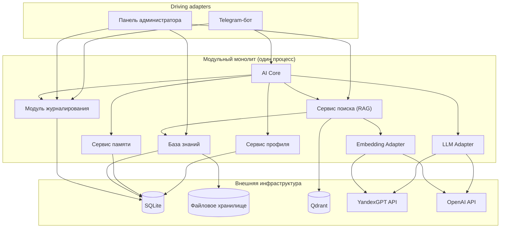
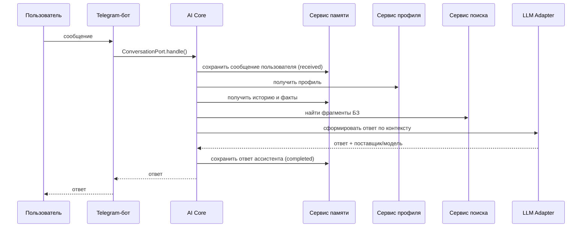

# Системная архитектура — MVP персонального AI-ассистента «Декодер»

Документ основан на утверждённом [`docs/01_requirements_analysis.md`](01_requirements_analysis.md) и не изменяет зафиксированные в нём границы MVP, роли, сценарии и архитектурные решения (единый профиль автора, определение кейса, разделение истории и памяти, LLM Adapter с выбором через конфигурацию, единая база знаний, единая учётная запись администратора, разделение журналов). Все решения ниже совместимы с этим документом. Точки, не имевшие однозначного решения в требованиях, вынесены в раздел 16 «Замечания архитектора».

## 1. Общая архитектура системы

«Декодер» реализуется как одно серверное приложение на Python/FastAPI — **модульный монолит**. Функциональные компоненты (Telegram-бот, AI Core, сервис профиля, сервис памяти, сервис поиска, база знаний, панель администратора, модуль журналирования, LLM Adapter) существуют как логически независимые модули внутри одного процесса, взаимодействующие только через явные интерфейсы (порты). Такое разделение позволяет в будущем вынести любой модуль в отдельный сервис без переписывания бизнес-логики — но в MVP это осознанно не делается.

Развёртывание — контейнеризация через Docker в Yandex Cloud:
- **основной контейнер приложения** — FastAPI-процесс, содержащий все модули из списка выше;
- **контейнер Qdrant** — отдельный инфраструктурный компонент (внешняя система, а не наш микросервис);
- **SQLite** — встроенная файловая база данных на постоянном томе, используемая приложением напрямую (отдельного контейнера не требует);
- **файловое хранилище документов** — постоянный том (persistent volume / постоянный диск Yandex Cloud), подключённый к основному контейнеру; файловый слой самого контейнера для хранения данных не используется, так как удаляется при его пересоздании.

Один экземпляр приложения соответствует принятому в требованиях допущению об отсутствии высокой доступности и цели горизонтального масштабирования (раздел 5 требований).

## 2. Архитектурный стиль

Комбинация трёх взаимодополняющих подходов:

- **Модульный монолит** — целевая архитектура MVP; единица развёртывания одна, единицы разработки — модули с чёткими границами.
- **Clean Architecture** (слоями): *domain* (сущности: Message, DialogueTurn, Fact, Profile, Document, Case, Fragment — без зависимости от фреймворков) → *application* (use-cases и порты) → *interface adapters* (Telegram-бот, HTTP-роуты панели администратора, репозитории) → *infrastructure* (конкретные реализации: aiogram/telegram-библиотека, SQLite-драйвер, Qdrant-клиент, HTTP-клиенты YandexGPT/OpenAI).
- **Ports & Adapters (Hexagonal)** — для всех внешних интеграций: AI Core и остальные сервисы зависят только от портов (интерфейсов), конкретные адаптеры подключаются через Dependency Injection в момент старта приложения (композиционный корень).

Соблюдается принцип **SOLID**, в первую очередь Dependency Inversion Principle (уже зафиксирован в разделе 8 требований) и Single Responsibility (каждый модуль отвечает за одну область — профиль, память, поиск и т. д.).

## 3. Основные компоненты

| Компонент | Тип (в терминах Hexagonal) | Назначение |
|---|---|---|
| Telegram-бот | driving adapter | приём сообщений/команд из Telegram, отправка ответов |
| AI Core | application service (ядро use-case) | оркестрация обработки сообщения, не привязана к конкретному каналу или поставщику LLM |
| Сервис профиля | application service (профиль) + SQLite-репозиторий (driven adapter) | хранение и предоставление единого профиля автора |
| Сервис памяти | application service (память) + SQLite-репозиторий (driven adapter) | история диалога и подтверждённые пользовательские факты |
| Сервис поиска по базе знаний (RAG) | application service (поиск/индексация) + Qdrant-репозиторий (driven adapter) | семантический поиск и индексация документов/кейсов |
| База знаний | SQLite-репозиторий метаданных + адаптер файлового хранилища (driven adapters) | хранение оригиналов документов и их метаданных, метаданных кейсов |
| Панель администратора | driving adapter (веб) + административный application-модуль | управление документами и кейсами администратором |
| Модуль журналирования | cross-cutting driven adapter | технические журналы, аудит, системные события |
| LLM Adapter | driven adapter (порт с двумя реализациями) | доступ к генеративной языковой модели (YandexGPT, OpenAI API) без привязки AI Core к конкретному поставщику; выбор через `LLM_PROVIDER`/`LLM_MODEL` |
| Embedding Adapter | driven adapter (порт с двумя реализациями) | доступ к модели эмбеддингов для сервиса поиска; выбор независимой конфигурацией `EMBEDDING_PROVIDER`/`EMBEDDING_MODEL` |

Для компонентов, отмеченных как «application service + …-репозиторий», это два отдельных элемента: прикладная логика (application service) не зависит от конкретного хранилища и обращается к нему только через порт; репозиторий — конкретная реализация порта (driven adapter). Аналогично для панели администратора: веб-слой (маршруты, шаблоны) — driving adapter, а управление документами/кейсами и аутентификация реализованы как отдельный административный application-модуль, вызываемый этим адаптером через порты. Это разделение должно быть выражено явно при создании структуры проекта.

## 4. Ответственность каждого компонента

**Telegram-бот**
- Принимает обновления Telegram Bot API (сообщения, команды `/запомнить`, `/память`, `/забыть`, нажатия inline-кнопок).
- Преобразует их в канало-независимый формат (входящее сообщение) и передаёт в AI Core через входной порт.
- Преобразует ответ AI Core (текст + при необходимости описание кнопки подтверждения) в объекты Telegram API и отправляет пользователю.

**AI Core**
- Принимает входящее сообщение и данные о диалоге.
- Сохраняет реплику пользователя в истории диалога (статус `received`) до начала формирования ответа.
- Запрашивает профиль, подтверждённые факты и историю диалога, релевантные фрагменты базы знаний.
- Определяет, зависит ли запрос от документов базы знаний; при недоступности сервиса поиска для таких запросов не подменяет отсутствующие документы общими знаниями модели, а сообщает о временной недоступности (см. раздел 11).
- Формирует единый контекст запроса по приоритету источников, зафиксированному в требованиях (системные ограничения → профиль → документы БЗ → факты → история → общие знания модели).
- Передаёт контекст активному LLM Adapter, получает ответ.
- Сохраняет ответ ассистента в истории диалога (статус `completed`, либо `failed` при ошибке) и фиксирует использованного поставщика/модель техническим логированием.
- Маршрутизирует команды `/запомнить`, `/память`, `/забыть` в сервис памяти, включая шаг подтверждения.

**Сервис профиля**
- Хранит единственный профиль автора (стиль, ограничения).
- При старте приложения загружает профиль из конфигурации/seed-данных, если запись в SQLite отсутствует.
- Предоставляет профиль AI Core по запросу.

**Сервис памяти**
- Хранит историю диалога (ограниченное окно последних сообщений) в SQLite, с состоянием каждой записи (`received` → `completed`/`failed`), отражающим статус обработки запроса.
- Хранит подтверждённые факты пользователя в SQLite, отдельно от истории.
- Управляет временным состоянием «факт ожидает подтверждения» до момента подтверждения или истечения срока.
- Предоставляет и удаляет факты по запросу пользователя (`/память`, `/забыть`).

**Сервис поиска по базе знаний (RAG)**
- Выполняет семантический поиск фрагментов документов и кейсов по запросу AI Core.
- Отвечает за индексацию (и переиндексацию/удаление из индекса) при изменениях в базе знаний, инициированных панелью администратора.
- Изолирует всё взаимодействие с Qdrant — остальные компоненты не обращаются к Qdrant напрямую.

**База знаний**
- Хранит оригиналы документов (файловое хранилище) и их метаданные, метаданные кейсов и связи «документ—кейс» (SQLite).
- Предоставляет данные панели администратора (для отображения/редактирования) и сервису поиска (для обогащения результатов метаданными).

**Панель администратора**
- Веб-слой (маршруты, шаблоны) — driving adapter; управление документами/кейсами и аутентификация реализованы как отдельный административный application-модуль, вызываемый этим адаптером через порты (`DocumentRepositoryPort`, `CaseRepositoryPort`, `AdminAuthPort`).
- Позволяет администратору создавать/изменять/удалять документы и кейсы, связывать документы с кейсами.
- Аутентифицирует единственную административную учётную запись (сессия; хеш пароля — из переменной окружения, сравнение выполняется на сервере после передачи пароля по HTTPS).
- Инициирует индексацию через сервис поиска после изменений в базе знаний.

**Модуль журналирования**
- Предоставляет остальным компонентам единый порт для записи технических событий, ошибок, аудита административных действий.
- Определяет и применяет правила исключения чувствительных данных из журналов (раздел 4.8 требований).

**LLM Adapter**
- Инкапсулирует протокол общения с конкретным поставщиком генеративной модели (YandexGPT или OpenAI API).
- Предоставляет AI Core единый интерфейс генерации ответа независимо от активного поставщика.
- Возвращает вместе с ответом идентификатор использованного поставщика и модели для логирования.
- Активный поставщик и модель задаются независимой конфигурацией (`LLM_PROVIDER`, `LLM_MODEL`) и не связаны с конфигурацией Embedding Adapter.

**Embedding Adapter**
- Инкапсулирует протокол получения векторного представления текста у конкретного поставщика (YandexGPT или OpenAI API).
- Используется сервисом поиска как при индексации документов/кейсов, так и при обработке поискового запроса.
- Активный поставщик и модель задаются независимой конфигурацией (`EMBEDDING_PROVIDER`, `EMBEDDING_MODEL`); смена генеративной модели (LLM Adapter) не влияет на выбор Embedding Adapter и не требует переиндексации базы знаний.

## 5. Что каждый компонент не должен делать

- **Telegram-бот** — не принимает решений о содержании ответа, не обращается к LLM/Qdrant/SQLite напрямую, не хранит бизнес-состояние дольше одного запроса, не форматирует ответ на основе бизнес-правил (кроме перевода абстрактного описания действия в Telegram-разметку).
- **AI Core** — не хранит данные самостоятельно (не является репозиторием), не обращается к Qdrant/SQLite/внешним API напрямую, не содержит Telegram-специфичного кода, не решает, как физически хранятся профиль/факты/документы.
- **Сервис профиля** — не редактирует профиль во время работы приложения (в MVP нет write-сценария через интерфейс), не хранит факты и историю диалога.
- **Сервис памяти** — не хранит документы и фрагменты базы знаний, не выполняет семантический поиск, не сохраняет факт без явного подтверждения, не смешивает историю диалога и факты в одном хранилище.
- **Сервис поиска (RAG)** — не хранит оригиналы документов, не принимает решений о применении профиля или приоритете источников (это ответственность AI Core), не выполняет генерацию текста.
- **База знаний** — не содержит бизнес-логики обработки запросов пользователя, не выполняет поиск (это делает сервис поиска), не хранит пользовательские данные (факты, историю).
- **Панель администратора** — не редактирует профиль автора, не управляет пользователями и их фактами, не формирует ответы пользователям бота.
- **Модуль журналирования** — не хранит секреты, полный текст фактов/документов/промптов, не принимает бизнес-решений, является пассивным получателем событий.
- **LLM Adapter** — не решает, что включать в контекст запроса, не хранит состояние диалога, не выбирает поставщика самостоятельно во время выполнения запроса (только по конфигурации при старте).
- **Embedding Adapter** — не участвует в генерации ответа пользователю (это делает LLM Adapter), не принимает решений о релевантности результатов поиска (это ответственность сервиса поиска), не выбирает провайдера самостоятельно во время выполнения запроса.

## 6. Зависимости между компонентами

Направление зависимостей — только внутрь, к абстракциям (портам), без обратных зависимостей ядра на инфраструктуру:

- Telegram-бот → входной порт AI Core (`ConversationPort`); → модуль журналирования (технические ошибки доставки).
- Панель администратора → порты базы знаний (`DocumentRepositoryPort`, `CaseRepositoryPort`) → порт индексации сервиса поиска (`IndexingPort`) → порт аутентификации (`AdminAuthPort`) → модуль журналирования (аудит).
- AI Core → `ProfileRepositoryPort` (сервис профиля), `DialogueHistoryPort` и `FactRepositoryPort` (сервис памяти), `KnowledgeSearchPort` (сервис поиска), `LLMPort` (LLM Adapter), `LoggerPort` (журналирование).
- Сервис поиска → база знаний (чтение метаданных), Qdrant Adapter, Embedding Adapter (см. раздел 16).
- Сервис профиля, сервис памяти, база знаний → SQLite (через собственные репозитории, не раскрывая SQLite наружу).
- LLM Adapter, Embedding Adapter → внешние API (YandexGPT, OpenAI) — единственные компоненты, знающие о внешних провайдерах.
- LLM Adapter и Embedding Adapter конфигурируются и переключаются независимо друг от друга (`LLM_PROVIDER`/`LLM_MODEL` и `EMBEDDING_PROVIDER`/`EMBEDDING_MODEL`); AI Core зависит только от `LLMPort`, сервис поиска — только от `EmbeddingPort`.
- Модуль журналирования → SQLite (аудит действий администратора и системные события/ошибки) и stdout/stderr (технические журналы). История диалога хранится сервисом памяти; модуль журналирования определяет только применимую к ней политику журналирования и защиты данных.

Ни один компонент, кроме перечисленных выше «единственных владельцев», не обращается к SQLite, Qdrant, файловому хранилищу или внешним API напрямую — только через порт соответствующего сервиса.

## 7. Внутренние интерфейсы взаимодействия (порты)

| Порт | Владелец | Контракт (описательно) |
|---|---|---|
| `ConversationPort` | AI Core (входной) | принимает входящее сообщение (пользователь, чат, текст, распознанная команда); возвращает ответ (текст, при необходимости — описание запроса на подтверждение) |
| `ProfileRepositoryPort` | Сервис профиля | получить текущий профиль автора |
| `DialogueHistoryPort` | Сервис памяти | получить последние N реплик диалога; сохранить реплику пользователя со статусом `received`; обновить запись до `completed` с текстом ответа ассистента либо до `failed` при ошибке обработки |
| `FactRepositoryPort` | Сервис памяти | создать черновик факта (staging), подтвердить черновик, получить список подтверждённых фактов, удалить факт |
| `KnowledgeSearchPort` | Сервис поиска | найти релевантные фрагменты документов/кейсов по запросу |
| `IndexingPort` | Сервис поиска | проиндексировать/переиндексировать/исключить из индекса документ или кейс |
| `DocumentRepositoryPort` / `CaseRepositoryPort` | База знаний | CRUD документов и кейсов, связывание документа с кейсом |
| `LLMPort` | LLM Adapter | сформировать ответ модели по единому контексту; вернуть поставщика и модель |
| `EmbeddingPort` | Embedding Adapter | получить векторное представление текста |
| `LoggerPort` | Модуль журналирования | записать техническое событие/ошибку |
| `AuditPort` | Модуль журналирования | записать факт административного действия |
| `AdminAuthPort` | Административный application-модуль (панель администратора — driving adapter) | аутентифицировать администратора (сравнение с хешем пароля из переменной окружения), проверить сессию |
| `AnalyticsReadPort` / `InteractionEventPort` | Модуль журналирования (поставщик данных для будущего аналитического модуля) | предоставить обезличенные записи о взаимодействиях для чтения аналитическим модулем; конкретная реализация может обращаться к SQLite, но контракт не завязан на структуру таблиц |

## 8. Основной поток обработки пользовательского сообщения

1. Пользователь отправляет сообщение в Telegram.
2. Telegram-бот получает обновление через Telegram Bot API, формирует входящее сообщение и вызывает `ConversationPort` AI Core.
3. AI Core сохраняет реплику пользователя в истории диалога со статусом `received` (`DialogueHistoryPort`) — до начала формирования ответа.
4. AI Core запрашивает профиль (`ProfileRepositoryPort`), последние реплики истории и подтверждённые факты (`DialogueHistoryPort`, `FactRepositoryPort`), релевантные фрагменты базы знаний (`KnowledgeSearchPort`; сервис поиска, в свою очередь, обращается к `EmbeddingPort` для векторизации запроса и к Qdrant за поиском).
5. AI Core формирует единый контекст запроса по приоритету источников (раздел 4.2 требований).
6. AI Core передаёт контекст активному поставщику через `LLMPort`.
7. AI Core сохраняет ответ ассистента в истории диалога, переводя запись в статус `completed` (`DialogueHistoryPort`), и фиксирует использованного поставщика/модель через `LoggerPort` (только идентификатор запроса и статус, без текста реплик).
8. AI Core возвращает ответ Telegram-боту через `ConversationPort`.
9. Telegram-бот отправляет ответ пользователю.

При ошибке на шагах 4–6 запись истории диалога переводится в статус `failed` — см. раздел 11. Текст диалога хранится только в истории (сервис памяти); технический журнал содержит лишь идентификатор запроса и статус — это разные сущности.

## 9. Поток загрузки и индексации документа

1. Администратор загружает файл документа и метаданные (название, категория, метки, опционально — связь с кейсом) через панель администратора.
2. Панель вызывает `DocumentRepositoryPort`: оригинал сохраняется в файловое хранилище, метаданные — в SQLite со статусом «ожидает индексации».
3. Индексация запускается асинхронно в рамках того же процесса (фоновая задача), чтобы не блокировать обработку сообщений Telegram-ботом.
4. Сервис поиска разбивает документ на фрагменты, получает вектор каждого фрагмента через `EmbeddingPort`, сохраняет фрагменты и векторы в Qdrant.
5. Статус документа в SQLite обновляется на «проиндексирован» либо «ошибка индексации».
6. Действие администратора фиксируется в аудите через `AuditPort`.

Фоновая задача индексации не является гарантированно доставляемой: при прерывании процесса (например, из-за перезапуска приложения) индексация может не завершиться. Статус документа хранится в SQLite; при старте приложения незавершённые задания (статус «ожидает индексации» дольше ожидаемого времени) переводятся в состояние, допускающее повторный запуск — вручную через панель администратора либо автоматически при старте. Отдельная очередь задач для MVP не требуется: восстановление состояния обеспечивается статусом в SQLite и проверкой при старте приложения.

Аналогично обрабатывается создание/изменение кейса и связи «документ—кейс».

## 10. Поток сохранения пользовательского факта по явной команде

1. Пользователь отправляет `/запомнить <факт>`.
2. Telegram-бот передаёт команду и текст в AI Core как распознанную команду (без интерпретации содержимого — это остаётся зоной AI Core/сервиса памяти).
3. AI Core запрашивает у сервиса памяти создание черновика факта (`FactRepositoryPort`); черновик сохраняется во временной области с ограниченным сроком жизни.
4. AI Core формирует ответ с сформулированным фактом и запросом подтверждения; Telegram-бот отображает кнопку «Сохранить» (либо ожидает явный текстовый ответ пользователя).
5. Пользователь подтверждает действие.
6. Telegram-бот передаёт подтверждение в AI Core; AI Core вызывает подтверждение черновика в сервисе памяти.
7. Сервис памяти переносит факт из черновика в подтверждённые, связывая его с пользователем.
8. AI Core сообщает пользователю об успешном сохранении.

Если подтверждение не получено (пользователь проигнорировал, отклонил или истёк срок черновика), факт не сохраняется и черновик удаляется. Команда `/память` возвращает список подтверждённых фактов через `FactRepositoryPort`; команда `/забыть` удаляет конкретный факт тем же портом.

## 11. Обработка ошибок

| Источник ошибки | Реакция системы |
|---|---|
| LLM Adapter (таймаут, недоступность, ошибка авторизации у активного поставщика) | AI Core перехватывает ошибку, логирует техническую запись, возвращает пользователю нейтральное сообщение об ошибке. Повторных попыток или автоматического перехода на резервного поставщика не выполняется (согласуется с отсутствием рантайм-переключения, зафиксированным в требованиях) |
| Сервис поиска / Qdrant недоступен при обработке сообщения | AI Core определяет, зависит ли запрос от документов базы знаний. Для зависимых от документов запросов пользователь получает нейтральное сообщение о временной недоступности поиска; генерация ответа из общих знаний модели вместо документов не выполняется. Запросы, не требующие обращения к базе знаний, обрабатываются без RAG в штатном режиме |
| Сервис памяти / SQLite недоступен при чтении | AI Core логирует ошибку и продолжает с доступной частью контекста |
| Сервис памяти / SQLite недоступен при записи (реплика, факт) | Для истории диалога — запись переводится в статус `failed` (если запись частично возможна) либо ошибка только логируется при полной недоступности SQLite; не прерывает возврат ответа пользователю. Для сохранения факта — пользователю явно сообщается о неудаче |
| Индексация документа завершилась ошибкой | Документ помечается статусом «ошибка индексации» в метаданных; ошибка логируется; администратор видит статус в панели и запускает индексацию повторно вручную |
| Ошибка доставки сообщения Telegram-ботом | Обрабатывается на уровне адаптера (штатные механизмы Telegram-библиотеки), логируется как техническая ошибка |
| Ошибка аутентификации в панели администратора | Стандартный отказ (401/403) без уточнения, что именно неверно (логин или пароль); фиксируется как техническая запись |

Общий принцип: ни пользователю, ни администратору не показываются технические детали ошибки (сообщения провайдеров, стек вызовов, ключи) — только нейтральный текст. Технические подробности доступны исключительно в техническом журнале, без чувствительных данных (раздел 4.8 требований).

## 12. Точки расширения

- **Аналитический модуль.** AI Core и модуль журналирования уже формируют структурированные записи о каждом взаимодействии (использованный поставщик, статусы обработки, факт обращения к базе знаний и т. д.). Будущий аналитический модуль получает эти данные не напрямую из SQLite, а через отдельный порт (`AnalyticsReadPort`/`InteractionEventPort`, раздел 7). Конкретная реализация порта может читать подготовленные обезличенные записи из SQLite, но доменная логика аналитического модуля не зависит от структуры таблиц и не обращается к базе данных напрямую — при выделении аналитики в отдельный сервис бизнес-логику не потребуется переписывать.
- **Голосовой интерфейс.** Реализуется как новый driving adapter, аналогичный Telegram-боту: преобразует голосовое сообщение в текст (шаг, полностью локализованный в новом адаптере) и вызывает тот же канало-независимый `ConversationPort`. AI Core не меняется.
- **Дополнительные каналы взаимодействия** (веб-виджет, другой мессенджер). Аналогично голосу — новый driving adapter, реализующий `ConversationPort`.
- **Внешние действия** (например, вызов внешних инструментов по результату ответа модели). Точка расширения — между получением ответа от `LLMPort` и возвратом результата в `ConversationPort`: место, куда в будущем можно добавить порт выполнения действий, не меняя остальной поток AI Core.
- **Подключение других языковых моделей.** Требует только новой реализации `LLMPort` и добавления значения `LLM_PROVIDER`/`LLM_MODEL` в конфигурацию — AI Core и остальные компоненты не изменяются (уже заложено требованиями через LLM Adapter). Подключение другого поставщика эмбеддингов выполняется аналогично и независимо, через `EMBEDDING_PROVIDER`/`EMBEDDING_MODEL` и реализацию `EmbeddingPort`, без влияния на выбор генеративной модели.

## 13. Требования к безопасности

- Все секреты (токен Telegram-бота, ключи YandexGPT/OpenAI, логин и хеш пароля администратора) передаются через переменные окружения и не встраиваются в код или репозиторий.
- Панель администратора: хеш пароля администратора хранится в переменной окружения. При входе администратор передаёт пароль по защищённому HTTPS-соединению; сервер сравнивает его с сохранённым хешем с использованием стойкого алгоритма хеширования паролей (предпочтительно Argon2id, либо bcrypt). Пароль и его хеш не записываются в журналы, базу данных или клиентские cookie. После успешной проверки устанавливается сессионная аутентификация; изменяющие операции защищены от CSRF; cookie сессии — с флагами httpOnly и secure; время жизни сессии ограничено.
- Административный веб-интерфейс и приём обновлений Telegram (webhook) работают только по HTTPS.
- Webhook Telegram проверяется по секретному токену, чтобы исключить приём поддельных запросов.
- Доступ к внешним API (YandexGPT, OpenAI) — по ключам с минимально необходимой областью действия, если это поддерживается провайдером.
- Обращения к SQLite выполняются только через параметризованные запросы репозиториев (без конкатенации пользовательского ввода в SQL).
- Соблюдаются правила журналирования из раздела 4.8 требований: в журналы не попадают ключи, пароли, полный текст фактов/документов/промптов, токены, персональные данные в открытом виде.
- Единый профиль и единая база знаний, доступные всем пользователям — осознанное решение MVP (см. требования, раздел 9), а не пробел в разграничении доступа.
- Остаточный риск инъекции через содержимое документов или сообщений пользователя в промпт языковой модели снижается приоритетом источников контекста (системные ограничения выше пользовательских данных), но не устраняется полностью в рамках MVP — см. раздел 15.

## 14. Требования к журналированию и наблюдаемости

- Три категории журналов сохраняются в соответствии с разделом 4.8 требований: технические (stdout/stderr → сборщик логов Docker/Yandex Cloud, ошибки для анализа — дополнительно в SQLite), аудит административных действий (SQLite), история диалогов (SQLite, физически в сервисе памяти).
- Каждая запись технического журнала и вызов LLM Adapter содержат идентификатор запроса/диалога (correlation id), позволяющий сопоставить техническую запись, запись истории диалога и (при необходимости) запись аудита при разборе инцидента.
- Метрики и распределённая трассировка не входят в MVP — требованиями и стеком (раздел 8 требований) не предусмотрены отдельные средства APM; при необходимости добавляются как точка расширения без изменения структуры логов.
- Ретеншн (срок хранения) журналов и данных истории диалога не зафиксирован требованиями — оставлен открытым эксплуатационным параметром, не блокирующим архитектуру MVP.
- Технический журнал и история диалога — разные сущности: технический журнал содержит только идентификатор запроса (correlation id) и статус (`received`/`completed`/`failed`), полный текст реплик хранится исключительно в истории диалога (сервис памяти) и не дублируется в техническом журнале.

## 15. Архитектурные риски и способы их снижения

| Риск | Снижение |
|---|---|
| SQLite — единая точка записи; конкурентные операции бота и панели администратора | Режим WAL, соответствие принятому допущению о нагрузке (раздел 5 требований: до 10 одновременных диалогов) |
| Один экземпляр приложения — отсутствие отказоустойчивости | Осознанное допущение MVP (раздел 9 требований); политика перезапуска контейнера и проверки состояния на уровне Yandex Cloud |
| Долгие ответы LLM (15–30 сек.) могут блокировать обработку других сообщений | Асинхронный ввод-вывод (FastAPI + асинхронная работа с Telegram API и HTTP-клиентами провайдеров) на уровне реализации |
| Смена модели эмбеддингов (провайдера, версии или размерности вектора) делает существующий индекс Qdrant несовместимым с новыми векторами | LLM Adapter и Embedding Adapter конфигурируются независимо (`LLM_PROVIDER`/`LLM_MODEL` и `EMBEDDING_PROVIDER`/`EMBEDDING_MODEL`); смена генеративной модели переиндексации не требует. Переиндексация фиксируется как обязательный шаг только при смене модели эмбеддингов, её версии или размерности вектора; отражается в эксплуатационных заметках, не в коде |
| Инъекция через содержимое документов/сообщений пользователя в промпт | Приоритет источников контекста (профиль и системные ограничения выше пользовательских данных); полная защита от prompt injection не входит в MVP |
| Рост нагрузки сверх принятых допущений (раздел 5, 9 требований) | Модульный монолит с чёткими границами портов позволяет вынести отдельный модуль (например, сервис поиска или память) в самостоятельный сервис без переписывания бизнес-логики — путь роста, а не работа MVP |
| Отсутствие рантайм-переключения между LLM-провайдерами (см. требования, раздел 9) | Известный и принятый риск; снижается операционно — мониторинг технических журналов и ручное обновление конфигурации |
| Фоновая индексация не гарантированно доставляется (прерывание процесса до завершения) | Статус документа хранится в SQLite; незавершённые задания переводятся в повторно запускаемое состояние при старте приложения; повторный запуск — вручную через панель администратора |

## 16. Замечания архитектора

Ниже — места, где исходные требования (`docs/01_requirements_analysis.md`) не дают достаточной детализации для проектирования, либо содержат пересечение формулировок между разделами. Это не противоречия функциональным требованиям и не расширение состава MVP — решения приняты в рамках архитектурной свободы и зафиксированы для прозрачности.

1. **Пересечение владения «историей диалогов» между разделами 4.4 и 4.8 требований.** Раздел 4.4 описывает историю диалога как часть сервиса памяти (нужна для контекста ответа); раздел 4.8 упоминает «историю диалогов» как один из трёх видов журналов. Чтобы не создавать два хранилища одних и тех же данных, в архитектуре принято: физически историю диалога хранит и пишет только сервис памяти; модуль журналирования учитывает её как категорию политики (что нельзя логировать, как её использовать при разборе инцидентов), не дублируя хранилище.
2. **Embedding Adapter не зависит от LLM Adapter.** Поставщик эмбеддингов для семантического поиска не назван в исходных требованиях (разделы 4.5–4.6 требуют RAG, но не определяют, чем генерируются векторы). Введён Embedding Adapter — порт, аналогичный LLM Adapter, но выбираемый отдельной конфигурацией (`EMBEDDING_PROVIDER`, `EMBEDDING_MODEL`), независимой от `LLM_PROVIDER`/`LLM_MODEL`. Смена генеративной модели не требует переиндексации базы знаний. Переиндексация требуется при смене модели эмбеддингов, её версии или размерности вектора. Это техническая деталь уже заявленной функции RAG, не новая возможность.
3. **Место хранения черновика факта до подтверждения** (`/запомнить`) не определено требованиями. Принято решение хранить его в SQLite (сервис памяти, отдельная запись с ограниченным сроком жизни), чтобы не терять данные при перезапуске единственного экземпляра приложения.
4. **Технология файлового хранилища оригиналов документов** не конкретизирована требованиями (сказано только «файловое хранилище» в составе базы знаний). Для MVP выбран постоянный том (persistent volume / постоянный диск Yandex Cloud), подключённый к контейнеру приложения — а не файловый слой самого контейнера, который удаляется при его пересоздании. Это простейший вариант, совместимый с допущением «один экземпляр приложения». Переход на объектное хранилище Yandex Cloud — возможная точка роста за пределами MVP.
5. **Размер окна истории диалога и логика резюме** не зафиксированы (требования допускают «ограниченное окно последних сообщений либо краткое резюме» без конкретики). Принят конфигурируемый через переменные окружения размер окна; автоматическое резюмирование как отдельная функция в MVP не реализуется.

Ни один из пунктов не меняет состав компонентов, пользовательские сценарии или ограничения, зафиксированные в `docs/01_requirements_analysis.md`.
