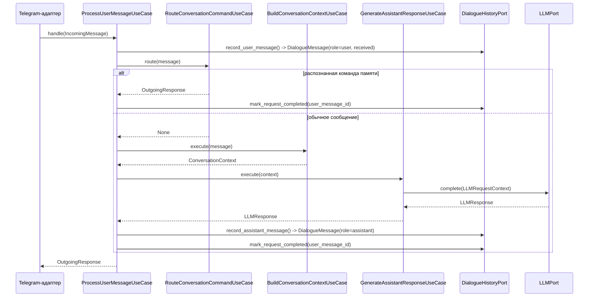

# Структура проекта — MVP персонального AI-ассистента «Декодер»

Документ описывает структуру Python-репозитория, реализующую архитектуру из [`docs/02_system_architecture.md`](02_system_architecture.md) в рамках требований [`docs/01_requirements_analysis.md`](01_requirements_analysis.md). Оба документа не изменялись; настоящая структура — их прямое следствие, а не пересмотр.

Структура создана без установки зависимостей, без подключения реальных API, без таблиц/миграций БД и без ORM-моделей. Все файлы — минимальные заглушки (Protocol-порты, dataclass-сущности, сигнатуры use case'ов, `raise NotImplementedError`).

## 1. Цели структуры проекта

- Явно выразить Clean Architecture (domain → application → adapters/infrastructure) и Ports & Adapters (Hexagonal) для каждого из 9 компонентов, зафиксированных в `docs/02`.
- Провести границы функциональных модулей так, как это заложено архитектурным стилем в `docs/02`, §1, но без создания микросервисов сейчас. Чёткие границы уменьшают объём изменений при возможном выделении отдельных модулей в самостоятельные сервисы в будущем — при этом такое выделение всё равно потребует транспортных адаптеров, сетевых контрактов (DTO) и обработки сетевых ошибок, а не сводится к переносу файлов без изменений (см. раздел 13).
- Гарантировать Dependency Inversion Principle: `AI Core` зависит от `LLMPort`, а не от YandexGPT/OpenAI; `RAG/Search` зависит от `EmbeddingPort`/`VectorStorePort`, а не от Qdrant-клиента; конфигурация LLM и Embedding независимы.
- Не допустить бизнес-логику в Telegram-боте и в FastAPI-роутах панели администратора — они вызывают application use cases и ничего не решают сами.
- Дать единый composition root, а не рассеянную по коду сборку зависимостей.
- Остаться реалистичной для одного разработчика за 3–4 недели: не вводить абстракции сверх уже согласованных в `docs/01`/`docs/02` компонентов и портов.

## 2. Полное дерево директорий и файлов

```
.
|-- .env.example
|-- docs
|   |-- 01_requirements_analysis.md
|   |-- 02_system_architecture.md
|   \-- 03_project_structure.md
|-- pyproject.toml
\-- src
    \-- dekoder
        |-- __init__.py
        |-- main.py                                   # ASGI-точка входа
        |-- composition/                               # 11. Composition Root
        |   |-- __init__.py
        |   |-- container.py                           # DI-сборка use case'ов
        |   \-- bootstrap.py                            # сборка приложения, recovery индексации
        |-- config/                                     # 10. Configuration
        |   |-- __init__.py
        |   \-- settings.py                              # Settings + load_settings() из os.environ
        |-- infrastructure/
        |   |-- __init__.py
        |   \-- sqlite/
        |       |-- __init__.py
        |       \-- connection.py                        # общая фабрика соединения SQLite
        |-- shared/                                       # минимальный shared kernel
        |   |-- __init__.py
        |   |-- domain/
        |   |   |-- __init__.py
        |   |   |-- identifiers.py                        # UserId, DocumentId, CorrelationId и т.д.
        |   |   \-- errors.py                              # DomainError
        |   \-- application/
        |       |-- __init__.py
        |       |-- errors.py                              # ApplicationError, NotFoundError, ValidationError, ConflictError
        |       \-- conversation_context.py                 # ConversationContext (кросс-модульный контракт, не ai_core)
        \-- modules/
            |-- __init__.py
            |-- ai_core/                                   # 1. AI Core
            |   |-- __init__.py
            |   |-- domain/
            |   |   |-- __init__.py
            |   |   \-- message.py                          # IncomingMessage, OutgoingResponse
            |   \-- application/
            |       |-- __init__.py
            |       |-- ports.py                            # ConversationPort
            |       \-- use_cases/
            |           |-- __init__.py
            |           |-- process_user_message.py         # ProcessUserMessageUseCase (координатор)
            |           |-- route_conversation_command.py   # RouteConversationCommandUseCase
            |           |-- build_conversation_context.py   # BuildConversationContextUseCase
            |           \-- generate_assistant_response.py  # GenerateAssistantResponseUseCase
            |-- profile/                                    # 2. Profile
            |   |-- __init__.py
            |   |-- domain/
            |   |   |-- __init__.py
            |   |   \-- profile.py                          # Profile
            |   |-- application/
            |   |   |-- __init__.py
            |   |   |-- ports.py                            # ProfileRepositoryPort
            |   |   \-- use_cases/
            |   |       |-- __init__.py
            |   |       \-- seed_profile.py                 # SeedProfileIfMissingUseCase
            |   \-- adapters/
            |       |-- __init__.py
            |       \-- sqlite_profile_repository.py
            |-- memory/                                     # 3. Memory
            |   |-- __init__.py
            |   |-- domain/
            |   |   |-- __init__.py
            |   |   |-- dialogue_message.py                  # DialogueMessage, MessageRole, RequestProcessingStatus
            |   |   |-- fact.py                              # Fact
            |   |   \-- fact_draft.py                        # FactDraft
            |   |-- application/
            |   |   |-- __init__.py
            |   |   |-- ports.py                            # DialogueHistoryPort, FactRepositoryPort
            |   |   \-- use_cases/
            |   |       |-- __init__.py
            |   |       \-- manage_facts.py                 # Stage/Confirm/List/ForgetFactUseCase
            |   \-- adapters/
            |       |-- __init__.py
            |       |-- sqlite_dialogue_history_repository.py
            |       \-- sqlite_fact_repository.py
            |-- knowledge_base/                             # 4. Knowledge Base
            |   |-- __init__.py
            |   |-- domain/
            |   |   |-- __init__.py
            |   |   |-- document.py                          # Document, DocumentIndexStatus
            |   |   |-- case.py                              # Case, CaseStatus
            |   |   \-- document_case_link.py                # DocumentCaseLink
            |   |-- application/
            |   |   |-- __init__.py
            |   |   \-- ports.py                             # DocumentRepositoryPort, CaseRepositoryPort, FileStoragePort
            |   \-- adapters/
            |       |-- __init__.py
            |       |-- sqlite_document_repository.py
            |       |-- sqlite_case_repository.py
            |       \-- file_storage_adapter.py
            |-- search/                                     # 5. RAG/Search (+ Embedding Adapter)
            |   |-- __init__.py
            |   |-- domain/
            |   |   |-- __init__.py
            |   |   \-- fragment.py                          # Fragment, FragmentSourceType
            |   |-- application/
            |   |   |-- __init__.py
            |   |   |-- ports.py                             # KnowledgeSearchPort, IndexingPort, EmbeddingPort, VectorStorePort
            |   |   |-- services/
            |   |   |   |-- __init__.py
            |   |   |   \-- chunking.py                      # DocumentChunker (application-сервис, не домен)
            |   |   \-- use_cases/
            |   |       |-- __init__.py
            |   |       |-- search_fragments.py              # SearchFragmentsUseCase
            |   |       \-- index_document.py                # IndexDocumentUseCase
            |   \-- adapters/
            |       |-- __init__.py
            |       |-- qdrant_vector_store.py                # VectorStorePort
            |       |-- yandexgpt_embedding_adapter.py        # EmbeddingPort
            |       \-- openai_embedding_adapter.py           # EmbeddingPort
            |-- llm/                                          # 6. LLM
            |   |-- __init__.py
            |   |-- application/
            |   |   |-- __init__.py
            |   |   \-- ports.py                              # LLMPort, LLMRequestContext, LLMResponse
            |   \-- adapters/
            |       |-- __init__.py
            |       |-- yandexgpt_llm_adapter.py
            |       \-- openai_llm_adapter.py
            |-- telegram/                                     # 7. Telegram Adapter
            |   |-- __init__.py
            |   \-- adapters/
            |       |-- __init__.py
            |       |-- bot.py                                # TelegramBot
            |       \-- handlers.py                           # TelegramUpdateHandler
            |-- admin/                                        # 8. Admin
            |   |-- __init__.py
            |   |-- application/
            |   |   |-- __init__.py
            |   |   |-- ports.py                              # AdminAuthPort
            |   |   \-- use_cases/
            |   |       |-- __init__.py
            |   |       |-- authenticate_admin.py
            |   |       |-- manage_documents.py                # Upload/Update/RemoveDocumentUseCase
            |   |       |-- manage_cases.py                    # Create/Update/Archive/LinkCaseUseCase
            |   |       \-- list_knowledge_base.py             # List Documents/CasesUseCase
            |   \-- adapters/
            |       |-- __init__.py
            |       \-- http/
            |           |-- __init__.py
            |           |-- routes.py                          # AdminRouter (driving adapter)
            |           \-- session.py                         # AdminSessionCookies
            \-- logging_audit/                                 # 9. Logging and Audit
                |-- __init__.py
                |-- domain/
                |   |-- __init__.py
                |   \-- entries.py                              # TechnicalLogEvent, AuditEntry, SystemEventEntry
                |-- application/
                |   |-- __init__.py
                |   \-- ports.py                                # LoggerPort, AuditPort, AnalyticsReadPort
                \-- adapters/
                    |-- __init__.py
                    |-- stdout_technical_logger.py
                    |-- sqlite_audit_repository.py
                    \-- sqlite_system_events_repository.py
```

## 3. Описание каждого верхнеуровневого модуля

| Модуль | Компонент из `docs/02` | Содержит |
|---|---|---|
| `ai_core` | AI Core | Единственный входной порт (`ConversationPort`); use case-координатор (`process_user_message`) делегирует маршрутизацию команд, сборку контекста и генерацию ответа трём отдельным use case'ам |
| `profile` | Сервис профиля | Единый профиль автора; порт только для чтения + один use case первичной загрузки (seed) |
| `memory` | Сервис памяти | История диалога как последовательность отдельных реплик (`DialogueMessage`, статус received/completed/failed — на реплике пользователя) и факты (черновик → подтверждение) — раздельные сущности и репозитории за двумя портами |
| `knowledge_base` | База знаний | Метаданные документов/кейсов/связей (SQLite) + оригиналы файлов (файловое хранилище); только CRUD за портами, без оркестрации |
| `search` | Сервис поиска (RAG) + Embedding Adapter | Поиск, индексация, разбиение на фрагменты (application-сервис `DocumentChunker`), изоляция Qdrant, эмбеддинги — согласно заданному списку модулей Embedding Adapter размещён здесь |
| `llm` | LLM Adapter | Единый `LLMPort` и две реализации (YandexGPT, OpenAI) |
| `telegram` | Telegram-бот | Только driving adapter, без domain/application — бизнес-логики в нём нет по определению |
| `admin` | Панель администратора | Административный application-модуль (use cases + `AdminAuthPort`) отдельно от HTTP driving adapter |
| `logging_audit` | Модуль журналирования | Три вида журналов + порт для будущего аналитического модуля |

## 4. Разделение domain/application/adapters/infrastructure

Каждый модуль в `modules/` — самостоятельный bounded context, повторяющий одну и ту же слоистую схему:

- **`domain/`** — dataclass-сущности и enum'ы, ноль внешних зависимостей (даже друг от друга внутри модуля — только через `shared.domain.identifiers`, если нужен общий тип идентификатора).
- **`application/ports.py`** — `Protocol`-порты, которые определяет модуль (входные и/или выходные).
- **`application/use_cases/`** — есть только там, где есть настоящая оркестрация (несколько шагов, вызов нескольких портов, ветвление). Там, где операция — чистый CRUD без бизнес-правила (`knowledge_base`, чтение профиля в `profile`), use cases нет: вызывающий модуль (`ai_core`, `admin`) обращается к порту напрямую. В `ai_core` эта директория разбита на use case-координатор (`process_user_message.py`) и три специализированных use case'а, за которыми закреплена своя часть логики (раздел 16).
- **`application/services/`** — встречается там, где есть переиспользуемый шаг обработки, который не реализует порт и не оркестрирует другие порты, но и не является доменной сущностью (пример — `DocumentChunker` в `search`: алгоритм разбиения текста, а не объект предметной области).
- **`adapters/`** — конкретные реализации портов: `sqlite_*_repository.py`, `qdrant_vector_store.py`, `*_llm_adapter.py`, `*_embedding_adapter.py`, `http/routes.py`, `telegram/adapters/*`.

Вне `modules/` — три сквозных пакета:
- **`shared/`** — общие идентификаторы, базовые исключения и кросс-модульные контракты. `shared/domain` не зависит ни от одного модуля. `shared/application` — с одним осознанным исключением: `conversation_context.py` (`ConversationContext`) зависит от `domain`-пакетов `profile`, `memory` и `search`, потому что сам контракт по своей природе объединяет их сущности (профиль, факты, история, фрагменты). Это не внутреннее состояние `ai_core` — `ConversationContext` собирается в `ai_core` (`build_conversation_context.py`), потребляется там же (`generate_assistant_response.py`) и предназначен для будущих внешних потребителей (driving adapters, тесты), поэтому вынесен из `ai_core` — иначе они импортировали бы его напрямую из `modules/ai_core`, создавая зависимость вида `<потребитель> → ai_core`, которой нет в `docs/02`. `shared/application` никогда не зависит от чужих `application`/`adapters`.
- **`config/`** и **`infrastructure/sqlite/`** — инфраструктурные детали (переменные окружения, соединение с БД), не содержат бизнес-логики.
- **`composition/`** — единственное место, которому разрешено импортировать одновременно порты и конкретные адаптеры всех модулей.

## 5. Правила импортов

- `domain` не импортирует ничего, кроме stdlib и `shared.domain`.
- `application` импортирует свой `domain`, порты других модулей (`<module>.application.ports`) и domain-сущности, которые эти порты возвращают, — но никогда `adapters`/`infrastructure` (ни свои, ни чужие) и никогда `fastapi`/telegram-библиотеку/`qdrant_client`/`openai`/YandexGPT SDK.
- Кросс-модульные контракты (сейчас — только `ConversationContext`) размещаются в `shared.application`, а не в `application` модуля, который их формирует, — чтобы другие потребители зависели от `shared`, а не от модуля-источника.
- `adapters` импортирует свой `application` (порт, который реализует) и конкретную инфраструктуру (`infrastructure.sqlite`, внешние клиенты).
- `telegram/adapters` и `admin/adapters/http` вызывают только application use cases (`ai_core.application.ports.ConversationPort`, `admin.application.use_cases.*`) — не порты чужих модулей напрямую и не `adapters` других модулей.
- `composition/` — единственное исключение из всех правил выше: собирает use cases из портов + adapters всех модулей.
- Один модуль не импортирует `adapters` другого модуля никогда — только `application` (порты и, где есть, use cases).

## 6. Матрица разрешённых зависимостей

Проверено статическим анализом импортов (см. раздел 15) — фактический граф совпадает с этой матрицей:

| Модуль (from \ to) | ai_core | profile | memory | knowledge_base | search | llm | telegram | admin | logging_audit |
|---|---|---|---|---|---|---|---|---|---|
| **ai_core** | — | ✅ | ✅ | — | ✅ | ✅ | — | — | ✅ |
| **profile** | — | — | — | — | — | — | — | — | — |
| **memory** | — | — | — | — | — | — | — | — | — |
| **knowledge_base** | — | — | — | — | — | — | — | — | — |
| **search** | — | — | — | ✅ (только чтение) | — | — | — | — | — |
| **llm** | — | — | — | — | — | — | — | — | — |
| **telegram** | ✅ | — | — | — | — | — | — | — | ✅ |
| **admin** | — | — | — | ✅ | ✅ (IndexingPort) | — | — | — | ✅ |
| **logging_audit** | — | — | — | — | — | — | — | — | — |

Пустых строк (модулей без исходящих зависимостей на другие `modules/*`) — большинство: `profile`, `memory`, `knowledge_base`, `llm`, `logging_audit` полностью самодостаточны и потребляются, а не потребляют. Это намеренно: чем меньше исходящих зависимостей у модуля, тем безопаснее его в будущем выделить в отдельный сервис.

Матрица показывает только зависимости между `modules/*`; `shared/` в неё не входит намеренно — на него могут (и должны, при необходимости) ссылаться все модули без исключения, не создавая при этом рёбер друг на друга. Именно поэтому `ConversationContext` вынесен в `shared.application`, а не оставлен в `modules/ai_core/application`: останься он там, `llm` (для передачи контекста в `LLMPort`), будущий голосовой адаптер и тесты со временем начали бы импортировать его из `ai_core`, добавив в эту матрицу строки вида `llm -> ai_core`, которых архитектура (`docs/02`) не предусматривает.

## 7. Перечень основных портов и место их размещения

| Порт | Файл |
|---|---|
| `ConversationPort` | `modules/ai_core/application/ports.py` |
| `ProfileRepositoryPort` | `modules/profile/application/ports.py` |
| `DialogueHistoryPort` | `modules/memory/application/ports.py` |
| `FactRepositoryPort` | `modules/memory/application/ports.py` |
| `DocumentRepositoryPort`, `CaseRepositoryPort`, `FileStoragePort` | `modules/knowledge_base/application/ports.py` |
| `KnowledgeSearchPort`, `IndexingPort`, `EmbeddingPort`, `VectorStorePort` | `modules/search/application/ports.py` |
| `LLMPort` | `modules/llm/application/ports.py` |
| `AdminAuthPort` | `modules/admin/application/ports.py` |
| `LoggerPort`, `AuditPort`, `AnalyticsReadPort` | `modules/logging_audit/application/ports.py` |

Отдельно от портов — кросс-модульный контракт `ConversationContext` (не порт, а DTO): `shared/application/conversation_context.py`. Он не привязан к конкретному порту, а передаётся напрямую между use case'ами `ai_core` и в будущем — другими потребителями (раздел 6).

## 8. Местоположение composition root

`src/dekoder/composition/`:
- `container.py` — `Container` (держит собранные use cases) и `build_container(settings) -> Container`, который единственный в проекте импортирует конкретные адаптеры (`sqlite_*_repository`, `qdrant_vector_store`, `*_llm_adapter`, `*_embedding_adapter`, `admin/adapters/http`, `telegram/adapters`) наряду с портами всех модулей.
- `bootstrap.py` — `create_app()` (сборка процесса: конфигурация → контейнер → HTTP/Telegram-роуты) и `recover_interrupted_indexing_jobs()` (docs/02, §9).
- `src/dekoder/main.py` — тонкая ASGI-точка входа, вызывающая `composition.bootstrap.create_app()`.

## 9. Схема подключения LLM Adapter

```
ai_core.application.use_cases.generate_assistant_response.GenerateAssistantResponseUseCase
        зависит от
llm.application.ports.LLMPort  (Protocol, без знания о конкретном поставщике)
        реализуется
llm.adapters.yandexgpt_llm_adapter.YandexGptLLMAdapter   (LLM_PROVIDER=yandex)
llm.adapters.openai_llm_adapter.OpenAiLLMAdapter          (LLM_PROVIDER=openai)
        выбор конкретной реализации — в composition.container,
        по значению config.settings.Settings.llm_provider / llm_model
```
`LLMPort` объявляет собственный DTO (`LLMRequestContext`), а не тип из `ai_core` — `GenerateAssistantResponseUseCase` сам конвертирует полученный `ConversationContext` (из `shared.application.conversation_context`, а не из `ai_core`, — раздел 6) в этот DTO перед вызовом порта. Это единственный способ не создать зависимость `ai_core → llm → ai_core` (см. раздел 13).

## 10. Схема подключения Embedding Adapter

```
search.application.use_cases.search_fragments.SearchFragmentsUseCase       (запрос → вектор → поиск)
search.application.use_cases.index_document.IndexDocumentUseCase           (документ → фрагменты → векторы)
        оба зависят от
search.application.ports.EmbeddingPort  (Protocol)
        реализуется
search.adapters.yandexgpt_embedding_adapter.YandexGptEmbeddingAdapter   (EMBEDDING_PROVIDER=yandex)
search.adapters.openai_embedding_adapter.OpenAiEmbeddingAdapter         (EMBEDDING_PROVIDER=openai)
        выбор — в composition.container, по EMBEDDING_PROVIDER/EMBEDDING_MODEL,
        НЕЗАВИСИМО от LLM_PROVIDER/LLM_MODEL (docs/02, §16.2)
```
`EmbeddingPort` виден только внутри `search` — ни `ai_core`, ни любой другой модуль не знает о его существовании (в отличие от `LLMPort`, который открыт наружу для `ai_core`).

## 11. Схема подключения SQLite и Qdrant

**SQLite** — общая фабрика соединения в `infrastructure/sqlite/connection.py` (`SqliteConnectionFactory`), которую в конструктор получают только `*_repository`-адаптеры:
```
profile.adapters.sqlite_profile_repository.SqliteProfileRepository
memory.adapters.sqlite_dialogue_history_repository.SqliteDialogueHistoryRepository
memory.adapters.sqlite_fact_repository.SqliteFactRepository
knowledge_base.adapters.sqlite_document_repository.SqliteDocumentRepository
knowledge_base.adapters.sqlite_case_repository.SqliteCaseRepository
logging_audit.adapters.sqlite_audit_repository.SqliteAuditRepository
logging_audit.adapters.sqlite_system_events_repository.SqliteSystemEventsRepository
        все получают SqliteConnectionFactory(settings.sqlite_path) из composition.container
```
Ни один модуль не открывает файл БД в обход этой фабрики — «SQLite-репозитории не должны использоваться напрямую вне своих адаптеров» реализовано тем, что `infrastructure.sqlite` ничего не знает о репозиториях, а репозитории — единственные потребители фабрики.

**Qdrant** — единственная точка входа `search.adapters.qdrant_vector_store.QdrantVectorStore`, реализующая `VectorStorePort`. Ни `ai_core`, ни `admin`, ни любой другой модуль не импортирует `qdrant_vector_store` напрямую — только через `search.application.ports.KnowledgeSearchPort`/`IndexingPort`.

## 12. Правила добавления нового driving или driven adapter

**Новый driving adapter** (например, голосовой канал, docs/02 §12):
1. Создать `modules/<channel>/adapters/` (без `domain`/`application`, как `telegram`).
2. Реализовать преобразование входа канала в `ai_core.domain.message.IncomingMessage` и вызвать `ai_core.application.ports.ConversationPort.handle(...)`.
3. Зарегистрировать адаптер в `composition.bootstrap.create_app()`.
4. `ai_core` не меняется.

**Новый driven adapter** (например, третий LLM-провайдер):
1. Добавить файл в `modules/llm/adapters/` (или `search/adapters/` для эмбеддингов), реализующий `LLMPort`/`EmbeddingPort`.
2. Добавить новое значение `LLM_PROVIDER`/`EMBEDDING_PROVIDER` в `config/settings.py` и `.env.example`.
3. Добавить ветку выбора реализации в `composition/container.py`.
4. `ai_core`/`search` не меняются — они зависят только от порта.

Правило в обоих случаях одно: новый файл появляется только в `adapters/` соответствующего модуля и в `composition/`; `domain`/`application` не трогаются.

## 13. Риски циклических зависимостей и способы их предотвращения

| Риск | Как предотвращён |
|---|---|
| `ai_core` ↔ `llm`: LLMPort нужен контекст, собранный в ai_core | `LLMPort` объявляет собственный `LLMRequestContext` в `llm.application.ports`, не импортирует ничего из `ai_core`; конвертацию делает `GenerateAssistantResponseUseCase` |
| `llm`/будущий voice-адаптер/тесты со временем начинают импортировать `ConversationContext` напрямую из `modules/ai_core`, образуя `<потребитель> → ai_core` | `ConversationContext` изначально размещён не в `ai_core`, а в `shared.application.conversation_context` — потребители зависят от `shared`, а не от `ai_core` (раздел 4, 6) |
| `ai_core` ↔ `search`: search возвращает Fragment, ai_core его использует | Только `ai_core.application` → `search.application`/`search.domain`; `search` не знает о существовании `ai_core` |
| `search` ↔ `knowledge_base`: search читает метаданные/файлы | Только `search.application` → `knowledge_base.application.ports`; `knowledge_base` не импортирует `search` |
| `admin` ↔ `knowledge_base`/`search`: admin оркестрирует оба | `admin` — единственный «верхний» потребитель обоих портов; `knowledge_base` и `search` об `admin` не знают |
| `telegram`/`admin.adapters.http` начинают напрямую дёргать чужие репозитории | Правило раздела 5: driving adapters вызывают только application use cases своего модуля (`admin`) или `ConversationPort` (`telegram`) |
| Случайный импорт `<module>.adapters` из чужого `application` | Не встречается ни разу в текущей структуре (проверено статическим анализом, раздел 15); дисциплина обеспечивается тем, что порты уже дают всё нужное |

Разбиение `ai_core/application/use_cases` на координатор и три специализированных use case'а (раздел 16) — внутримодульная декомпозиция и на матрицу раздела 6 не влияет: все четыре файла в сумме зависят от тех же модулей (`memory`, `profile`, `search`, `llm`, `logging_audit`), что и раньше единый `ProcessUserMessageUseCase`.

Статическая проверка (раздел 15) подтверждает: цикл в графе `modules/*` отсутствует.

## 14. Реалистичность структуры для MVP и одного разработчика

Фактические цифры (раздел 15): **105 Python-файлов**, из них **47 — `__init__.py`** (структурные, пустые или с однострочным docstring) и **58 — файлов с содержанием** (порты, сущности, use case'ы, адаптеры). Это детализация выше минимально необходимой для работающего MVP: часть портов, доменных сущностей и use case'ов можно было бы объединить в более крупные файлы без нарушения архитектурных границ, описанных в разделах 4–6. Большое число файлов само по себе не является признаком качества архитектуры — здесь оно является следствием буквального (файл на порт/сущность/use case) отражения уже согласованных в `docs/02` компонентов (9) и портов (13), а не самостоятельным расширением архитектора.

Структура детализирована сильнее минимально необходимой, однако большинство файлов представляют собой небольшие контракты, порты или точки расширения. При необходимости отдельные файлы внутри одного слоя могут быть объединены без нарушения архитектурных границ — например, три файла `route_conversation_command.py`/`build_conversation_context.py`/`generate_assistant_response.py` можно свести к одному, если для конкретного разработчика поддерживать четыре файла в `ai_core/application/use_cases/` окажется менее удобно, чем один с тремя классами (по аналогии с `memory/.../manage_facts.py`).

Что удерживает структуру от избыточности:
- Там, где операция — чистый CRUD без бизнес-правила (`knowledge_base`, чтение профиля), отдельный слой `use_cases/` сознательно не создан.
- Однотипные use case'ы объединены в один файл с несколькими маленькими классами (`memory/.../manage_facts.py` — 4 класса, `admin/.../manage_documents.py` — 3 класса) вместо файла на каждый глагол.
- `telegram` и `llm` — самые маленькие модули (4 и 6 файлов) ровно потому, что у них нет собственной бизнес-логики — что и требуется правилами задачи.
- Один физический файл SQLite и одна фабрика соединения — не 8 разных баз данных на 8 модулей.
- Нет ни одного элемента, характерного для микросервисов (отдельных процессов на модуль, брокеров сообщений, service discovery, k8s-манифестов) — всё разворачивается одним процессом (docs/02, §1).

## 15. Перечень созданных файлов

Корень репозитория: `pyproject.toml`, `.env.example`, `docs/03_project_structure.md` (этот документ).

Пакет `src/dekoder/` — **105 Python-файлов**: **47 `__init__.py`** и **58 остальных** (порты, доменные сущности, use case'ы, адаптеры — перечислены в разделе 2 этого документа). Точные цифры получены командой `find src -name "*.py" | wc -l` (и отдельно для `__init__.py`), а не оценены на глаз.

Проверка импортов проведена статически (AST) и динамически (`importlib.import_module` для каждого из 105 файлов, с `src/` на `sys.path`):
- все модули импортируются без ошибок;
- граф зависимостей между `modules/*` не содержит циклов (совпадает с матрицей раздела 6);
- ни один файл в `domain/`/`application/` не импортирует `fastapi`, telegram-библиотеку, `qdrant_client`, `openai` или YandexGPT SDK.

Эта проверка относится к текущему каркасу проекта — только Protocol-порты, dataclass-сущности и заглушки с `raise NotImplementedError`, без единой строки кода, использующей реальные библиотеки. После подключения реальных зависимостей (FastAPI, библиотеки Telegram Bot API, `qdrant-client`, HTTP-клиентов YandexGPT/OpenAI) аналогичная проверка (импорт каждого модуля + статический граф зависимостей между `modules/*`) должна остаться частью CI, а не разовым шагом на этапе создания структуры — реализация use case'ов может незаметно добавить нарушающий слои импорт, который эта проверка обязана ловить автоматически.

## 16. Поток обработки сообщения — проекция на use case'ы и порты

Основной поток уже описан в `docs/02`, §8, на уровне компонентов; этот раздел — его проекция на конкретные файлы `ai_core` и на уточнённую модель истории диалога (раздел 2, `memory/domain/dialogue_message.py`). Раздел не переопределяет `docs/02` — только показывает, как тот же поток реализован во внутренней структуре `ai_core` и как в нём участвуют отдельные записи `DialogueMessage` вместо одной обновляемой записи.

1. `TelegramUpdateHandler` строит `IncomingMessage` и вызывает `ConversationPort.handle(...)` — реализация этого порта — координатор `ProcessUserMessageUseCase`.
2. Координатор вызывает `DialogueHistoryPort.record_user_message(...)` — создаётся **новая** запись `DialogueMessage(role=USER, processing_status=RECEIVED)`.
3. Координатор вызывает `RouteConversationCommandUseCase.route(message)`. Если сообщение — команда `/запомнить`, `/память`, `/забыть` или подтверждение черновика, use case делегирует её `memory.application.use_cases.manage_facts.*` и возвращает готовый `OutgoingResponse`; координатор переводит статус реплики пользователя в `completed` и возвращает ответ, не обращаясь к профилю/поиску/LLM.
4. Если `route_command` вернул `None` (обычное сообщение), координатор вызывает `BuildConversationContextUseCase.execute(message)` — тот запрашивает профиль, `get_recent(dialogue_id, limit)` из `DialogueHistoryPort` (уже без текущей реплики пользователя, которая обрабатывается отдельно), подтверждённые факты и фрагменты базы знаний, и собирает `ConversationContext` в порядке приоритета (docs/01, §4.2).
5. Координатор передаёт `ConversationContext` в `GenerateAssistantResponseUseCase.execute(...)`, тот конвертирует его в `LLMRequestContext` и вызывает `LLMPort.complete(...)`.
6. Координатор вызывает `DialogueHistoryPort.record_assistant_message(...)` — создаётся **вторая, отдельная** запись `DialogueMessage(role=ASSISTANT)` — и `mark_request_completed(user_message_id)` для исходной реплики пользователя.
7. При исключении на шагах 4–5 координатор вызывает `mark_request_failed(user_message_id)`, логирует техническую ошибку через `LoggerPort` (только идентификатор запроса и статус, без текста — docs/02, §14) и возвращает нейтральный `OutgoingResponse`.



## Замечания архитектора к этому шагу

Как и в `docs/02`, ниже — места, где решение принято архитектором в рамках уже согласованного, а не расширение состава MVP:

1. **`FileStoragePort` и `VectorStorePort`** не названы по имени в `docs/02` — они прямо следуют из уже описанного там разделения хранения (оригиналы файлов отдельно от метаданных; изоляция Qdrant) и явно запрошены в этой задаче для RAG. Введены как обычные порты соответствующих модулей.
2. **Embedding Adapter физически размещён в `modules/search/`**, а не как отдельный top-level модуль — так задано списком модулей в этой задаче (RAG/Search включает Embedding Adapter как подпункт), и это не противоречит `docs/02` (там сказано только «Сервис поиска → Embedding Adapter», без указания директории).
3. **`knowledge_base` и `profile` не получили `use_cases/`** (кроме одного use case в `profile` — `seed_profile`) — в `docs/02` для этих модулей не описано никакой оркестрации сверх CRUD, поэтому дополнительный слой стал бы абстракцией «на будущее», что прямо запрещено условием задачи.
4. **Административный HTTP-слой оркестрирует `knowledge_base` и `search`** (модуль `admin`) — это прямое отражение зависимостей из `docs/02`, §6 («Панель администратора → порты базы знаний → порт индексации сервиса поиска»), а не новое архитектурное решение.
5. **История диалога смоделирована как отдельные `DialogueMessage`, а не как одна обновляемая запись.** `docs/02` в прозе §8 и в sequence-диаграмме говорит о том, что AI Core «сохраняет реплику пользователя со статусом received», а затем «переводит запись в статус completed» с текстом ответа — при буквальном прочтении это можно понять как одну и ту же запись, дописываемую текстом ответа. `docs/02` фиксирует функциональное поведение (какие статусы существуют, что текст диалога отделён от технического журнала), но не диктует физическую схему на уровне «одна запись или две». На уровне структуры проекта выбрана модель с раздельными записями на реплику пользователя и ответ ассистента (раздел 16) — она устраняет двусмысленность («одна запись не должна превращаться из сообщения пользователя в пару запрос+ответ»), сохраняя весь функциональный смысл `docs/02`: статус received/completed/failed остаётся на реплике пользователя, текст диалога по-прежнему отделён от технического журнала.
6. **`DocumentChunker` перенесён из `search/domain` в `search/application/services`.** `docs/02` не фиксирует, что разбиение документа на фрагменты — доменная сущность; это шаг конвейера индексации (используется только внутри `IndexDocumentUseCase`), а не объект предметной области со своим жизненным циклом — в отличие от `Fragment`, который остаётся в `domain`. Расположение не влияет ни на один порт и ни на одну зависимость между модулями.

Ни один из пунктов не меняет состав компонентов, порты или ограничения, зафиксированные в `docs/01` и `docs/02`.
