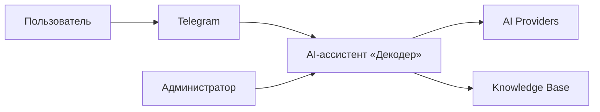
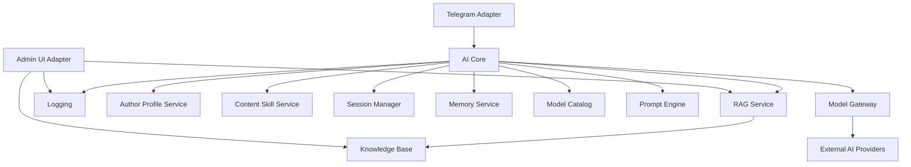
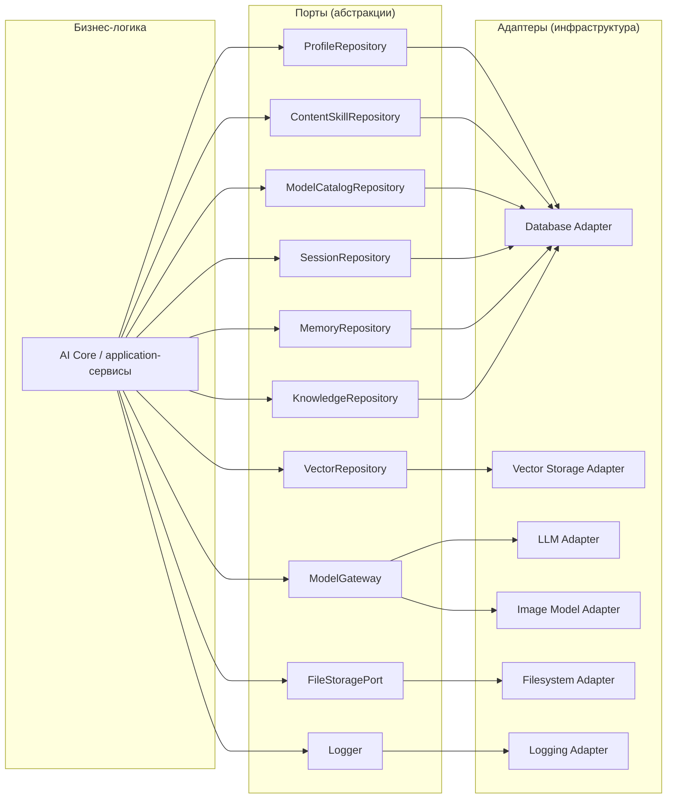
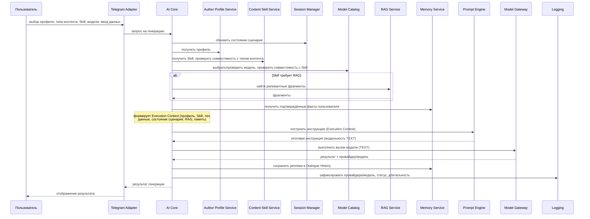
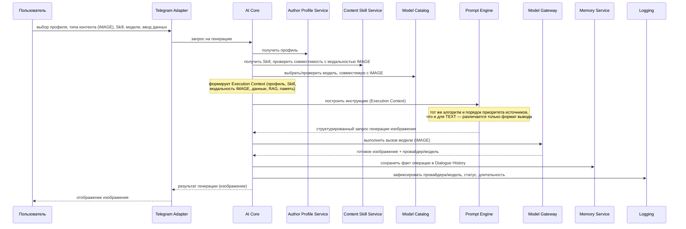
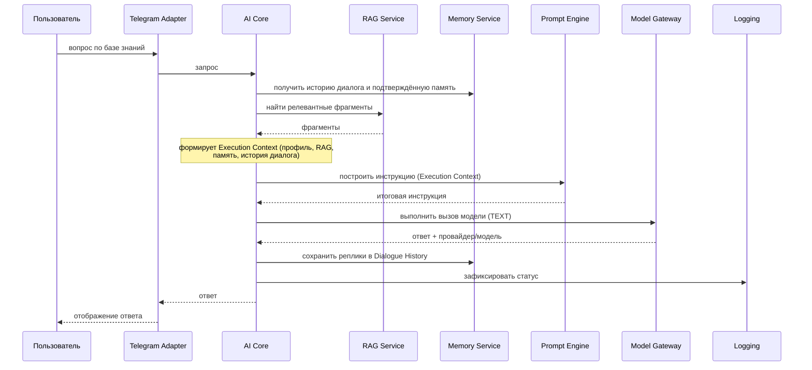
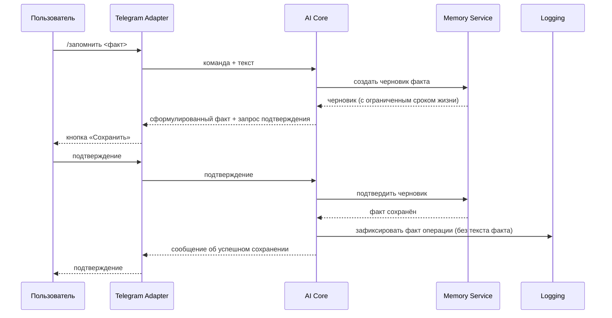

# Системная архитектура — MVP персонального AI-ассистента «Декодер» (версия 2.0)

**Версия документа:** 2.0
**Статус:** Approved
**Дата:** 2026-07-28
**Основание:** [`01_requirements_analysis_v2.0.md`](01_requirements_analysis_v2.0.md) (требования, версия 2.0, Approved)
**Соотношение с версией 1.0:** [`docs/02_system_architecture.md`](../02_system_architecture.md) описывает архитектуру состава MVP версии 1.0 (единый профиль автора, одна модель на экземпляр приложения) и не изменяется этим документом. Состав MVP версии 2.0 (несколько профилей автора, Content Skills, Prompt Engine, каталог моделей, мультимодальная генерация) меняет ключевые компоненты и потоки обработки запроса структурно, поэтому архитектура спроектирована заново, а не является правкой версии 1.0.

## 1. Назначение документа

Документ определяет логическую архитектуру системы «Декодер» версии 2.0: состав компонентов, их зоны ответственности, порты и адаптеры, направление зависимостей между ними, основные потоки обработки запроса и точки расширения.

Документ описывает архитектуру на уровне **Software Architecture Document** — не является ни обзором функций (это сделано в `01_requirements_analysis_v2.0.md`), ни описанием реализации. Документ не фиксирует модель данных, классы, структуру каталогов проекта, SQL, REST API или физические таблицы — эти вопросы относятся к последующим проектным документам (структура проекта, доменная модель, внутренние интерфейсы), которые для версии 2.0 будут спроектированы отдельно вслед за этим документом.

## 2. Контекст системы

Диаграмма показывает место системы среди внешних участников — без раскрытия внутренних компонентов (они описаны в разделах 4–9).



На этом уровне абстракции Knowledge Base показана как внешний концептуальный источник данных заказчика, с которым система обменивается данными. Во внутренней архитектуре (раздел 6) хранение и обслуживание базы знаний — зона ответственности одноимённого компонента Knowledge Base; это не противоречие, а разный уровень детализации одной и той же сущности.

## 3. Архитектурные принципы

| Принцип | Пояснение |
|---|---|
| **Modular Monolith** | Система разворачивается как одна единица (один процесс), но состоит из логически независимых компонентов с чёткими границами и явными портами взаимодействия. Модульность — организационная, а не физическая: компоненты не являются отдельными сервисами, но спроектированы так, что любой из них может быть выделен в отдельный сервис в будущем без переписывания бизнес-логики. |
| **Clean Architecture** | Направление зависимостей — только внутрь: бизнес-логика (AI Core и application-сервисы) не зависит от способа доставки запроса (Telegram, веб) и не зависит от способа хранения или вызова моделей. Внешние слои (адаптеры) зависят от внутренних (портов и бизнес-логики), а не наоборот. |
| **Ports & Adapters (Hexagonal)** | Каждое взаимодействие с внешним миром (хранилище, модель, канал доставки) выражено абстрактным портом. Конкретная реализация — адаптер — подключается извне и может быть заменена без изменения бизнес-логики. |
| **Dependency Inversion Principle** | Компоненты верхнего уровня (AI Core, application-сервисы) зависят от абстракций (портов), а не от конкретных реализаций (адаптеров); адаптеры зависят от портов, которые они реализуют, а не наоборот. |
| **Separation of Concerns** | Каждый компонент отвечает ровно за одну зону: правила профиля отдельно от правил Skill, построение инструкции отдельно от её исполнения, выбор модели отдельно от вызова модели. Ни один компонент не берёт на себя чужую ответственность. |
| **Single Responsibility** | У каждого компонента ровно одна причина для изменения. Например: изменение алгоритма приоритета источников контекста меняет только Prompt Engine; изменение способа вызова конкретного провайдера меняет только соответствующий адаптер Model Gateway. |
| **Stateless AI Core** | AI Core не хранит данные между вызовами. Всё состояние, необходимое для обработки запроса (профиль, состояние сценария, история, память), явно запрашивается в начале обработки и явно сохраняется по её завершении — через Session Manager и Memory Service. Это делает AI Core предсказуемым оркестратором и не создаёт скрытого состояния процесса. |
| **Infrastructure Independence** | Ни AI Core, ни application-сервисы (Author Profile Service, Content Skill Service, Prompt Engine, Model Catalog, Memory Service, RAG Service) не знают о конкретной СУБД, конкретном векторном хранилище, конкретном провайдере моделей или конкретном облачном провайдере — это прямо соответствует техническим ограничениям требований версии 2.0 (`01_requirements_analysis_v2.0.md`, раздел 8). |

## 4. Общая архитектура системы

Архитектура строится вокруг AI Core как единственного оркестратора сценария обработки запроса — независимо от того, идёт ли речь о генерации текста, генерации изображения или ответе по базе знаний.

Концептуальная схема слоёв обработки запроса:

```text
Telegram Adapter
        │
        ▼
     AI Core
        │
 ┌──────┼────────────┐
 ▼      ▼            ▼
Profile Skill     Session
Service Service   Manager
 │      │            │
 └──────┼────────────┘
        ▼
   Prompt Engine
        │
 ┌──────┼────────────┐
 ▼      ▼            ▼
Memory  RAG    Model Catalog
        │            │
        └────┬───────┘
             ▼
      Model Gateway
             │
             ▼
 External AI Providers
```

Эта схема показывает слои, через которые проходит обработка запроса, а не буквальное направление вызовов. Фактическое управление вызовами полностью сосредоточено в AI Core: ни Prompt Engine, ни Model Gateway не инициируют вызовы других компонентов — они только получают данные, собранные AI Core, и возвращают результат (раздел 6). Ниже — более точная диаграмма зависимостей вызовов:



Ни один компонент, кроме AI Core и Admin, не вызывает других компонентов из раздела 6 напрямую — это гарантирует, что бизнес-правила сценария (порядок шагов, проверки совместимости, реакция на ошибки) существуют ровно в одном месте.

## 5. Границы системы

Раздел явно разделяет предмет проектирования этого документа и внешние зависимости, к которым система обращается через порты и адаптеры (разделы 8–9).

### Внутри системы

- AI Core
- Author Profile Service
- Content Skill Service
- Session Manager
- Prompt Engine
- Model Catalog
- Memory Service
- RAG Service
- Knowledge Base
- Logging

### Внешние системы

- Telegram
- AI Providers
- Vector Storage
- Database
- Filesystem
- Admin UI

Telegram Adapter, Admin UI Adapter и реализации Model Gateway (LLM Adapter, Image Model Adapter) — часть предмета проектирования, но выполняют роль пограничных адаптеров между компонентами «внутри системы» выше и перечисленными внешними системами, не добавляя собственной бизнес-логики (описаны в разделах 6 и 9).

## 6. Логические компоненты

Для каждого компонента ниже зафиксированы: ответственность, зависимости (исходящие вызовы) и то, что компонент не должен делать.

### Telegram Adapter

**Ответственность.** Driving-адаптер: принимает обновления Telegram Bot API (сообщения, нажатия кнопок, команды), преобразует их в канало-независимый входной контракт AI Core и обратно — ответ AI Core в Telegram-разметку (меню, инлайн-кнопки, сообщения). Отображает главное меню, мастер создания профиля, выбор типа контента/Skill/модели, результат генерации, команды памяти.

**Знает.** Telegram Bot API, формат сообщений и кнопок Telegram, входной/выходной контракт AI Core.

**Не знает.** Skills, модели, RAG, Prompt Engine, правила профиля, способ хранения данных — никакой бизнес-логики; не принимает решений о содержании ответа.

**Зависимости.** → AI Core (единственный вызываемый компонент бизнес-логики).

**Не должен делать.** Не обращается к хранилищам, RAG или моделям напрямую; не хранит бизнес-состояние дольше одного запроса; не форматирует ответ на основе бизнес-правил (только переводит уже готовый ответ в Telegram-разметку).

---

### AI Core

**Ответственность.** Главный оркестратор системы. Единственная точка входа бизнес-логики и единственный компонент, которому разрешено вызывать все остальные application-сервисы в рамках одного запроса. Определяет тип запроса (генерация контента, вопрос по базе знаний, управление профилем, управление памятью, управление сценарием), выполняет проверки совместимости выбранных элементов, вызывает нужные сервисы в нужном порядке, обрабатывает ошибки на уровне сценария, инициирует журналирование факта операции.

**Не хранит данные.** AI Core не имеет собственного хранилища — состояние сценария, история, память и профиль читаются и сохраняются через Session Manager и Memory Service на каждый вызов (принцип Stateless AI Core, раздел 3).

**Не знает Telegram.** Работает с канало-независимым входным/выходным контрактом; ничего не знает о конкретном канале доставки.

**Не знает конкретные модели.** Обращается к Model Catalog за выбором совместимой модели и к Model Gateway за исполнением вызова — оба компонента абстрагируют конкретного поставщика.

**Не знает конкретные базы данных.** Обращается только к application-сервисам (Author Profile Service, Content Skill Service, Session Manager, Memory Service, RAG Service, Model Catalog), а не к портам или адаптерам хранения напрямую.

**Не знает Prompt Engine "внутренне".** Не участвует в алгоритме построения инструкции — формирует Execution Context (раздел 7) из уже собранных данных (профиль, Skill, тип контента, исходные данные, RAG-контекст, память, историю сценария) и получает готовую инструкцию как результат, не влияя на то, как она формируется.

**Отвечает только за выполнение сценария**, а не за содержание результата.

#### Оркестрационная ответственность

AI Core отвечает исключительно за координацию сценария обработки запроса. AI Core:

- не реализует бизнес-правила отдельных компонентов;
- не принимает решений вместо Prompt Engine;
- не реализует правила работы памяти;
- не реализует правила RAG;
- не знает внутреннего устройства других компонентов.

Все специализированные правила остаются внутри соответствующих сервисов (Author Profile Service, Content Skill Service, Memory Service, RAG Service, Model Catalog, Prompt Engine). AI Core управляет только порядком их вызова.

**Зависимости.** → Author Profile Service, Content Skill Service, Session Manager, Memory Service, RAG Service, Model Catalog, Prompt Engine, Model Gateway, Logging.

**Не должен делать.** Не хранит состояние между вызовами; не обращается к адаптерам напрямую; не формирует текст инструкции самостоятельно; не выбирает конкретного поставщика модели; не содержит Telegram-специфичного или Skill-специфичного кода.

---

### Author Profile Service

**Ответственность.** Бизнес-правила профиля автора: создание, изменение, архивирование, назначение активного профиля по умолчанию, проверка принадлежности профиля пользователю и его статуса (не архивный), контроль лимита активных профилей на пользователя (требования, раздел 9).

**Зависимости.** → ProfileRepository (порт).

**Не должен делать.** Не хранит данные напрямую (делегирует ProfileRepository); не решает, какой профиль применить к конкретной генерации, — этот выбор делает пользователь через AI Core; не участвует в построении инструкции.

---

### Content Skill Service

**Ответственность.** Чтение каталога Content Skills, фильтрация Skills по совместимости с выбранным типом контента и модальностью (Generation Type), проверка совместимости конкретного Skill с моделью.

**Зависимости.** → ContentSkillRepository (порт).

**Не должен делать.** Не создаёт и не редактирует Skills в runtime (каталог изменяется только конфигурацией/seed-данными, требования раздел 4.5); не формирует инструкцию; не вызывает модели.

---

### Session Manager

**Ответственность.** Владеет Generation Session State — состоянием одного незавершённого пользовательского сценария (выбранный на данный момент профиль, тип контента, Skill, модель, введённые исходные данные, текущий шаг мастера). Обеспечивает отмену сценария, возврат в главное меню, сброс незавершённой генерации и распознавание устаревшего состояния (требования, раздел 3, сценарии 21–24).

**Зависимости.** → SessionRepository (порт).

**Не должен делать.** Не хранит историю диалога и не хранит долговременную память — это отдельные сущности с иным жизненным циклом, которыми владеет Memory Service (требования, раздел 4.10); не участвует в формировании контента.

---

### Prompt Engine

**Ответственность.** Детерминированное построение итоговой инструкции для модели из данных, переданных AI Core, в фиксированном порядке приоритета источников (системные ограничения → профиль автора → Content Skill → тип контента → исходные данные пользователя → RAG-контекст → подтверждённая память → история текущего сценария — требования, раздел 4.8).

**Получает** — единый Execution Context (раздел 7), сформированный AI Core непосредственно перед вызовом; сам Prompt Engine ничего не запрашивает у других компонентов. Execution Context включает: профиль автора; Content Skill; тип контента/модальность; RAG-контекст; подтверждённую долговременную память; исходные данные, введённые пользователем; необходимую историю текущего сценария.

**Возвращает** готовую инструкцию для модели — единый по структуре построения результат, формат полезной нагрузки которого зависит только от модальности (текстовая инструкция для TEXT, структурированный запрос генерации для IMAGE).

**Prompt Engine никогда не вызывает модель.** В основном сценарии обработки запроса MVP (раздел 10) Prompt Engine — чистое преобразование Execution Context в готовую инструкцию; вызов модели выполняет исключительно AI Core через Model Gateway.

> **Примечание — расширение вне основного pipeline MVP.** Требования (раздел 4.8) допускают опциональную стратегию улучшения промпта дополнительным вызовом модели. Такая стратегия рассматривается как отдельное расширение архитектуры и не входит в основной сценарий обработки запроса MVP, описанный в этом документе. Конкретный механизм этого расширения (в том числе то, какой компонент инициирует дополнительный вызов) фиксируется отдельно, если и когда стратегия будет включена для конкретных Skills — до этого момента она не меняет роль Prompt Engine, зафиксированную выше.

**Зависимости.** Нет исходящих зависимостей на другие application-сервисы или порты — Prompt Engine не имеет побочных эффектов и не выполняет операций ввода-вывода. Единственный вход — Execution Context, сформированный AI Core.

**Не должен делать.** Не запрашивает данные из хранилищ самостоятельно; не принимает решений о выборе модели; не хранит и не кэширует построенные инструкции; не решает, что делать при отсутствии RAG-контекста, — это решение AI Core принимает до формирования Execution Context, на основе режима использования RAG, заданного Skill.

---

### Model Catalog

**Ответственность.** Хранит метаданные разрешённых моделей (отображаемое имя, провайдер, поддерживаемые модальности и типы контента, статус доступности), отвечает на запрос AI Core о списке моделей, совместимых с выбранным Skill и типом контента, реализует правило режима «Автоматически» — выбор первой совместимой модели из приоритетного списка, заданного конфигурацией (требования, раздел 4.7).

**Отвечает только за выбор совместимых моделей** — не выполняет генерацию и не обращается к внешним провайдерам.

**Зависимости.** → ModelCatalogRepository (порт).

**Не должен делать.** Не вызывает модели; не хранит промпт или результат генерации; не решает, что произойдёт при недоступности выбранной модели во время исполнения, — этот случай обрабатывает AI Core по результату ошибки от Model Gateway.

---

### Model Gateway

**Ответственность.** Абстрактный интерфейс подключения моделей — единая точка вызова модели независимо от модальности и конкретного поставщика. Принимает от AI Core готовую инструкцию (полученную от Prompt Engine) и идентификатор модели (полученный от Model Catalog), возвращает результат генерации и технические метаданные вызова (фактически использованные провайдер и модель — для журналирования).

**Поддерживает:** TEXT (текстовые модели) и IMAGE (модели генерации изображений) — через единый контракт с модальностно-специфичным форматом полезной нагрузки.

**Не зависит от поставщика** — конкретные интеграции скрыты за портом ModelGateway и подключаются как адаптеры (раздел 9).

**Зависимости.** → ModelGateway (порт, реализуемый LLM Adapter и Image Model Adapter).

**Не должен делать.** Не выбирает модель самостоятельно (выбор — ответственность Model Catalog и пользователя); не хранит состояние диалога или сессии; не решает, что включать в инструкцию.

---

### Memory Service

**Ответственность.** Владеет двумя сущностями с разным жизненным циклом (требования, раздел 4.10): Dialogue History (реплики пользователя и ассистента) и Long-term Memory (подтверждённые факты пользователя, включая временные черновики до подтверждения). Реализует бизнес-правила: факт сохраняется только после подтверждения; черновик факта существует с ограниченным сроком жизни; память принадлежит пользователю, а не профилю автора, и не зависит от выбора активного профиля.

**Зависимости.** → MemoryRepository (порт).

**Не должен делать.** Не хранит Generation Session State (это Session Manager); не выполняет семантический поиск; не решает, какие факты применимы к текущей генерации, — только предоставляет подтверждённые факты по запросу, приоритет их использования определяет Prompt Engine.

---

### RAG Service

**Ответственность.** Семантический поиск релевантных фрагментов документов и кейсов базы знаний по текстовому запросу; изолирует всё взаимодействие с векторным хранилищем от остальных компонентов.

**Зависимости.** → KnowledgeRepository (порт, чтение метаданных), → VectorRepository (порт).

**Не должен делать.** Не хранит оригиналы документов; не принимает решений о приоритете источников контекста (это AI Core/Prompt Engine); не выполняет генерацию текста; не решает, обязателен ли RAG для конкретного Skill, — режим использования RAG уже задан конфигурацией Skill, RAG Service только выполняет сам поиск по запросу AI Core.

---

### Knowledge Base

**Ответственность.** Хранение метаданных документов и кейсов, связей документ–кейс и оригиналов файлов документов (требования, разделы 4.6, 4.9).

**Зависимости.** → KnowledgeRepository (порт, метаданные), → FileStoragePort (порт, оригиналы файлов).

**Не должен делать.** Не выполняет поиск (это RAG Service); не содержит бизнес-логики обработки пользовательского запроса; не хранит пользовательские данные (профили, память, состояние сессии).

---

### Admin

**Ответственность.** Административный application-слой: управление документами и кейсами базы знаний, инициирование индексации после изменений, аутентификация единственной административной учётной записи.

**Зависимости.** → Knowledge Base (через KnowledgeRepository/FileStoragePort), → RAG Service (запуск индексации), → Logging (аудит административных действий).

**Не должен делать.** Не управляет профилями автора и памятью пользователей; не редактирует каталог Content Skills или каталог моделей (оба — только конфигурация/seed, требования раздел 4.11); не формирует ответы пользователям бота; не вызывается через AI Core и не вызывает AI Core — это два независимых driving-сценария.

---

### Logging

**Ответственность.** Сквозной (cross-cutting) сервис технических журналов, аудита административных действий и системных событий, требующих анализа. Определяет и применяет правила исключения чувствительных данных (полный текст промптов, факты памяти, содержимое документов, секреты) из журналов (требования, раздел 4.12).

**Зависимости.** → Logger (порт).

**Не должен делать.** Не хранит секреты и чувствительные данные; не принимает бизнес-решений; является пассивным получателем событий от всех остальных компонентов.

## 7. Execution Context

Execution Context — не отдельный сервис, не отдельный компонент и не отдельный application-слой: в перечне раздела 6 такого компонента нет и не должно быть. Это логический объект, который AI Core формирует внутри одного сценария обработки запроса непосредственно перед вызовом Prompt Engine, объединяя всё необходимое для выполнения AI-задачи в единую структуру.

Execution Context включает:

- профиль автора;
- выбранный Content Skill;
- Generation Type (модальность);
- пользовательский ввод (исходные данные);
- состояние сценария (Generation Session State);
- подтверждённую долговременную память;
- RAG-контекст;
- технические параметры выполнения (например, идентификатор операции для журналирования).

Prompt Engine работает исключительно с Execution Context как с единственным входом — он не запрашивает данные из Author Profile Service, Content Skill Service, Session Manager, Memory Service или RAG Service самостоятельно (раздел 6, Prompt Engine). Формирование Execution Context — часть оркестрационной ответственности AI Core (раздел 6), а не отдельный шаг, требующий собственного порта или адаптера.

## 8. Архитектурные порты

Список включает порты, соответствующие компонентам раздела 6, а также два порта (FileStoragePort, ModelCatalogRepository), необходимых для полноты архитектуры при том же уровне абстракции. Ниже фиксируется только зона ответственности каждого порта — без сигнатур методов.

| Порт | Ответственность |
|---|---|
| `ProfileRepository` | Хранение и получение профилей автора: создание, чтение по идентификатору и по пользователю, изменение, архивирование. |
| `ContentSkillRepository` | Чтение каталога Content Skills, загружаемого из конфигурации/seed-данных; доступен на чтение в runtime. |
| `ModelCatalogRepository` | Чтение метаданных каталога моделей, загружаемого из конфигурации/seed-данных. |
| `SessionRepository` | Хранение состояния незавершённого пользовательского сценария (Generation Session State): чтение, обновление, сброс. |
| `MemoryRepository` | Хранение истории диалога (Dialogue History) и подтверждённой долговременной памяти (Long-term Memory), включая временные черновики фактов до подтверждения. |
| `KnowledgeRepository` | Хранение метаданных документов и кейсов базы знаний, связей документ–кейс. |
| `FileStoragePort` | Хранение оригиналов файлов документов, отдельно от метаданных. |
| `VectorRepository` | Хранение и поиск векторных представлений фрагментов документов и кейсов. |
| `ModelGateway` | Единый вызов модели генерации (TEXT/IMAGE) независимо от поставщика; возвращает результат и метаданные вызова (провайдер, модель). |
| `PromptBuilder` | Построение итоговой инструкции для модели из переданного Execution Context; реализуется Prompt Engine. |
| `Logger` | Запись технических событий, системных ошибок, требующих анализа, и фактов административных действий. |

## 9. Адаптеры

| Адаптер | Реализует порт(ы) | Примечание |
|---|---|---|
| **Telegram Adapter** | — (driving-адаптер, вызывает AI Core) | Единственный компонент, знающий о Telegram Bot API. |
| **Database Adapter** | `ProfileRepository`, `ContentSkillRepository`, `ModelCatalogRepository`, `SessionRepository`, `MemoryRepository`, `KnowledgeRepository` | Хранилище структурированных данных; конкретная СУБД — предмет реализации, а не архитектуры (требования, раздел 8). |
| **Vector Storage Adapter** | `VectorRepository` | Векторное хранилище; конкретная технология — предмет реализации. |
| **LLM Adapter** | `ModelGateway` (модальность TEXT) | Один или несколько поставщиков текстовых моделей за единым портом. |
| **Image Model Adapter** | `ModelGateway` (модальность IMAGE) | Один или несколько поставщиков моделей генерации изображений за тем же портом. |
| **Filesystem Adapter** | `FileStoragePort`; начальная загрузка seed-данных Content Skill/Model Catalog | Постоянное файловое хранилище. |
| **Admin UI Adapter** | — (driving-адаптер, вызывает Admin) | Веб-интерфейс панели администратора. |
| **Logging Adapter** | `Logger` | Вывод технических журналов и запись аудита/системных событий. |

Направление зависимости всегда **Core → Port → Adapter**: AI Core и application-сервисы зависят только от портов, объявленных в разделе 8; конкретные адаптеры подключаются извне (в композиционном корне, вне области этого документа) и никогда не вызываются бизнес-логикой напрямую. Ни один порт не знает о своих адаптерах; ни один адаптер не вызывается в обход порта.



## 10. Основные потоки обработки

### Генерация текста

Пользователь выбирает профиль, тип контента, Skill, модель (или режим «Автоматически») и вводит исходные данные. AI Core проверяет совместимость выбранных элементов, при необходимости получает RAG-контекст (если это предусмотрено режимом Skill) и подтверждённую память, формирует Execution Context (раздел 7), передаёт его Prompt Engine, получает готовую инструкцию и вызывает Model Gateway с модальностью TEXT.



### Генерация изображения

Схема идентична генерации текста — отличается только модальность, передаваемая в Execution Context, Prompt Engine и Model Gateway: вместо текстовой инструкции формируется структурированный запрос генерации изображения, а Model Gateway маршрутизирует вызов в Image Model Adapter вместо LLM Adapter. Конечным результатом является готовое изображение — не текстовый промпт к нему.



### Ответ по базе знаний

Вопрос пользователя вне сценария генерации контента (без выбора Skill/типа/модели): AI Core обращается к RAG Service и Memory Service, формирует Execution Context и передаёт его в Prompt Engine, затем вызывает Model Gateway с модальностью TEXT.



Если запрос зависит от документов базы знаний, а RAG недоступен, AI Core не подменяет отсутствующий контекст общими знаниями модели — см. раздел 12.

### Сохранение памяти

Факт сохраняется только после явного подтверждения пользователем — черновик и подтверждённый факт представлены как два разных состояния данных Memory Service. Сценарий не строит Execution Context и не вызывает Prompt Engine — это прямое взаимодействие AI Core с Memory Service.



## 11. Потоки данных

| Что хранится | Владелец (компонент) | Кто читает | Кто изменяет |
|---|---|---|---|
| Dialogue History | Memory Service | AI Core (через Memory Service) | Только Memory Service, по вызову AI Core |
| Generation Session State | Session Manager | AI Core (через Session Manager) | Только Session Manager, по вызову AI Core |
| Long-term Memory | Memory Service | AI Core (через Memory Service) | Только Memory Service, по вызову AI Core, только после подтверждения пользователем |
| Knowledge Base (метаданные + файлы) | Knowledge Base | RAG Service (только чтение метаданных), Admin (чтение и запись) | Только Admin |
| Profiles (Author Profile) | Author Profile Service | AI Core (через Author Profile Service) | Только Author Profile Service, по действию владельца профиля |
| Skills (каталог Content Skills) | Content Skill Service | AI Core, Admin (только для отображения) | Никто в runtime — только конфигурация/seed при развёртывании |
| Model Catalog | Model Catalog | AI Core | Никто в runtime — только конфигурация/seed при развёртывании |
| Векторные фрагменты (индекс) | RAG Service | RAG Service | Только RAG Service, при индексации/переиндексации по инициативе Admin |

Ни один компонент, кроме владельца, не читает и не изменяет данные напрямую — доступ всегда идёт через компонент-владельца и его порт (раздел 8).

## 12. Обработка ошибок

| Источник ошибки | Архитектурная реакция |
|---|---|
| Ошибка доставки сообщения Telegram | Обрабатывается на уровне Telegram Adapter, не распространяется в AI Core; логируется как техническая ошибка |
| Ошибка модели (Model Gateway: таймаут, недоступность, ошибка авторизации) | Перехватывается на границе AI Core ↔ Model Gateway; AI Core логирует ошибку и возвращает пользователю нейтральное сообщение; автоматический повтор или fallback на другую модель архитектурой не предусмотрены (требования, раздел 8) |
| Ошибка RAG (RAG Service/векторное хранилище недоступно) | AI Core определяет по режиму Skill, зависит ли запрос от базы знаний; для зависимых запросов — нейтральное сообщение о временной недоступности без подмены общими знаниями модели; для независимых — генерация продолжается без RAG-контекста |
| Ошибка Memory Service при чтении | AI Core логирует ошибку и продолжает с доступной частью контекста |
| Ошибка Memory Service при записи (реплика, факт) | Пользователю явно сообщается о неудаче; операция не считается тихо успешной |
| Несовместимость Skill с типом контента или моделью | Обнаруживается на границе AI Core ↔ Content Skill Service/Model Catalog до формирования Execution Context; запрос отклоняется с понятным сообщением, частичное исполнение не допускается |
| Устаревшее состояние сценария | Session Manager возвращает признак недействительности состояния; AI Core предлагает пользователю актуальное действие вместо технической ошибки |
| Ошибка индексации документа (инициирована Admin) | Документ помечается недоступным для поиска; ошибка логируется; администратор видит статус и инициирует повторную индексацию |
| Ошибка аутентификации в Admin UI Adapter | Стандартный отказ без уточнения деталей; фиксируется как техническая запись |

**Принцип.** Инфраструктурные исключения (сбой сети, таймаут внешнего провайдера, недоступность хранилища) перехватываются на границе порт ↔ адаптер или на границе AI Core ↔ application-сервис и не распространяются вглубь бизнес-логики как есть — каждый такой случай преобразуется в понятный бизнес-результат (нейтральное сообщение, статус ошибки) на той границе, где произошёл сбой, прежде чем подняться выше по стеку вызовов.

## 13. Расширяемость

Ниже — расширения, не требующие изменения AI Core, Prompt Engine или Model Gateway:

- **Новый Skill** — новая запись в конфигурации/seed каталога Content Skills, реализующая существующий контракт Skill (модальность, требуемые данные, шаблон, режим RAG/памяти); Content Skill Service и AI Core не меняются.
- **Новый провайдер моделей** — новая реализация `ModelGateway` (аналогично LLM Adapter/Image Model Adapter) и новая запись в Model Catalog; AI Core и Prompt Engine не меняются.
- **Новый Telegram Workflow** — новый сценарий внутри Telegram Adapter, вызывающий существующий входной контракт AI Core; AI Core не меняется.
- **Web UI** — новый driving-адаптер, аналогичный Telegram Adapter, реализующий тот же входной контракт AI Core; AI Core не меняется.
- **Voice Adapter** — новый driving-адаптер, преобразующий голос в текст на своей стороне и вызывающий тот же контракт AI Core; AI Core не меняется.
- **Новые модальности** (например, VIDEO/AUDIO — при отдельном согласовании с заказчиком и пересмотре границ MVP) — новое значение Generation Type, новая реализация `ModelGateway` для этой модальности, Skills, поддерживающие модальность; порядок приоритета источников в Prompt Engine не меняется — меняется только формат итогового запроса на последнем шаге.

**Open/Closed Principle.** Архитектура открыта для расширения — новые Skills, провайдеры моделей, каналы взаимодействия и модальности добавляются как новые конфигурационные записи и новые реализации существующих портов — и закрыта для модификации: ни одно из перечисленных расширений не требует изменения кода компонентов, реализующих инвариантную часть системы (AI Core, Prompt Engine, Model Gateway).

## 14. Качественные характеристики

Ниже — архитектурные свойства системы, обеспечиваемые принципами раздела 3 и структурой компонентов раздела 6, без деталей реализации.

- **Расширяемость.** Новые Skills, провайдеры моделей, каналы взаимодействия и модальности добавляются как новые конфигурационные записи и новые реализации существующих портов, без изменения AI Core, Prompt Engine или Model Gateway (раздел 13).
- **Масштабируемость.** Stateless AI Core и явное разделение состояния по владеющим компонентам (Session Manager, Memory Service) не создают архитектурных препятствий для последующего выделения отдельных компонентов в самостоятельные сервисы, если нагрузка превысит принятые допущения (требования, раздел 5).
- **Тестируемость.** Каждый компонент взаимодействует с остальными только через порты (раздел 8); это позволяет проверять бизнес-правила любого компонента изолированно, подставляя вместо портов тестовые реализации, без поднятия реальной инфраструктуры.
- **Наблюдаемость.** Каждая операция журналируется через единый порт Logger (раздел 8) с фиксацией статуса, длительности и фактически использованных провайдера/модели (раздел 12; требования, раздел 4.12), без обязательного участия распределённой трассировки.
- **Независимость инфраструктуры.** Ни один application-компонент не зависит от конкретной СУБД, векторного хранилища, провайдера моделей или облачной инфраструктуры (принцип Infrastructure Independence, раздел 3) — замена любой из этих технологий не требует изменения бизнес-логики.
- **Предсказуемость выполнения сценариев.** Единственная точка оркестрации (AI Core, раздел 6) и фиксированный порядок шагов для каждого типа AI-задачи (раздел 10) гарантируют, что результат обработки запроса зависит только от входных данных и конфигурации, а не от места вызова.

## 15. Архитектурные решения MVP

| Решение | Обоснование |
|---|---|
| **Modular Monolith, а не микросервисы** | Состав MVP (нагрузка по допущениям требований версии 2.0, раздел 5) не требует независимого масштабирования отдельных компонентов. Распределённая система добавила бы сетевые контракты, обработку сетевых ошибок и операционную сложность без выигрыша при этом объёме нагрузки — при этом чёткие границы портов (раздел 8) позволяют выделить любой компонент в отдельный сервис в будущем без переписывания бизнес-логики. |
| **Единый AI Core** | Одна точка применения бизнес-правил (проверка совместимости, приоритет источников контекста, статус операции) для всех типов AI-задачи — генерации текста, генерации изображения и ответа по базе знаний. Несколько оркестраторов создали бы риск рассинхронизации этих правил. |
| **Prompt Engine — отдельный компонент** | Построение инструкции — самостоятельная зона ответственности со своими инвариантами (детерминированность, фиксированный приоритет источников, отсутствие вызова моделей в основном сценарии), которая должна оставаться стабильной и проверяемой независимо от того, как AI Core оркестрирует сценарий. |
| **Model Catalog отделён от Model Gateway** | Model Catalog решает «какая модель подходит» (метаданные, совместимость, режим «Автоматически») — вопрос конфигурации и бизнес-правил. Model Gateway решает «как вызвать модель» — вопрос интеграции с конкретным провайдером. Совмещение этих ответственностей сделало бы невозможным менять список разрешённых моделей без изменения кода интеграции, и наоборот. |
| **Memory Service отделён от Session Manager (Long-term Memory отделена от Dialogue History и Generation Session State)** | Требования (раздел 4.10) фиксируют три разные по назначению и жизненному циклу сущности: история диалога — техническая, ведётся автоматически; состояние сценария — временное, существует только в пределах одной незавершённой операции; долговременная память — сохраняется только по явному подтверждению. Разделение владения предотвращает смешение правил одной сущности с правилами другой, даже там, где History и Memory физически обслуживаются одним компонентом (Memory Service). |
| **Generation Type отделён от Skill** | Generation Type (модальность TEXT/IMAGE) — техническая ось совместимости, определяющая, какие Skills и модели вообще применимы; Skill — бизнес-сценарий генерации внутри этой оси. Разделение позволяет добавлять новые Skills в рамках существующей модальности и новые модальности без пересмотра структуры Skill, и наоборот — расширение каталога Skills не требует пересмотра списка модальностей. |
| **Все зависимости проходят через Ports** | Обеспечивает Dependency Inversion Principle: бизнес-логика не зависит от конкретных технологий хранения, векторного поиска или провайдеров моделей. Любая инфраструктурная замена (СУБД, векторное хранилище, провайдер модели, шлюз доступа к моделям) не требует изменения бизнес-логики — что прямо соответствует техническим ограничениям требований версии 2.0 (раздел 8: независимость бизнес-логики от конкретных технологий реализации). |

## 16. Architecture Decision Records (ADR)

Каждая запись — краткое обоснование ключевого решения раздела 15, а не повтор всего документа.

### ADR-001. Modular Monolith вместо микросервисов

**Решение.** MVP разворачивается как один процесс (модульный монолит) с чёткими границами компонентов и портов, а не как набор независимо разворачиваемых сервисов.

**Причина.** Допущения по нагрузке MVP (требования версии 2.0, раздел 5) не требуют независимого масштабирования отдельных компонентов; распределённая система добавила бы операционную сложность без соразмерного выигрыша на этом объёме.

**Альтернативы.** Микросервисная архитектура с отдельным развёртыванием каждого компонента — отклонена как избыточная для текущего объёма MVP.

**Последствия.** Один цикл сборки и развёртывания на весь MVP; выделение отдельного компонента в самостоятельный сервис в будущем возможно без переписывания бизнес-логики благодаря чётким портам (раздел 8), но потребует отдельного проектного решения.

### ADR-002. AI Core как единый оркестратор

**Решение.** Весь сценарий обработки запроса — независимо от типа AI-задачи — проходит через единственный компонент AI Core (раздел 6).

**Причина.** Централизация проверок совместимости, приоритета источников контекста и обработки ошибок в одном месте исключает риск рассинхронизации бизнес-правил между несколькими потенциальными точками входа.

**Альтернативы.** Отдельный оркестратор на каждый тип AI-задачи (генерация текста, генерация изображения, ответ по базе знаний) — отклонён, так как дублировал бы одни и те же проверки и правила в нескольких местах.

**Последствия.** AI Core становится компонентом с наибольшим числом исходящих зависимостей (раздел 6); это осознанный компромисс, компенсируемый тем, что AI Core остаётся stateless и не содержит специализированной бизнес-логики самих сервисов («Оркестрационная ответственность», раздел 6).

### ADR-003. Выделение Prompt Engine

**Решение.** Построение итоговой инструкции для модели вынесено в отдельный компонент Prompt Engine, получающий на входе единый Execution Context (раздел 7).

**Причина.** Построение инструкции — самостоятельная зона ответственности со своими инвариантами (детерминированность, фиксированный приоритет источников), которая должна оставаться стабильной и тестируемой независимо от оркестрации сценария.

**Альтернативы.** Встраивание логики построения инструкции непосредственно в AI Core — отклонено, так как смешало бы оркестрацию сценария с построением содержимого инструкции и усложнило бы независимое тестирование каждой части.

**Последствия.** Prompt Engine не вызывает модель и не имеет побочных эффектов (раздел 6); любое будущее расширение алгоритма построения инструкции (например, опциональная стратегия улучшения промпта) остаётся отдельным вопросом и не затрагивает AI Core.

### ADR-004. Разделение Model Catalog и Model Gateway

**Решение.** Выбор модели (Model Catalog) и вызов модели (Model Gateway) — два разных компонента за двумя разными портами.

**Причина.** Model Catalog решает вопрос конфигурации и бизнес-правил («какая модель подходит»), а Model Gateway — вопрос интеграции с конкретным провайдером («как её вызвать»); это разные категории изменений.

**Альтернативы.** Единый компонент, совмещающий выбор и вызов модели, — отклонён: изменение списка разрешённых моделей потребовало бы трогать код интеграции с провайдерами, и наоборот.

**Последствия.** Добавление нового провайдера модели не требует изменения правил выбора модели (раздел 13); добавление новой модели существующего провайдера не требует изменения кода интеграции.

### ADR-005. Разделение Memory Service и Session Manager

**Решение.** Generation Session State (владеет Session Manager) отделена от Dialogue History и Long-term Memory (владеет Memory Service) — три сущности с разным жизненным циклом, а не одно хранилище состояния.

**Причина.** Требования (раздел 4.10) фиксируют разные правила для каждой сущности: состояние сценария — временное и техническое; история диалога — ведётся автоматически; долговременная память — сохраняется только по явному подтверждению пользователя.

**Альтернативы.** Единое хранилище «состояния пользователя», совмещающее все три сущности, — отклонено: смешение правил одной сущности с правилами другой создало бы риск, например, случайного превращения черновика сценария в факт долговременной памяти.

**Последствия.** Отмена сценария или смена активного профиля (Session Manager) не влияет на историю диалога и память (Memory Service); каждая сущность развивается и очищается по собственным правилам (раздел 6).
