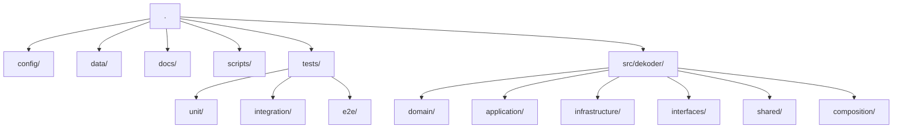
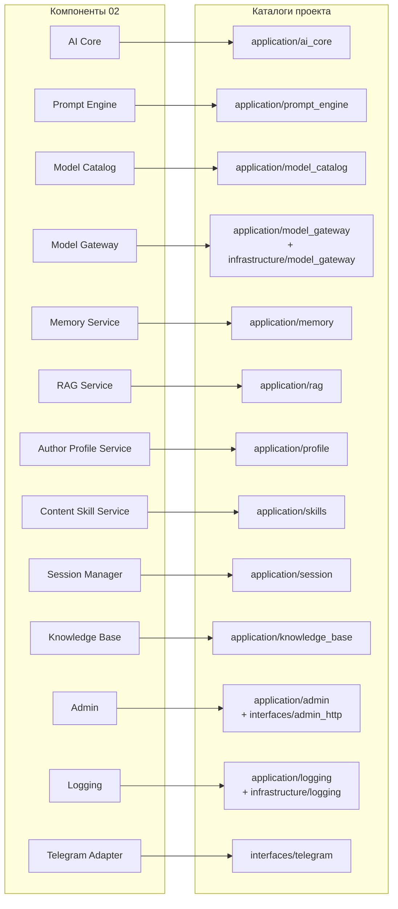
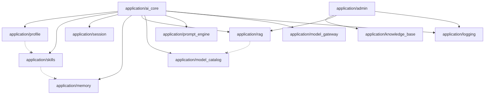
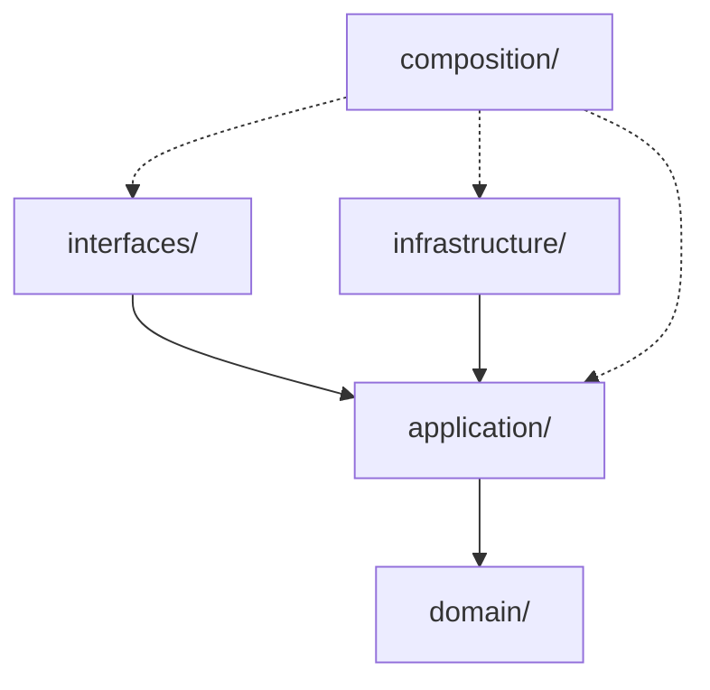

# Структура проекта — MVP персонального AI-ассистента «Декодер» (версия 2.0)

**Версия документа:** 2.0
**Статус:** Draft
**Дата:** 2026-07-28
**Основание:** [`01_requirements_analysis_v2.0.md`](01_requirements_analysis_v2.0.md) (требования, версия 2.0, Approved), [`02_system_architecture_v2.0.md`](02_system_architecture_v2.0.md) (архитектура, версия 2.0, Approved)
**Соотношение с версией 1.0:** [`docs/03_project_structure.md`](../03_project_structure.md) описывает структуру проекта для состава MVP версии 1.0 (модуль на bounded context: `modules/<module>/{domain,application,adapters}`) и не изменяется этим документом. Состав компонентов версии 2.0 (Author Profile Service, Content Skill Service, Session Manager, Prompt Engine, Model Catalog, Model Gateway) и организация архитектуры вокруг единого AI Core (`02_system_architecture_v2.0.md`) делают точечное редактирование структуры версии 1.0 нецелесообразным — структура спроектирована заново.

## 1. Назначение документа

Документ определяет организацию исходного кода проекта «Декодер» версии 2.0: структуру каталогов, назначение каждого каталога, правила зависимостей и импортов между слоями, расположение компонентов и точки расширения кодовой базы.

Структура проекта — прямая проекция архитектуры из `02_system_architecture_v2.0.md` на файловую систему: каждый логический компонент, порт и адаптер архитектуры имеет ровно одно определённое место в дереве каталогов (раздел 6). Документ отвечает на вопрос **«как должна выглядеть кодовая база проекта»** — он не пересматривает архитектуру и не переопределяет бизнес-требования, а показывает, где в коде размещается то, что уже зафиксировано в `01` и `02`.

Документ не описывает модель данных, SQL, REST API, классы или конкретную реализацию — эти вопросы (там, где они не относятся к структуре каталогов) остаются предметом последующих проектных документов (доменная модель, внутренние интерфейсы, окружение разработки), которые для версии 2.0 будут спроектированы отдельно вслед за этим документом.

## 2. Принципы организации проекта

| Принцип | Пояснение |
|---|---|
| **Feature-oriented structure** | Внутри каждого архитектурного слоя (`domain/`, `application/`) код группируется по бизнес-модулю (`profile/`, `skills/`, `memory/`, `rag/` и т. д.), а не по техническому типу файла. Найти весь код, относящийся к одному компоненту архитектуры, можно по одному и тому же имени подкаталога в каждом слое. |
| **Clean Architecture** | Верхнеуровневое деление проекта — по слоям (`domain/` → `application/` → `infrastructure/`/`interfaces/`), а не по модулям. Направление зависимостей — только внутрь, к `domain/`; ни один внутренний слой не знает о существовании внешних. |
| **High Cohesion** | Всё, что относится к одному бизнес-модулю (сущности, use case'ы, порты), располагается рядом — в одноимённых подкаталогах `domain/<module>/` и `application/<module>/`. Изменение правил одного модуля не требует правок в других частях дерева. |
| **Low Coupling** | Модули внутри `application/` не импортируют внутренности друг друга напрямую — взаимодействие идёт только через порты (раздел 7) и только там, где это разрешено архитектурой (`02`, раздел 4: только AI Core и Admin вызывают несколько других application-модулей). |
| **Dependency Rule** | Зависимости исходного кода направлены только внутрь: `interfaces/` и `infrastructure/` зависят от `application/`, `application/` зависит от `domain/`, `domain/` не зависит ни от чего в проекте, кроме `shared/domain/`. Ни один внутренний каталог не импортирует внешний (раздел 7, раздел 8). |
| **Explicit Module Boundaries** | Граница каждого бизнес-модуля — это его подкаталог и ничего за его пределами. Порты объявляют, что модуль отдаёт вовне; всё остальное (внутренние детали) не импортируется из-за пределов модуля. |

## 3. Общая структура проекта

```text
.
├── config/
├── data/
├── docs/
├── scripts/
├── tests/
│   ├── unit/
│   ├── integration/
│   └── e2e/
└── src/
    └── dekoder/
        ├── domain/
        ├── application/
        ├── infrastructure/
        ├── interfaces/
        ├── shared/
        └── composition/
```



`composition/` добавлен к дереву, предложенному для этого документа: без единственного места, которому разрешено одновременно знать о портах (`application/`) и адаптерах (`infrastructure/`), Dependency Rule (раздел 2, раздел 7) физически нечем было бы обеспечить — кто-то должен собрать конкретные адаптеры и передать их use case'ам. Это тот же принцип, что и в архитектуре (`02`, раздел 9: «конкретные адаптеры подключаются извне, в композиционном корне»).

## 4. Назначение каталогов

### `domain/`

**Что находится.** Сущности и типы бизнес-модулей, отражающие уже согласованные сущности требований и архитектуры (`01`, `02`): `Author Profile`, `Content Skill`, `Generation Session State`, `Dialogue History`/`Long-term Memory`, `Document`/`Case`, `Fragment`, метаданные `Model Catalog`. Инварианты, которые должны соблюдаться независимо от способа хранения или доставки.

**Чего не должно быть.** Обращений к базе данных, HTTP, Telegram, внешним провайдерам моделей; импортов из `application/`, `infrastructure/`, `interfaces/`; фреймворко-зависимого кода.

Подкаталоги: `profile/`, `skills/`, `session/`, `memory/`, `knowledge_base/`, `rag/`, `model_catalog/`, `logging/` (аудиторские/системные записи — раздел 5, «Организация модулей»).

---

### `application/`

**Какие use case'ы.** Оркестрация одного сценария в границах одного бизнес-модуля: создание/архивирование профиля, постановка и подтверждение черновика факта, поиск релевантных фрагментов, выбор совместимой модели.

**Какие orchestrators.** Единственный кросс-модульный оркестратор — `ai_core/` (раздел 5); второй, более узкий — `admin/`, оркеструющий `knowledge_base/` и `rag/` по действию администратора (`02`, раздел 6, компонент Admin).

**Какие сервисы.** Application-сервисы, соответствующие логическим компонентам `02` (раздел 6): Author Profile Service, Content Skill Service, Session Manager, Prompt Engine, Model Catalog, Memory Service, RAG Service — каждый как отдельный подкаталог.

**Чего не должно быть.** Импортов `infrastructure/` или `interfaces/`; SQL, HTTP-клиентов, Telegram-библиотек, клиентов конкретных провайдеров моделей.

---

### `infrastructure/`

**Repositories.** Реализации портов чтения/записи (`ProfileRepository`, `ContentSkillRepository`, `ModelCatalogRepository`, `SessionRepository`, `MemoryRepository`, `KnowledgeRepository`) — все в `persistence/`, поверх одного хранилища структурированных данных.

**Adapters.** `model_gateway/` — реализации порта `ModelGateway` для текстовых моделей и моделей генерации изображений; `vector_storage/` — реализация `VectorRepository`; `filesystem/` — реализация `FileStoragePort`.

**Persistence.** Общая инфраструктура подключения к хранилищу структурированных данных (фабрика соединения), от которой зависят только репозитории `persistence/` — не бизнес-логика.

**External providers.** Вся интеграция с внешними AI-провайдерами изолирована внутри `model_gateway/`; ни один другой каталог `infrastructure/` не знает о внешних провайдерах.

**Чего не должно быть.** Бизнес-правил (проверка совместимости, приоритет источников контекста, лимиты профилей); импортов `interfaces/`; вызовов use case'ов `application/` (направление зависимости — только `infrastructure/ → application/`, не наоборот).

---

### `interfaces/`

**Telegram.** Единственный driving-канал MVP (`01`, раздел 4.1) — переводит обновления Telegram Bot API в вызов `application/ai_core/` и обратно.

**Admin UI.** Веб-интерфейс панели администратора — переводит HTTP-запросы в вызовы `application/admin/`.

**CLI, Future Web.** В MVP не создаются — `02` (раздел 13) описывает их как точки расширения, а не текущий состав. Каталог `interfaces/` спроектирован так, чтобы новый канал добавлялся как ещё один подкаталог на этом же уровне, реализующий тот же входной контракт `application/ai_core/`, без изменения существующих каналов (раздел 11).

**Чего не должно быть.** Обращений к репозиториям или адаптерам `infrastructure/` напрямую; бизнес-правил; форматирования ответа на основе данных, а не на основе того, что уже вернул `application/`.

---

### `shared/`

**Exceptions.** Базовые категории ошибок (доменная, прикладная — раздел 12 архитектуры), общие для всех модулей; не заменяют собственные проверки модуля.

**Types.** Общие идентификаторы (пользователь, диалог, документ и т. п.) и кросс-модульные контракты, которые должны быть видны нескольким `application/`-модулям одновременно, не будучи частью ни одного из них, — в первую очередь **Execution Context** (`02`, раздел 7): он не принадлежит ни `ai_core/`, ни `prompt_engine/`, поэтому его тип объявлен здесь, а не в одном из них (иначе другой модуль был бы вынужден импортировать внутренности первого).

**Utilities.** Не привязанные к бизнес-логике вспомогательные функции (например, генерация идентификатора трассировки операции).

**Configuration.** Единственная точка чтения переменных окружения и загрузки конфигурации (модели, каталог, лимиты) — потребляется только `composition/`.

Внутреннее деление `shared/` — по тому же принципу, что и весь проект (раздел 2): `domain/` (базовые исключения и идентификаторы, ноль внешних зависимостей), `application/` (кросс-модульные контракты, в первую очередь Execution Context), `config/` (загрузка переменных окружения), `utils/` (вспомогательные функции без бизнес-логики).

---

### `tests/`

Структура тестов — раздел 9.

---

### `docs/`

Проектная документация репозитория (в том числе документы серии `docs/versions/`, включая этот). Не участвует в исполняемой кодовой базе.

---

### `scripts/`

Вспомогательные операционные скрипты (загрузка seed-данных при первом запуске, разовые обслуживающие операции). Не содержат бизнес-логики и не импортируются из `src/dekoder/` — вызывают публичные точки входа (composition root) так же, как это делает `main.py`.

---

### `config/`

Файлы конфигурации, не являющиеся секретами: каталог моделей, каталог Content Skills, seed-профиль по умолчанию, конфигурация журналирования. Формат и точный состав — раздел 10.

---

### `data/`

Каталог для персистентных данных на постоянном томе (файл хранилища структурированных данных, оригиналы документов базы знаний). Не содержит кода и не коммитится в репозиторий как данные — только как путь по умолчанию.

## 5. Организация модулей

```text
domain/
    profile/
    skills/
    session/
    memory/
    knowledge_base/
    rag/
    model_catalog/
    logging/

application/
    ai_core/
    prompt_engine/
    model_gateway/
    profile/
    skills/
    session/
    memory/
    rag/
    model_catalog/
    knowledge_base/
    admin/
    logging/
```

Каждый подкаталог `domain/<module>/` и `application/<module>/` с одинаковым именем — одна и та же зона ответственности архитектуры (`02`, раздел 6), рассечённая на «что это» (`domain/`) и «что с этим можно сделать» (`application/`). Ниже — что именно означает каждый модуль `application/`.

| Модуль `application/` | Соответствует компоненту `02` | Содержит |
|---|---|---|
| `ai_core/` | AI Core | Единственный входной use case обработки запроса; сборка Execution Context (`shared/`, раздел 4) перед вызовом `prompt_engine/`; маршрутизация команд памяти и сценария. |
| `prompt_engine/` | Prompt Engine | Детерминированное построение инструкции из Execution Context; не вызывает ничего за пределами собственного модуля (`02`, раздел 6). |
| `model_gateway/` | Model Gateway | Порт `ModelGateway` — единый контракт вызова модели (TEXT/IMAGE), не зависящий от поставщика. |
| `profile/` | Author Profile Service | Правила профиля автора: лимит активных профилей, архивирование, проверка принадлежности. |
| `skills/` | Content Skill Service | Чтение каталога Content Skills, фильтрация по модальности и типу контента. |
| `session/` | Session Manager | Правила Generation Session State: отмена, сброс, распознавание устаревшего состояния. |
| `memory/` | Memory Service | Dialogue History и Long-term Memory: запись реплик, черновик факта, подтверждение, удаление. |
| `rag/` | RAG Service | Семантический поиск фрагментов по запросу; не хранит оригиналы документов. |
| `model_catalog/` | Model Catalog | Метаданные разрешённых моделей, правило режима «Автоматически». |
| `knowledge_base/` | Knowledge Base | Порты чтения/записи метаданных документов, кейсов, связей и оригиналов файлов — без собственных use case'ов (чистый CRUD, аналогично `01`, раздел 4.6; use case'ы, которые этим управляют, — в `admin/`). |
| `admin/` | Admin | Use case'ы управления документами/кейсами, инициирование индексации через `rag/`, аутентификация административной учётной записи. |
| `logging/` | Logging | Порт `Logger`; правила исключения чувствительных данных из журналов. |

`domain/` не содержит подкаталога `ai_core/`, `prompt_engine/` или `model_gateway/`: у этих трёх компонентов нет собственных долгоживущих сущностей — они оперируют данными, которые предоставляют другие модули, через Execution Context (`shared/`).

## 6. Mapping архитектуры на проект

### Логические компоненты

| Архитектурный компонент (`02`, раздел 6) | Каталог проекта |
|---|---|
| Telegram Adapter | `interfaces/telegram/` |
| AI Core | `application/ai_core/` |
| Author Profile Service | `application/profile/` (+ `domain/profile/`) |
| Content Skill Service | `application/skills/` (+ `domain/skills/`) |
| Session Manager | `application/session/` (+ `domain/session/`) |
| Prompt Engine | `application/prompt_engine/` |
| Model Catalog | `application/model_catalog/` (+ `domain/model_catalog/`) |
| Model Gateway | `application/model_gateway/` (порт) → `infrastructure/model_gateway/` (реализации) |
| Memory Service | `application/memory/` (+ `domain/memory/`) |
| RAG Service | `application/rag/` (+ `domain/rag/`) |
| Knowledge Base | `application/knowledge_base/` (+ `domain/knowledge_base/`) |
| Admin | `application/admin/`, `interfaces/admin_http/` |
| Logging | `application/logging/` (+ `domain/logging/`) → `infrastructure/logging/` (реализация) |

### Execution Context

| Сущность (`02`, раздел 7) | Расположение |
|---|---|
| Execution Context | `shared/` — не компонент и не модуль `application/`; кросс-модульный DTO, собираемый `application/ai_core/` (раздел 4, подраздел `shared/`). |

### Порты

| Порт (`02`, раздел 8) | Каталог проекта |
|---|---|
| `ProfileRepository` | `application/profile/` |
| `ContentSkillRepository` | `application/skills/` |
| `ModelCatalogRepository` | `application/model_catalog/` |
| `SessionRepository` | `application/session/` |
| `MemoryRepository` | `application/memory/` |
| `KnowledgeRepository` | `application/knowledge_base/` |
| `FileStoragePort` | `application/knowledge_base/` |
| `VectorRepository` | `application/rag/` |
| `ModelGateway` | `application/model_gateway/` |
| `PromptBuilder` | `application/prompt_engine/` |
| `Logger` | `application/logging/` |

### Адаптеры

| Адаптер (`02`, раздел 9) | Каталог проекта |
|---|---|
| Telegram Adapter | `interfaces/telegram/` |
| Database Adapter | `infrastructure/persistence/` |
| Vector Storage Adapter | `infrastructure/vector_storage/` |
| LLM Adapter | `infrastructure/model_gateway/llm/` |
| Image Model Adapter | `infrastructure/model_gateway/image_model/` |
| Filesystem Adapter | `infrastructure/filesystem/` |
| Admin UI Adapter | `interfaces/admin_http/` |
| Logging Adapter | `infrastructure/logging/` |



## 7. Правила зависимостей

| Слой | Знает | Не знает |
|---|---|---|
| `domain/` | Только `shared/domain/` и стандартную библиотеку | `application/`, `infrastructure/`, `interfaces/` — ни один из них, включая свои собственные порты |
| `application/` | Свой `domain/<module>/`; `shared/`; порты и (только для `ai_core/` и `admin/`) use case'ы других модулей `application/` | `infrastructure/`, `interfaces/`; конкретных адаптеров; Telegram, HTTP, SQL, клиентов моделей |
| `infrastructure/` | Свой порт из `application/<module>/`, который реализует; `domain/<module>/` — для типов, которые возвращает; `shared/` | Другие модули `infrastructure/` напрямую (без обхода через use case уровня выше); `interfaces/` |
| `interfaces/` | `application/ai_core/` (Telegram) или `application/admin/` (Admin UI) — только use case'ы своего целевого модуля | `infrastructure/`; порты и use case'ы чужих `application/`-модулей напрямую; друг друга |
| `composition/` | Всё — порты и адаптеры всех модулей, `interfaces/`, `shared/config/` | — (единственное исключение из правил выше) |

Правило раздела 4 архитектуры (`02`) — «только AI Core и Admin вызывают несколько application-сервисов в рамках одного запроса» — на уровне проекта означает: только `application/ai_core/` и `application/admin/` импортируют use case'ы/порты **других** подкаталогов `application/*`. Все остальные модули `application/` (profile, skills, session, memory, rag, model_catalog, prompt_engine, model_gateway, knowledge_base, logging) не импортируют друг друга — это исключает циклические зависимости между ними по построению: граф вызовов внутри `application/` — звезда с двумя центрами (`ai_core`, `admin`), а не сеть.



Пунктирные линии с крестом на диаграмме — примеры запрещённых связей: ни один листовой модуль `application/` не имеет исходящей зависимости на другой листовой модуль.

## 8. Правила импортов

```text
interfaces
   ↓
application
   ↓
domain
   ↑
infrastructure
```



Сплошные стрелки — обязательное направление импорта каждого слоя; пунктирные — то, что знает только `composition/` (раздел 7), больше никто. Направление стрелок — направление разрешённого импорта. Запрещено:

- `domain` не импортирует `application` — доменные типы не должны знать, как их будут использовать.
- `domain` не импортирует `infrastructure` или `interfaces` — ни напрямую, ни через `application`.
- `application` не импортирует `infrastructure` — use case'ы работают только с портами, объявленными в собственном подкаталоге `application/<module>/`.
- `application` не импортирует `interfaces` — бизнес-логика не должна знать о существовании конкретного канала доставки.
- `infrastructure` не импортирует `interfaces` и наоборот — это два разных внешних слоя, не связанных друг с другом; их общий знаменатель — только `application` (порты) и `domain` (типы).
- Ни один модуль `infrastructure/<adapter>/` не импортирует другой модуль `infrastructure/<adapter>/` — согласованность между несколькими адаптерами (например, при удалении документа: метаданные + файл + векторный индекс) обеспечивает use case уровня `application/` (`admin/`), а не адаптеры друг через друга.
- `shared/domain/` не импортирует ничего, кроме стандартной библиотеки; `shared/application/` (в первую очередь Execution Context) может зависеть от `domain/`-типов нескольких модулей, но не от `application/`, `infrastructure/` или `interfaces/` какого-либо конкретного модуля.
- Только `composition/` не подчиняется этим ограничениям — это единственное место, которому разрешено одновременно импортировать порты (`application/*`) и адаптеры (`infrastructure/*`, `interfaces/*`).

## 9. Структура тестов

```text
tests/
    unit/
        domain/
        application/
    integration/
        infrastructure/
        interfaces/
    e2e/
```

- **`unit/`** зеркалирует `domain/` и `application/` — тесты бизнес-правил без ввода-вывода; вместо портов подставляются тестовые реализации, реальная инфраструктура не поднимается (соответствует принципу тестируемости, `02`, раздел 14).
- **`integration/`** зеркалирует `infrastructure/` и `interfaces/` — тесты конкретных адаптеров (репозиториев, векторного хранилища, шлюза моделей, Telegram/Admin UI) против реальной или временной тестовой инфраструктуры.
- **`e2e/`** — тесты полного сценария через `interfaces/` и `composition/`, аналогично реальному запуску приложения, без деления по внутренним слоям.

## 10. Конфигурация проекта

| Что | Где |
|---|---|
| Переменные окружения (`.env`, секреты, пути) | Корень репозитория (`.env.example` — шаблон; `.env.local`/переменные окружения контейнера — не коммитятся), загружаются только `shared/config/` |
| Конфигурация журналирования | `config/` |
| Каталог моделей (Model Catalog, seed) | `config/` — читается `infrastructure/persistence/` при первичной загрузке, аналогично тому, как в версии 1.0 загружался единый профиль |
| Каталог Content Skills (seed) | `config/` |
| Шаблоны/правила Skills, используемые Prompt Engine | `config/` — конфигурация, а не код; `application/prompt_engine/` и `application/skills/` читают её через порты, не хранят как константы в коде |

Ни один файл конфигурации не читается напрямую из `application/` или `domain/` — только через `shared/config/` (единственная точка чтения переменных окружения) и порты соответствующих модулей (единственная точка чтения seed-данных из `config/`).

## 11. Расширяемость структуры

| Расширение | Что добавляется | Что не меняется |
|---|---|---|
| Новый Skill | Запись в `config/` (каталог Content Skills) | `application/skills/`, `application/ai_core/`, `application/prompt_engine/` |
| Новый Adapter (провайдер модели) | Новый подкаталог в `infrastructure/model_gateway/` | `application/model_gateway/`, `application/ai_core/` |
| Новый Interface (канал) | Новый подкаталог в `interfaces/`, реализующий контракт `application/ai_core/` | Существующие подкаталоги `interfaces/`, весь `application/` |
| Новый Provider эмбеддингов/векторного хранилища | Новый подкаталог в `infrastructure/vector_storage/` или замена его содержимого | `application/rag/` |
| Новый модуль (бизнес-домен) | Пара новых подкаталогов `domain/<module>/` + `application/<module>/`, подключённых в `composition/` | Существующие модули `domain/` и `application/` |

Правило одно и то же для всех случаев из раздела 10 архитектуры (`02`): новый код появляется только в новом подкаталоге на уже существующем уровне дерева (`interfaces/`, `infrastructure/<adapter>/`, `config/`) и в `composition/`, где он подключается, — файлы существующих модулей `domain/` и `application/` не редактируются.

## 12. Архитектурные ограничения

- `domain/` не знает об инфраструктуре — ни один файл `domain/` не импортирует `infrastructure/`, `interfaces/` или сторонние библиотеки.
- `AI Core` (`application/ai_core/`) не зависит от Telegram — работает только с входным/выходным контрактом, который переводит `interfaces/telegram/`.
- `Prompt Engine` (`application/prompt_engine/`) не знает моделей — принимает и возвращает данные через Execution Context и инструкцию, не импортирует `application/model_gateway/` и не импортирует `infrastructure/model_gateway/`.
- Репозитории реализуются только в `infrastructure/` — ни один порт из `application/` не имеет реализации внутри `application/` или `domain/`.
- Execution Context не хранится между запросами — это объект в памяти одного вызова `application/ai_core/`, а не сущность `domain/` и не запись в `infrastructure/persistence/`.
- Новые интерфейсы добавляются как отдельные подкаталоги `interfaces/`, реализующие уже существующий входной контракт, а не как изменение `application/ai_core/`.
- Ни один модуль `application/`, кроме `ai_core/` и `admin/`, не импортирует другой модуль `application/*` (раздел 7) — это ограничение проверяется тем же способом, что и в версии 1.0 (`docs/03_project_structure.md`, раздел 15): статическим анализом графа импортов как часть CI, а не разовой проверкой.

## Результат

### Итоговое дерево `src/dekoder/`

```text
src/dekoder/
├── domain/
│   ├── profile/
│   ├── skills/
│   ├── session/
│   ├── memory/
│   ├── knowledge_base/
│   ├── rag/
│   ├── model_catalog/
│   └── logging/
├── application/
│   ├── ai_core/
│   ├── prompt_engine/
│   ├── model_gateway/
│   ├── profile/
│   ├── skills/
│   ├── session/
│   ├── memory/
│   ├── rag/
│   ├── model_catalog/
│   ├── knowledge_base/
│   ├── admin/
│   └── logging/
├── infrastructure/
│   ├── persistence/
│   ├── vector_storage/
│   ├── model_gateway/
│   │   ├── llm/
│   │   └── image_model/
│   ├── filesystem/
│   └── logging/
├── interfaces/
│   ├── telegram/
│   └── admin_http/
├── shared/
│   ├── domain/
│   ├── application/
│   ├── config/
│   └── utils/
└── composition/
```
