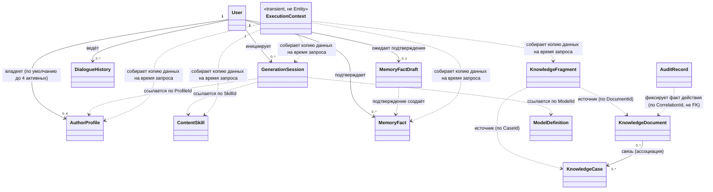
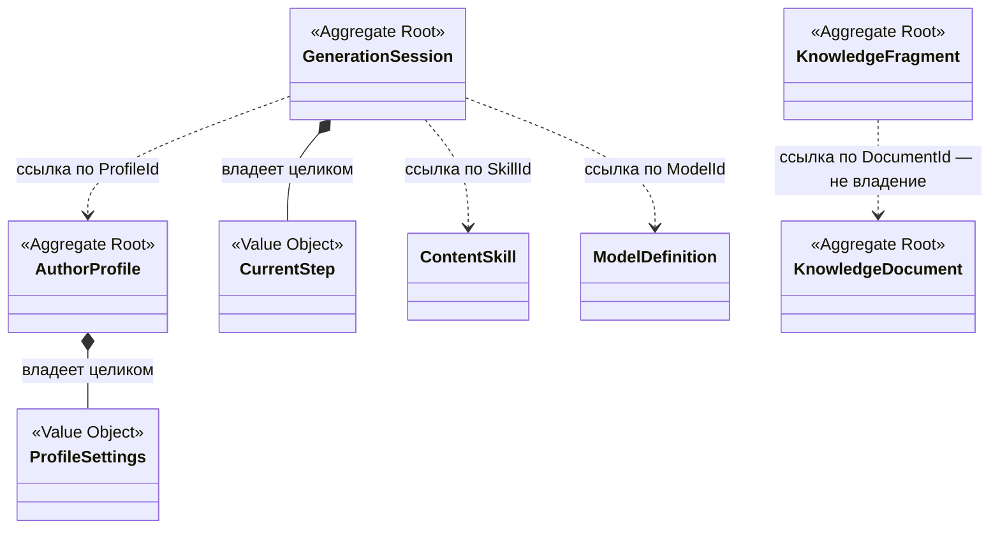
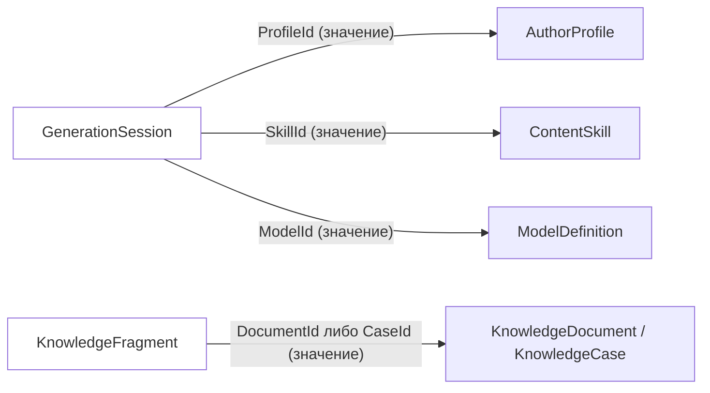
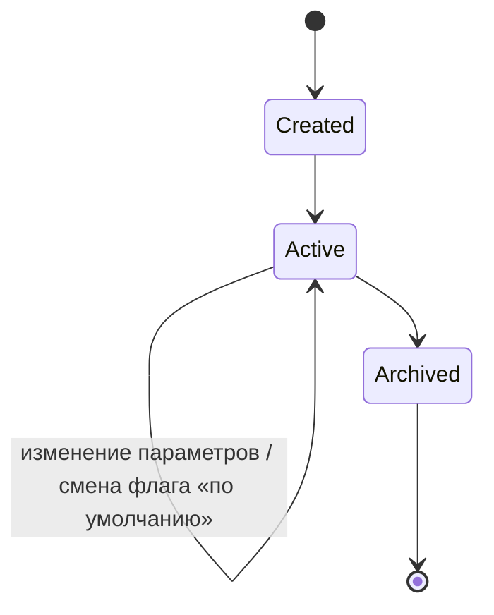
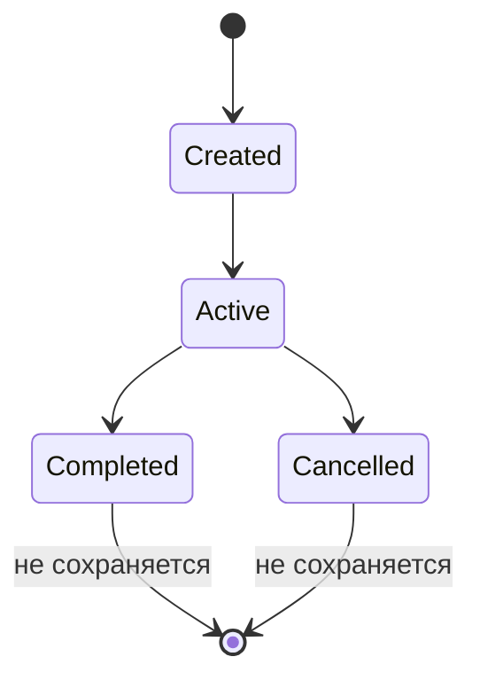
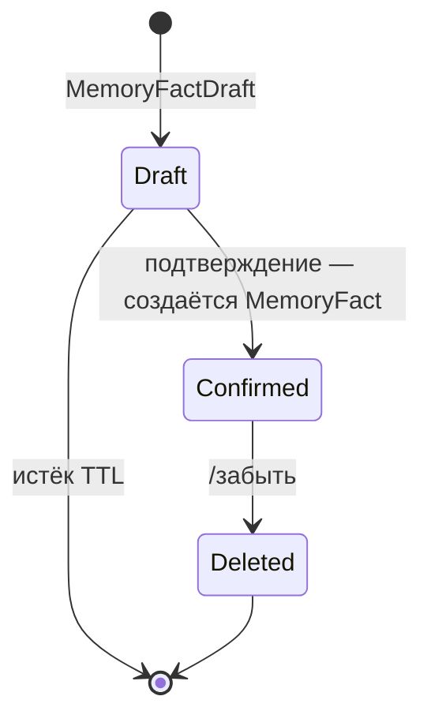
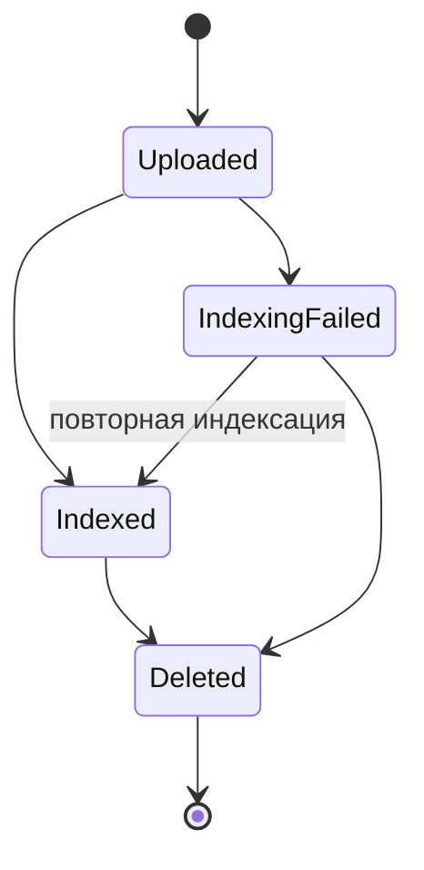
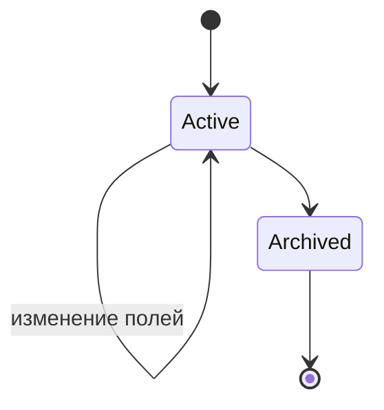
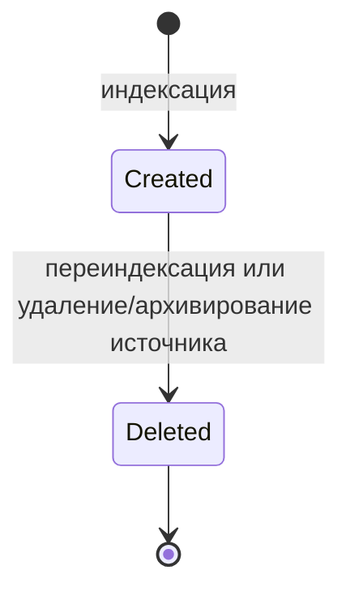

# Доменная модель — MVP персонального AI-ассистента «Декодер» (версия 2.0)

**Версия документа:** 2.0
**Статус:** Approved
**Дата:** 2026-07-28
**Основание:** [`01_requirements_analysis_v2.0.md`](01_requirements_analysis_v2.0.md) (требования, версия 2.0, Approved), [`02_system_architecture_v2.0.md`](02_system_architecture_v2.0.md) (архитектура, версия 2.0, Approved), [`03_project_structure_v2.0.md`](03_project_structure_v2.0.md) (структура проекта, версия 2.0)
**Соотношение с версией 1.0:** [`docs/04_domain_model.md`](../04_domain_model.md) описывает доменную модель состава MVP версии 1.0 (единый профиль автора, `DialogueMessage`/`FactDraft`/`Fact`/`Document`/`Case`/`Fragment` в границах модулей `profile`/`memory`/`knowledge_base`/`search`) и не изменяется этим документом. Новые сущности версии 2.0 (`AuthorProfile` с множественностью, `ContentSkill`, `GenerationSession`, `ModelDefinition`) и переосмысление владения (RAG отделён от Knowledge Base, Session отделена от Memory — `02`, раздел 15) делают точечное редактирование модели версии 1.0 нецелесообразным — модель спроектирована заново.

## 1. Назначение документа

Документ определяет предметную модель системы «Декодер» версии 2.0: какие сущности существуют в предметной области, какими правилами (инвариантами) они обладают, как связаны между собой и как меняется их состояние во времени.

Документ отвечает на вопрос **«какие сущности существуют в предметной области и какими правилами они обладают»** — не «как эти данные хранятся». Он не описывает физическую схему базы данных, ORM, репозитории, SQL, JSON, REST API или сериализацию: способ хранения относится к внутренним интерфейсам и структуре проекта (`03`) и последующим проектным документам, а не к этому. Логическая модель ниже — то, что должно оставаться верным независимо от выбранной СУБД, формата хранения или API.

## 2. Принципы доменной модели

| Принцип | Пояснение |
|---|---|
| **Rich Domain Model** | Сущности несут собственные правила и ограничения (раздел 8), а не являются пустыми контейнерами данных, которые проверяет кто-то снаружи. Правило «архивный профиль нельзя выбрать для генерации» — часть определения `AuthorProfile`, а не проверка, разбросанная по вызывающему коду. |
| **Explicit Invariants** | Каждая сущность документирует, что не должно нарушаться никогда, независимо от того, как именно система это обеспечивает технически (раздел 8). Инвариант формулируется как факт о предметной области, а не как проверка кода. |
| **Aggregate Boundaries** | Каждая сущность принадлежит ровно одному агрегату; согласованность (атомарность изменения) гарантируется только внутри границ одного агрегата. Между агрегатами согласованность — на усмотрение вызывающей стороны (сценария), а не самой модели (раздел 6, раздел 7). |
| **Immutable Value Objects** | Value Object не имеет собственной идентичности и жизненного цикла — два объекта с одинаковым значением неразличимы и взаимозаменяемы; после создания Value Object не изменяется, а заменяется целиком новым значением (раздел 5). |
| **Identity vs Value** | Сущность (Entity) различается по идентификатору даже при полном совпадении атрибутов (два профиля с одинаковым названием — разные профили); Value Object различается только по значению (два одинаковых `GenerationType` — один и тот же `GenerationType`). Это разграничение проведено явно для каждого понятия модели (разделы 4–5) — нигде оно не смешивается. |
| **Ubiquitous Language** | Термины модели — те же, что в `01`–`03`, без переименований и синонимов: `Author Profile`, `Content Skill`, `Generation Type`, `Generation Session`, `Execution Context`, `Prompt Engine`, `Model Catalog`, `Dialogue History`, `Long-term Memory`, `Knowledge Base` (раздел 12 — словарь). |

## 3. Общая модель предметной области

Пунктирные стрелки (`..>`) — не владение и не хранимая связь, а ссылка по идентификатору или временное чтение на момент одного запроса (раздел 7). Сплошные стрелки — владение (агрегат владеет вложенным значением или диапазоном экземпляров, раздел 6). `ExecutionContext` показан на диаграмме для полноты картины предметной области, но отмечен как не-Entity (раздел 11) — он не участвует в разделах 4, 6, 8 как самостоятельная сущность.

## 4. Доменные сущности (Entities)

### User

**Ответственность.** Идентифицирует человека, с которым связаны все остальные данные предметной области (профили, память, сессии, история).

**Идентичность.** `UserId` — Telegram User ID (`01`, раздел 2.4). Не создаётся и не выпускается системой — предоставляется внешней средой (Telegram) при первом обращении.

**Жизненный цикл.** Не управляется этой системой: система не ведёт отдельной регистрации, создания или удаления пользователя (`01`, раздел 2.4 — «отдельная регистрация пользователей отсутствует»). `User` существует в модели постольку, поскольку существует его `UserId`, на который ссылаются другие сущности.

**Инварианты.** `UserId` неизменен и уникален на всём протяжении взаимодействия; ни одна сущность, принадлежащая одному `UserId`, не может быть переназначена другому.

**Связи.** Владеет (по идентификатору) `AuthorProfile` (0..4 активных), `GenerationSession` (0..*), `DialogueHistory` (0..*), `MemoryFactDraft` (0..1 одновременно), `MemoryFact` (0..*). `User` не является агрегатом в строгом смысле (раздел 6) — у него нет собственных изменяемых полей и правил, кроме факта существования идентификатора.

---

### AuthorProfile

**Ответственность.** Определяет стиль, тон, нишу и ограничения, применяемые к форме генерируемого контента для одного пользователя.

**Идентичность.** `ProfileId`.

**Жизненный цикл.** Создан (мастером в Telegram) → Активен (возможно, с флагом «профиль по умолчанию») → Архивирован. Обратного перехода из «Архивирован» нет — удаления как отдельного состояния не существует (`01`, раздел 2.3: архивирование заменяет удаление).

**Инварианты.** Раздел 8.

**Связи.** Принадлежит ровно одному `User`. Ссылается на него `GenerationSession` (по `ProfileId`) в момент генерации.

---

### ContentSkill

**Ответственность.** Специализированный конфигурируемый сценарий генерации: определяет, какая модальность и тип контента поддерживаются, какие исходные данные требуются, какой режим RAG и памяти применяется (`01`, раздел 4.5). Не автономный агент — набор правил и параметров.

**Идентичность.** `SkillId`.

**Жизненный цикл.** Определяется конфигурацией/seed-данными при развёртывании (`01`, раздел 4.5) — не создаётся, не изменяется и не удаляется пользователем или администратором в runtime. В границах одного развёртывания `ContentSkill` — практически неизменяемый справочник; переход между версиями каталога — операция вне области этой модели.

**Инварианты.** Раздел 8.

**Связи.** Не принадлежит `User`. На него ссылается `GenerationSession` (по `SkillId`); он сам ссылается (по значению, не по идентичности) на совместимые `GenerationType` и совместимые `ModelDefinition` (раздел 5, раздел 7).

---

### GenerationSession

**Ответственность.** Представляет состояние одного незавершённого пользовательского сценария создания контента или управления профилем: что уже выбрано (профиль, тип контента, Skill, модель), какие данные уже введены, на каком шаге находится пользователь (`01`, раздел 4.10; `02`, раздел 6, Session Manager).

**Идентичность.** `SessionId`.

**Жизненный цикл.** Раздел 9.

**Инварианты.** Раздел 8.

**Связи.** Принадлежит ровно одному `User`. Ссылается на `AuthorProfile`, `ContentSkill`, `ModelDefinition` только по идентификатору — не хранит и не встраивает сами эти сущности (раздел 7).

---

### DialogueHistory

**Ответственность.** Одна реплика диалога — пользователя или ассистента, необходимая для продолжения текущего разговора (`01`, раздел 4.10). Совокупность (упорядоченный по времени набор) таких реплик, принадлежащих одному пользователю, и есть то, что `01`/`02` называют историей диалога; отдельного объекта-«контейнера истории» с собственной идентичностью в модели нет — есть только упорядоченное множество записей одного типа.

**Идентичность.** Идентификатор одной реплики (`DialogueEntryId`). Совпадающий по смыслу текст двух разных реплик не делает их одной и той же записью.

**Жизненный цикл.** Создана (в момент получения сообщения либо в момент формирования ответа) → далее не редактируется. Записи не удаляются и не архивируются в этой модели.

**Инварианты.** Раздел 8.

**Связи.** Принадлежит ровно одному `User`. Не связана напрямую ни с `AuthorProfile`, ни с `MemoryFact` — эти сущности независимы (раздел 11: «`DialogueHistory` не является памятью»).

---

### MemoryFactDraft

**Ответственность.** Временный черновик факта, ожидающий явного подтверждения пользователем перед сохранением в долговременную память (`01`, раздел 4.10).

**Идентичность.** `DraftId`.

**Жизненный цикл.** Создан (командой `/запомнить`) → Подтверждён (создаёт `MemoryFact`, черновик прекращает существовать) либо Истёк по TTL (черновик удаляется без следа). Черновик никогда не редактируется.

**Инварианты.** Раздел 8.

**Связи.** Принадлежит ровно одному `User`. Подтверждение — единственный способ появления `MemoryFact`; прямого создания факта, минуя черновик, не существует.

---

### MemoryFact (сущность `LongTermMemory`)

**Ответственность.** Один подтверждённый факт о пользователе, сохранённый только по его явному подтверждению (`01`, раздел 4.10). Это конкретный экземпляр того, что `01`/`02` называют долговременной памятью (`Long-term Memory`) — как и в случае с `DialogueHistory`, отдельного «объекта памяти» сверх множества таких фактов модель не вводит.

**Идентичность.** `FactId`. Не совпадает и не наследуется от `DraftId` черновика, из которого факт возник, — подтверждение создаёт новую сущность, а не переименовывает черновик (раздел 9).

**Жизненный цикл.** Создан (только через подтверждение `MemoryFactDraft`) → Удалён (командой `/забыть`). Текст факта не редактируется никогда.

**Инварианты.** Раздел 8.

**Связи.** Принадлежит ровно одному `User`. Не связан с `AuthorProfile` — факт о пользователе и профиль автора относятся к разным субъектам (раздел 11).

---

### KnowledgeDocument

**Ответственность.** Метаданные документа заказчика в базе знаний: заголовок, категория, метки, статус индексации, ссылка на оригинал файла (`01`, раздел 4.6; `02`, раздел 6, Knowledge Base).

**Идентичность.** `DocumentId`.

**Жизненный цикл.** Раздел 9.

**Инварианты.** Раздел 8.

**Связи.** Не принадлежит `User` — база знаний едина для всех пользователей (`01`, раздел 4.9). Связан с `KnowledgeCase` через association-связь (многие-ко-многим, ни один документ и ни один кейс не владеют этой связью единолично). На него ссылается `KnowledgeFragment` (по `DocumentId`), когда источник фрагмента — документ.

---

### KnowledgeCase

**Ответственность.** Структурированный пример выполнения пользовательской задачи (исходные данные, тип задачи, ожидаемый подход, пример результата) — дополнительный пример для формирования ответа, не клиентский проект и не отдельная база знаний (`01`, раздел 3, сценарий 19).

**Идентичность.** `CaseId`.

**Жизненный цикл.** Активен → Архивирован (раздел 9). В отличие от `KnowledgeDocument`, физического удаления у `KnowledgeCase` нет — только архивирование (асимметрия закреплена уже в `01`, раздел 4.11).

**Инварианты.** Раздел 8.

**Связи.** Не принадлежит `User`. Связан с `KnowledgeDocument` через ту же association-связь. На него ссылается `KnowledgeFragment` (по `CaseId`), когда источник фрагмента — кейс.

---

### KnowledgeFragment

**Ответственность.** Фрагмент текста документа или кейса — единица семантического поиска (`01`, раздел 4.9; `02`, раздел 6, RAG Service).

**Идентичность.** `FragmentId`.

**Жизненный цикл.** Создан (только в процессе индексации) → Удалён (при переиндексации источника или удалении/архивировании источника; полный набор фрагментов источника заменяется целиком, частичное обновление не предусмотрено).

**Инварианты.** Раздел 8.

**Связи.** Ссылается ровно на один источник — `KnowledgeDocument` либо `KnowledgeCase` (по идентификатору, никогда на оба одновременно). Не принадлежит `KnowledgeDocument` как часть его агрегата (раздел 6 — обоснование).

---

### ModelDefinition

**Ответственность.** Одна запись каталога моделей: отображаемое имя, провайдер, технический идентификатор, поддерживаемые модальности и типы контента, статус доступности (`01`, раздел 4.7; `02`, раздел 6, Model Catalog).

**Идентичность.** `ModelId`.

**Жизненный цикл.** Определяется конфигурацией/seed-данными каталога — не создаётся и не изменяется пользователем или администратором в runtime (`01`, раздел 9, п. 5); статус доступности может меняться (например, при недоступности у поставщика).

**Инварианты.** Раздел 8.

**Связи.** Не принадлежит `User`. На неё ссылается `GenerationSession` (по `ModelId`) и `ContentSkill` (список совместимых моделей, по значению).

---

### AuditRecord

**Ответственность.** Факт одного успешно завершённого административного действия — загрузки, изменения, удаления документа или кейса (`01`, раздел 4.12; `02`, раздел 6, Logging).

**Является ли сущностью.** Да: несмотря на то, что запись после создания никогда не изменяется (поведенчески похожа на Value Object), у неё должна быть собственная идентичность, отличающая одну запись от другой при полном совпадении содержимого — например, два административных действия одного типа, выполненных подряд в одну секунду, обязаны остаться двумя разными записями, а не схлопнуться в одну. Наличие обязательной идентичности за пределами значений полей — определяющий признак Entity, а не Value Object (раздел 2, Identity vs Value).

**Идентичность.** Идентификатор записи аудита (внутренний, не совпадающий с `CorrelationId` — раздел 5).

**Жизненный цикл.** Создана в момент успешно выполненного административного действия → далее не редактируется и не удаляется (append-only).

**Инварианты.** Раздел 8.

**Связи.** Не принадлежит `User` в смысле владения (`01`: администратор — не пользователь, а единственная учётная запись вне модели памяти/профилей). Может быть сопоставлена по `CorrelationId` с операцией, которая её породила, — это конвенция трассировки, а не хранимая связь (аналогично прежнему обоснованию для `CorrelationId` в версии 1.0).

## 5. Value Objects

| Value Object | Почему это Value Object | Immutable |
|---|---|---|
| `UserId` | Различается только по значению идентификатора; два `UserId` с одинаковым значением — один и тот же пользователь, не два похожих | Да |
| `ProfileId`, `SkillId`, `SessionId`, `ModelId`, `DocumentId`, `CaseId`, `FragmentId` | Идентификаторы соответствующих сущностей (раздел 4) — сами по себе не несут состояния и не изменяются, служат только для ссылки | Да |
| `CorrelationId` | Идентификатор трассировки одной операции, не первичный ключ сущности; используется только для сопоставления записей при разборе инцидента (`01`, раздел 4.12) — сам по себе не владеет ничем | Да |
| `GenerationType` | Модальность (`TEXT` либо `IMAGE`, `01` раздел 4.6) — фиксированное значение из закрытого набора; два экземпляра со значением `TEXT` неразличимы | Да |
| `ContentType` | Пользовательский формат результата (например, «статья», «пост», «изображение», `01` раздел 4.6) — самостоятельное значение, отличное от `GenerationType`: один `GenerationType` соответствует нескольким возможным `ContentType` | Да |
| `Prompt` | Итоговая инструкция, которую строит Prompt Engine (`02`, раздел 6) — описывает содержание запроса к модели, но не имеет собственной идентичности и никогда не сохраняется как отдельная адресуемая запись (раздел 11) | Да |

**Почему у перечисленных объектов нет собственной идентичности.** Ни один из них не адресуется отдельно от контекста, в котором используется: `GenerationType` не «создаётся» и не «удаляется» — оно просто равно `TEXT` или `IMAGE` в данный момент; `Prompt` не хранится и не имеет истории изменений — это одноразовое значение одного вызова.

**О `MemoryFact` как о Value Object.** Одна из типичных ошибок при первом черновике модели — предположить, что подтверждённый факт достаточно прост, чтобы быть Value Object. Это неверно: `MemoryFact` обладает идентичностью (`FactId`, раздел 4), которая требуется, чтобы адресно удалить один конкретный факт командой `/забыть`, даже если текст этого факта текстуально совпадает с другим фактом того же пользователя. Поэтому в этой модели `MemoryFact` определён как **Entity** (раздел 4), а не как Value Object — сохранение обратного привело бы к смешению Entity и Value Object, которого модель обязана избегать (раздел 2).

## 6. Aggregate Roots

| Агрегат (корень) | Внутреннее содержимое (владение) | Что нельзя изменить в обход корня |
|---|---|---|
| `AuthorProfile` | `ProfileSettings` (тон, стиль, ниша, аудитория, позиционирование, предпочитаемая/нежелательная лексика, предпочтительные/запрещённые приёмы, правила форматирования, примеры текстов) | `ProfileSettings` не адресуется отдельно — это внутреннее значение, изменяемое только целиком через операцию изменения самого `AuthorProfile` |
| `ContentSkill` | Собственные параметры (модальность, требуемые данные, шаблон, режим RAG/памяти, совместимые модели) | Параметры Skill не редактируются в runtime вообще — ни напрямую, ни в обход (раздел 4) |
| `GenerationSession` | `CurrentStep`, ссылки `SelectedProfile` (`ProfileId`), `SelectedSkill` (`SkillId`), `SelectedModel` (`ModelId`), введённые пользователем данные | `SelectedSkill`/`SelectedModel` — это значения-ссылки, а не сами сущности `ContentSkill`/`ModelDefinition`; изменить сам Skill или саму модель через сессию нельзя, можно только сменить, на что она ссылается |
| `DialogueHistory` (одна запись) | Не имеет вложенного содержимого | — (нет вложенных объектов) |
| `MemoryFactDraft` | Не имеет вложенного содержимого | — |
| `MemoryFact` | Не имеет вложенного содержимого | — |
| `KnowledgeDocument` | Метаданные документа (заголовок, категория, метки, статус индексации), ссылка на файл | Оригинал файла не редактируется в обход `KnowledgeDocument` — замена файла обязана обновить и статус индексации |
| `KnowledgeCase` | Структурированные поля кейса (исходные данные, тип задачи, ожидаемый подход, пример результата), статус | — |
| `KnowledgeFragment` | Не имеет вложенного содержимого | — |
| `ModelDefinition` | Метаданные модели (имя, провайдер, идентификатор, поддерживаемые модальности, статус доступности) | — |
| `AuditRecord` | Не имеет вложенного содержимого | — |

Сплошная линия с ромбом (`*--`) — владение внутри границы одного агрегата (изменяется только через корень). Пунктирная стрелка (`..>`) — то, что раньше выглядело бы как «вложенность» в примере задания, но на самом деле — ссылка на другой, независимый агрегат.

**Почему `KnowledgeFragment` — самостоятельный агрегат, а не часть `KnowledgeDocument`.** Пример в задании на этот документ предполагает вложенность `KnowledgeDocument → KnowledgeFragments`. Она не принята: архитектура (`02`, раздел 11, «Потоки данных») закрепляет владение фрагментами за RAG Service, а метаданными документа — за Knowledge Base; это два разных компонента с разными правилами изменения (индексация не требует прав на изменение метаданных документа, и наоборот). Совмещение двух разных владельцев в одном агрегате противоречило бы уже принятому архитектурному решению, поэтому `KnowledgeFragment` — самостоятельный агрегат, ссылающийся на источник только по идентификатору (`DocumentId` либо `CaseId`), как и остальные межагрегатные связи (раздел 7).

**Почему `Long-term Memory` не единый агрегат над всеми `MemoryFact` пользователя.** Пример в задании предполагает дерево `LongTermMemory → MemoryFacts`. Модель не вводит общий объект-контейнер: факты пользователя создаются и удаляются по одному, независимо друг от друга, и не имеют инварианта, требующего совместного атомарного изменения нескольких фактов сразу, — а такое совместное изменение и есть определяющее свойство агрегата (принцип Aggregate Boundaries, раздел 2). Поэтому каждый `MemoryFact` — собственный агрегат; «долговременная память пользователя» как единая сущность в модели не существует, это лишь обиходное название множества независимых фактов одного `User` (раздел 3).

**`User` не является агрегатом в строгом смысле.** У `User` нет ни одного изменяемого доменного поля и ни одного инварианта, который система обязана поддерживать сверх факта существования идентификатора (раздел 4) — необходимости в корне агрегата нет.

## 7. Связи между агрегатами

Агрегаты ссылаются друг на друга **только по идентификатору** — никогда через прямое включение или прямую ссылку на объект другого агрегата. Так, `GenerationSession` хранит `ProfileId`, `SkillId`, `ModelId`, а не сами `AuthorProfile`, `ContentSkill`, `ModelDefinition`; `KnowledgeFragment` хранит `DocumentId` или `CaseId`, а не сам документ или кейс.

Каждая стрелка на этой диаграмме — не хранимый указатель на объект, а значение идентификатора, скопированное в момент, когда пользователь сделал выбор; получение актуального состояния другого агрегата по этому значению — отдельное, явное действие вызывающей стороны, а не часть самого агрегата-владельца ссылки.

**Почему.** Правило Aggregate Boundaries (раздел 2) гарантирует, что каждый агрегат можно изменить независимо, без риска нарушить инвариант другого. Если бы `GenerationSession` хранила сам объект `ContentSkill`, то изменение каталога Skills потребовало бы либо синхронного обновления всех активных сессий (нарушение независимости агрегатов), либо риска работы с устаревшей копией Skill без явного об этом сигнала. Ссылка по идентификатору делает необходимость получить актуальное состояние другого агрегата явной — тот, кто использует ссылку, обязан обратиться за актуальными данными отдельно (это и делает `Execution Context`, раздел 11, — но он сам не является частью ни одного агрегата, а временной проекцией нескольких агрегатов на момент одного запроса).

Единственное исключение — association-связь `KnowledgeDocument ↔ KnowledgeCase` (раздел 3): это не владение одним агрегатом другим, а самостоятельная связь-по-значению «документ связан с кейсом», не принадлежащая ни одной из сторон и хранимая отдельно от обоих агрегатов.

## 8. Инварианты

**`AuthorProfile`**
- Профиль принадлежит ровно одному `User`; владелец не меняется после создания.
- Число одновременно активных (неархивных) профилей одного `User` — по умолчанию не более четырёх, значение управляется конфигурацией системы (`01`, раздел 9, п. 8); архивные профили в этот лимит не входят.
- Архивный профиль не может быть выбран для генерации.
- У одного `User` не более одного профиля одновременно помечено как «активный по умолчанию».
- Архивирование профиля, который был отмечен как «активный по умолчанию», не обязано сопровождаться немедленным назначением другого профиля по умолчанию — наличие профиля по умолчанию необязательно (`01`, раздел 2.3: «может существовать»), поэтому пример из задания «нельзя архивировать активный профиль без выбора нового» этой моделью не принят как инвариант.

**`ContentSkill`**
- Не может существовать без объявленной модальности (`GenerationType`) и хотя бы одного совместимого `ModelDefinition`.
- Не создаётся, не изменяется и не удаляется вне конфигурации/seed-данных (`01`, раздел 4.5).

**`GenerationSession`**
- В любой момент времени сессия имеет ровно один текущий шаг (`CurrentStep`) — не два одновременно и не ноль в активном состоянии.
- В любой момент времени сессия ссылается не более чем на одну выбранную модель (`SelectedModel`) и не более чем на один выбранный `ContentSkill` (`SelectedSkill`).
- У одного `User` в любой момент времени не более одной активной `GenerationSession` (`02`, раздел 6, Session Manager: «состоянием **одного** незавершённого сценария»).
- `GenerationType` сессии однозначно определяется выбранным `ContentType` (`01`, раздел 4.6) — сессия не может одновременно указывать `ContentType`, не соответствующий её `GenerationType`.

**`DialogueHistory`**
- Текст и роль (пользователь/ассистент) записи неизменны после создания.
- Записи не удаляются и не редактируются.

**`MemoryFactDraft`**
- Существует не дольше срока жизни (TTL), заданного конфигурацией; не может быть подтверждён после истечения.
- Принадлежит ровно одному `User`.
- У одного `User` в один момент времени существует не более одного черновика, ожидающего подтверждения; повторная команда `/запомнить` при уже существующем черновике заменяет его — это решение принято этой моделью по аналогии с уже обоснованным выбором версии 1.0 (простейший вариант для MVP, без отдельного пользовательского сценария подтверждения замены).

**`MemoryFact`**
- Не может быть создан иначе, чем через подтверждение `MemoryFactDraft`; прямое создание факта не предусмотрено.
- Текст факта не редактируется после создания.
- Удаление факта не затрагивает `DialogueHistory` — эти сущности независимы.

**`KnowledgeDocument`**
- Не может существовать без идентификатора и без заголовка.
- Оригинал файла должен существовать в файловом хранилище, пока существует запись метаданных документа.
- Статус индексации `INDEXED` не обязан означать наличие хотя бы одного `KnowledgeFragment` (корректный, но пустой документ может дать ноль фрагментов и всё равно считаться проиндексированным).
- Физически удаляется (не архивируется); удаление обязано согласованно убрать связанные `KnowledgeFragment` и файл.

**`KnowledgeCase`**
- Все четыре содержательных поля (исходные данные, тип задачи, ожидаемый подход, пример результата) обязательны одновременно.
- Не может быть физически удалён — только архивирован.

**`KnowledgeFragment`**
- Ссылается ровно на один источник — `KnowledgeDocument` либо `KnowledgeCase`, никогда на оба одновременно и никогда ни на один (источник обязателен).
- Существует только в привязке к своему источнику — не может существовать самостоятельно вне документа или кейса. Пример из задания сужает это правило до «только внутри документа»; в этой модели источником равноправно может быть и `KnowledgeCase` (`01`, раздел 4.9: «кейсов и примеров»), поэтому формулировка обобщена.
- Неизменяем: существующий фрагмент не редактируется — при изменении источника весь набор фрагментов этого источника удаляется и создаётся заново.

**`ModelDefinition`**
- `ModelId` уникален в каталоге.
- Модель, доступная для выбора, обязана поддерживать хотя бы одну модальность (`TEXT` или `IMAGE`).
- Модель со статусом «недоступна» не может быть выбрана автоматически в режиме «Автоматически» (`01`, раздел 4.7).

**`AuditRecord`**
- Создаётся только вместе с успешно завершённым административным действием — неудачные попытки в эту сущность не попадают.
- Неизменяем и не удаляется после создания.
- Не содержит содержимого документа/кейса — только факт действия и обезличенные идентификаторы (`01`, раздел 4.12).

## 9. Жизненный цикл сущностей

**`AuthorProfile`**

**`GenerationSession`**

Пример из задания добавляет терминальное состояние `Archived`. Оно не принято: раздел 11 (по прямому указанию задания на этот документ) фиксирует, что сессия не хранится после завершения, — архивное хранение завершённой сессии противоречило бы этому же документу.

**`MemoryFactDraft` → `MemoryFact`**

Черновик и факт — две разные сущности (раздел 4); переход «Draft → Confirmed» отражает создание нового `MemoryFact`, а не изменение статуса одного и того же объекта.

**`KnowledgeDocument`**

Пример из задания включает состояния `Active` и `Archived`. `Active` избыточно (документ либо существует и проиндексирован/не проиндексирован, либо не существует — отдельного состояния «активен» между этими двумя нет), а `Archived` не принято по той же причине, что и для `GenerationSession`: `01` (раздел 4.11) описывает для документа удаление, а не архивирование — это установленная и не пересматриваемая этим документом асимметрия с `KnowledgeCase`.

**`KnowledgeCase`**

**`KnowledgeFragment`**

## 10. Domain Events

Ниже — события, которые предметная область могла бы порождать, зафиксированные концептуально, без брокера сообщений/шины событий (в MVP не реализуются — `01`, раздел 7).

| Событие | Порождается при |
|---|---|
| `ProfileCreated` | Создание `AuthorProfile` |
| `ProfileUpdated` | Изменение параметров существующего `AuthorProfile` |
| `ProfileArchived` | Архивирование `AuthorProfile` |
| `SessionStarted` | Создание `GenerationSession` |
| `SkillSelected` | Выбор `ContentSkill` в рамках `GenerationSession` |
| `ModelSelected` | Выбор `ModelDefinition` (явно или через режим «Автоматически») в рамках `GenerationSession` |
| `SessionCompleted` | Успешное завершение `GenerationSession` |
| `SessionCancelled` | Отмена или сброс `GenerationSession` пользователем |
| `FactDraftStaged` | Создание `MemoryFactDraft` |
| `FactConfirmed` | Подтверждение `MemoryFactDraft`, создание `MemoryFact` |
| `FactDeleted` | Удаление `MemoryFact` |
| `DocumentUploaded` | Загрузка `KnowledgeDocument` администратором |
| `DocumentIndexed` | Успешное завершение индексации `KnowledgeDocument` |
| `DocumentIndexingFailed` | Неуспешное завершение индексации |
| `CaseArchived` | Архивирование `KnowledgeCase` |
| `AuditRecorded` | Создание `AuditRecord` по факту успешного административного действия |

## 11. Доменные ограничения

- `Prompt` не хранится как Entity (раздел 5) — это Value Object, существующий в пределах одного вызова.
- `Execution Context` не является Entity (раздел 3, раздел 4 — не описан среди сущностей) — это временная проекция данных нескольких агрегатов на момент одного запроса, а не хранимый объект предметной области.
- RAG (в лице `KnowledgeFragment`) не хранит документы — оригиналы принадлежат `KnowledgeDocument`/файловому хранилищу, фрагмент хранит только текст и ссылку на источник.
- `DialogueHistory` не является памятью — это отдельная сущность с собственным жизненным циклом, не пересекающимся с `MemoryFact`/`MemoryFactDraft` (раздел 4, раздел 8).
- `GenerationSession` не хранится после завершения (раздел 9) — состояние сценария существует только для одного незавершённого сценария.
- `KnowledgeFragment` существует только в привязке к своему источнику (документу либо кейсу) — не может существовать самостоятельно.
- `ContentSkill` не хранит пользовательские данные — это справочная сущность, общая для всех пользователей, не привязанная ни к одному `User`.
- `ModelDefinition` не выполняет генерацию — это метаданные, используемые для выбора модели, а не исполняемый компонент.
- `AuditRecord` не содержит содержимого документа/кейса, только факт действия и обезличенные идентификаторы.
- `MemoryFact` не создаётся напрямую — только через подтверждение `MemoryFactDraft` (раздел 4, раздел 8).

## 12. Domain Glossary

**Author Profile.** Набор данных о стиле, тоне, нише и ограничениях автора, применяемый к форме генерируемого контента для одного пользователя. Пользователь может иметь несколько профилей; выбирается перед генерацией.

**Content Skill.** Специализированный конфигурируемый сценарий генерации, определяющий поддерживаемую модальность, требуемые исходные данные, шаблон формирования запроса и режим использования RAG/памяти. Не автономный агент.

**Generation Session.** Состояние одного незавершённого пользовательского сценария создания контента: что уже выбрано и на каком шаге находится пользователь. Не хранится после завершения сценария.

**Execution Context.** Не сущность предметной области — временная проекция данных из нескольких сущностей (профиль, Skill, сессия, память, фрагменты), собираемая на время одного запроса для построения инструкции.

**Knowledge Base.** Совокупность документов и кейсов заказчика, единая для всех пользователей, вместе с их метаданными и связями. Не выполняет поиск самостоятельно.

**Long-term Memory.** Обиходное название множества подтверждённых фактов (`MemoryFact`) одного пользователя. Не единый объект — факты независимы друг от друга.

**Dialogue History.** Упорядоченный по времени набор реплик (пользователя и ассистента), необходимый для продолжения текущего разговора. Не считается обучением и не становится памятью автоматически.

**Generation Type.** Модальность результата генерации — `TEXT` либо `IMAGE`. Определяет, какие `Content Skill` и `Model Definition` совместимы с запросом.

**Model Catalog.** Совокупность записей `Model Definition`, из которых пользователь выбирает модель для генерации (либо режим «Автоматически»).

**Model Gateway.** Не сущность предметной области — архитектурная абстракция вызова модели (`02`, раздел 6); упомянута здесь только для полноты словаря терминов, использующихся в `01`–`03`.

## Результат

### Изменённые/добавленные файлы
- Создан: `docs/versions/04_domain_model_v2.0.md` (этот документ).
- Не изменены: `docs/04_domain_model.md` (версия 1.0), `01_requirements_analysis_v2.0.md`, `02_system_architecture_v2.0.md`, `03_project_structure_v2.0.md`.

### Перечень Entities (11)
`User`, `AuthorProfile`, `ContentSkill`, `GenerationSession`, `DialogueHistory`, `MemoryFactDraft`, `MemoryFact`, `KnowledgeDocument`, `KnowledgeCase`, `KnowledgeFragment`, `ModelDefinition`, `AuditRecord`.

*(Пересчёт: 12 наименований в списке — `MemoryFactDraft` и `MemoryFact` заданием объединены в один пункт «`LongTermMemory`», в этой модели явно разделены, раздел 4.)*

### Перечень Value Objects (10)
`UserId`, `ProfileId`, `SkillId`, `SessionId`, `ModelId`, `DocumentId`, `CaseId`, `FragmentId`, `CorrelationId`, `GenerationType`, `ContentType`, `Prompt`.

*(12 в списке — `CaseId`, `ContentType` и `CorrelationId` добавлены к примеру из задания как необходимые для полноты; `MemoryFact` из примера исключён и определён как Entity, раздел 5.)*

### Перечень Aggregate Roots (11)
`AuthorProfile`, `ContentSkill`, `GenerationSession`, `DialogueHistory`, `MemoryFactDraft`, `MemoryFact`, `KnowledgeDocument`, `KnowledgeCase`, `KnowledgeFragment`, `ModelDefinition`, `AuditRecord`. `User` — не агрегат в строгом смысле (раздел 6).

### Domain Events (16)
`ProfileCreated`, `ProfileUpdated`, `ProfileArchived`, `SessionStarted`, `SkillSelected`, `ModelSelected`, `SessionCompleted`, `SessionCancelled`, `FactDraftStaged`, `FactConfirmed`, `FactDeleted`, `DocumentUploaded`, `DocumentIndexed`, `DocumentIndexingFailed`, `CaseArchived`, `AuditRecorded` — концептуально, без событийной шины (раздел 10).

### Замечания к примерам из задания
Пять мест, где пример в задании на этот документ разошёлся с уже утверждёнными `01`–`03`, и модель скорректирована в пользу утверждённых документов, а не примера:

1. **`KnowledgeFragment` не вложен в `KnowledgeDocument`** — владение фрагментами и владение метаданными документа закреплены за разными компонентами архитектуры (`02`, раздел 11); совмещение в одном агрегате противоречило бы этому (раздел 6).
2. **`MemoryFact` — Entity, не Value Object** — обладает идентичностью, необходимой для адресного удаления одного факта среди текстуально одинаковых (раздел 5).
3. **`GenerationSession` не архивируется** — раздел 11 этого же задания прямо требует «Session не хранится после завершения»; терминальное состояние `Archived` из примера жизненного цикла (раздел 9) этому противоречило бы (раздел 9).
4. **`KnowledgeDocument` не архивируется, только удаляется** — асимметрия между документом (удаление) и кейсом (архивирование) зафиксирована уже в `01`, раздел 4.11, и не пересматривается.
5. **`KnowledgeFragment` привязан к документу или кейсу, а не только к документу** — `01`, раздел 4.9 называет источником RAG и документы, и кейсы; формулировка ограничения обобщена (раздел 11).

Ни один из пяти пунктов не меняет состав компонентов или границы MVP, зафиксированные в `01`–`03`, — это уточнения на уровне логической модели, устраняющие внутренние противоречия примера из задания, а не пересмотр уже принятых решений.
