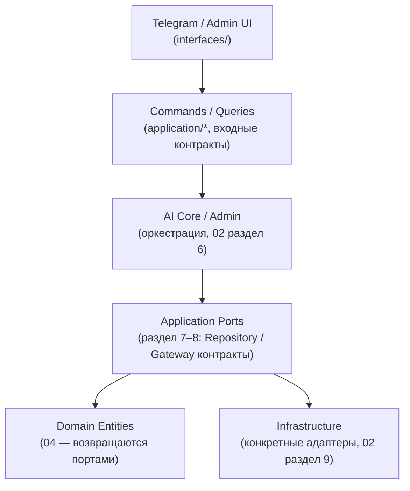
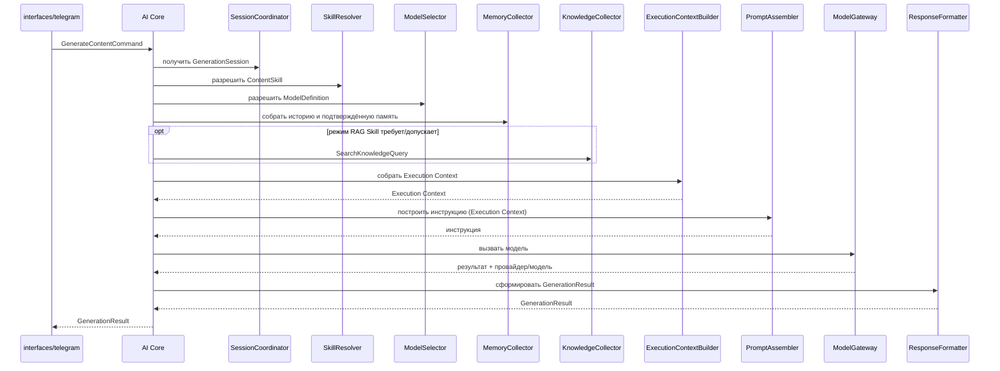
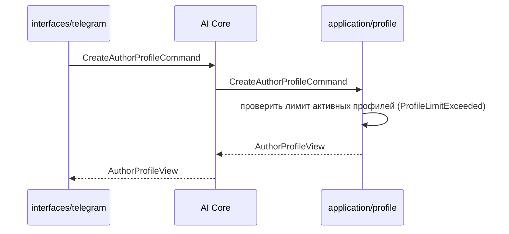
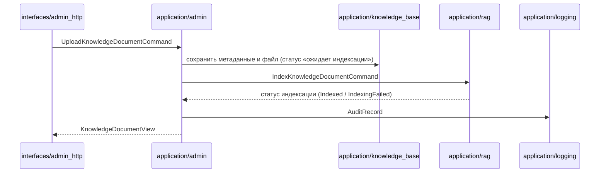
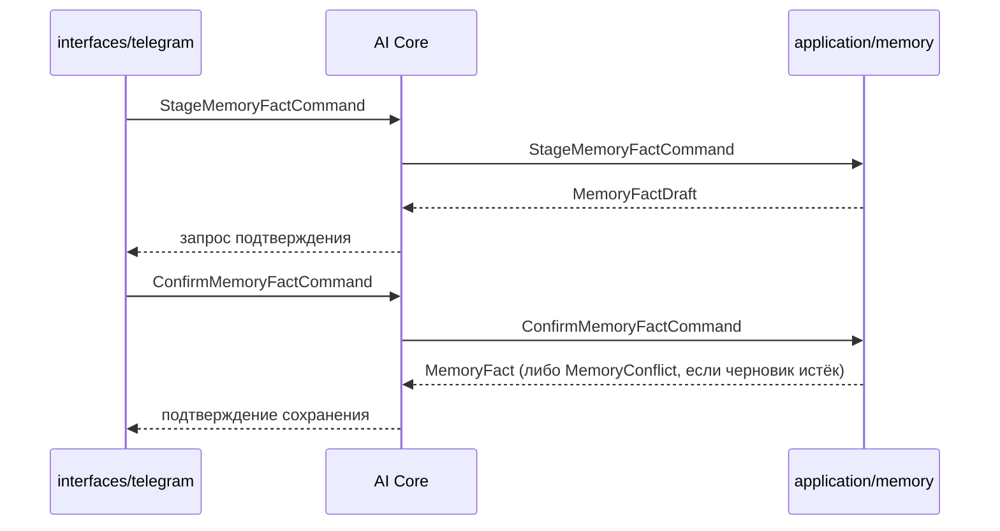

# Внутренние интерфейсы — MVP персонального AI-ассистента «Декодер» (версия 2.0)

**Версия документа:** 2.0
**Статус:** Approved
**Дата:** 2026-07-28
**Основание:** [`01_requirements_analysis_v2.0.md`](01_requirements_analysis_v2.0.md) (требования, версия 2.0, Approved), [`02_system_architecture_v2.0.md`](02_system_architecture_v2.0.md) (архитектура, версия 2.0, Approved), [`03_project_structure_v2.0.md`](03_project_structure_v2.0.md) (структура проекта, версия 2.0), [`04_domain_model_v2.0.md`](04_domain_model_v2.0.md) (доменная модель, версия 2.0)
**Соотношение с версией 1.0:** [`docs/05_internal_interfaces.md`](../05_internal_interfaces.md) описывает внутренние интерфейсы состава MVP версии 1.0 (16 портов, единый профиль, одна модель) и не изменяется этим документом. Новый состав портов и команд версии 2.0 (Author Profile Service, Content Skill Service, Session Manager, Prompt Engine, Model Catalog отдельно от Model Gateway) делает точечное редактирование интерфейсов версии 1.0 нецелесообразным — контракты спроектированы заново, поверх уже утверждённых `01`–`04`.

## 1. Назначение документа

Документ определяет внутренние контракты между архитектурными компонентами системы «Декодер» версии 2.0: какие команды и запросы существуют, какие данные пересекают границу между слоями, какие порты вызывает каждый модуль и какие ошибки может вернуть.

Это контракты, а не реализация: документ фиксирует **что** передаётся между компонентами и **кто кого вызывает**, а не как это работает внутри (сигнатуры методов, код, SQL, сериализация — вне области документа). Это не REST API, не Telegram Bot API и не HTTP — все контракты ниже существуют внутри одного процесса (`02`, раздел 3 — модульный монолит) и не подразумевают сетевого протокола.

## 2. Принципы внутренних интерфейсов

| Принцип | Пояснение |
|---|---|
| **Dependency Inversion** | Вызывающий модуль зависит от абстрактного порта, а не от конкретного модуля, который его реализует (`02`, раздел 3). Контракт объявляется на стороне потребителя (или в общей точке, видимой обеим сторонам), а не на стороне реализации. |
| **Interface Segregation** | Каждый порт — узкий и специализированный контракт одного модуля (раздел 7, раздел 8), а не один общий интерфейс на всё приложение. Потребителю не нужно знать об операциях, которые он не вызывает. |
| **Explicit Contracts** | Каждая Command, Query и DTO документируются как самостоятельный контракт с явным составом полей (разделы 4–6) — неявных, «подразумеваемых» полей нет. |
| **DTO Isolation** | DTO существуют только на границе между `interfaces/`/`application/` и между `application/`-модулями (раздел 14) — они не проникают в `domain/`: доменные сущности (`04`) ничего не знают о Command/Query/Response/View DTO. |
| **CQRS (Commands / Queries)** | Каждое обращение к системе — либо Command (меняет состояние, не возвращает данные для чтения, кроме факта результата — раздел 4), либо Query (только читает, никогда не меняет состояние — раздел 5). Ни один контракт не смешивает оба назначения. |
| **Stateless Interfaces** | Ни один порт или Command/Query не хранит состояние между вызовами — каждый вызов самодостаточен и содержит всё необходимое (включая идентификаторы, а не подразумеваемый «текущий» контекст), что согласуется со Stateless AI Core (`02`, раздел 3). |

## 3. Общая схема взаимодействия



Направление вызова — всегда сверху вниз; результат (DTO или доменная сущность) возвращается снизу вверх по тому же пути, а не напрямую от `infrastructure/` к `interfaces/` (раздел 11).

## 4. Application Commands

Command меняет состояние системы и не предназначен для чтения данных (принцип CQRS, раздел 2). Возможные ошибки — раздел 12.

### Author Profile Service

| Command | Обязательные поля | Кто вызывает | Что изменяет |
|---|---|---|---|
| `CreateAuthorProfileCommand` | `user_id`, параметры профиля (раздел 6) | AI Core (по действию пользователя) | Создаёт `AuthorProfile` (`04`) |
| `UpdateAuthorProfileCommand` | `user_id`, `profile_id`, изменяемые параметры | AI Core | Изменяет параметры существующего `AuthorProfile` |
| `ArchiveAuthorProfileCommand` | `user_id`, `profile_id` | AI Core | Переводит `AuthorProfile` в статус «архивный» |
| `SetDefaultProfileCommand` | `user_id`, `profile_id` | AI Core | Назначает `AuthorProfile` активным по умолчанию для пользователя |

### Session Manager

| Command | Обязательные поля | Кто вызывает | Что изменяет |
|---|---|---|---|
| `StartGenerationSessionCommand` | `user_id` | AI Core | Создаёт `GenerationSession` (`04`) |
| `SelectContentTypeCommand` | `session_id`, `content_type` | AI Core | Устанавливает `ContentType`/`GenerationType` сессии |
| `SelectSkillCommand` | `session_id`, `skill_id` | AI Core | Устанавливает `SelectedSkill` сессии (после проверки совместимости — раздел 9, SkillResolver) |
| `SelectModelCommand` | `session_id`, `model_id` (может быть признаком «Автоматически») | AI Core | Устанавливает `SelectedModel` сессии |
| `SubmitUserInputCommand` | `session_id`, введённые пользователем данные | AI Core | Сохраняет исходные данные в `GenerationSession` |
| `CancelSessionCommand` | `session_id` | AI Core | Прекращает `GenerationSession` (`01`, раздел 3, сценарий 21) |
| `ResetSessionCommand` | `session_id` | AI Core | Сбрасывает незавершённую генерацию, начинает новую (`01`, раздел 3, сценарий 23) |

### AI Core (сквозные команды AI-задачи)

| Command | Обязательные поля | Кто вызывает | Что изменяет |
|---|---|---|---|
| `GenerateContentCommand` | `user_id`, `session_id` (профиль/Skill/модель/данные уже установлены в сессии) | Telegram Adapter | Запускает основной сценарий генерации (`02`, раздел 10); создаёт записи `DialogueHistory` |
| `AnswerKnowledgeQuestionCommand` | `user_id`, `question_text` | Telegram Adapter | Запускает сценарий ответа по базе знаний (`02`, раздел 10, «Ответ по базе знаний»); создаёт записи `DialogueHistory` |
| `RegenerateCommand` | `user_id`, `session_id` | Telegram Adapter | Повторяет операцию с параметрами предыдущей (если ничего не изменилось) либо начинает новый сценарий, если параметры изменились (`01`, раздел 9, п. 14) |

### Memory Service

| Command | Обязательные поля | Кто вызывает | Что изменяет |
|---|---|---|---|
| `RecordDialogueMessageCommand` | `user_id`, `role` (пользователь/ассистент), `message_text`, `correlation_id` | AI Core (внутренний вызов в рамках `GenerateContentCommand`/`AnswerKnowledgeQuestionCommand`) | Создаёт запись `DialogueHistory` (`04`) |
| `StageMemoryFactCommand` | `user_id`, `fact_text` | AI Core (команда `/запомнить`) | Создаёт `MemoryFactDraft` (заменяет предыдущий активный черновик, если был — `04`, раздел 8) |
| `ConfirmMemoryFactCommand` | `user_id`, `draft_id` | AI Core (после подтверждения пользователем) | Подтверждает `MemoryFactDraft`, создаёт `MemoryFact` |
| `ForgetMemoryFactCommand` | `user_id`, `fact_id` | AI Core (команда `/забыть`) | Удаляет `MemoryFact` |

### Admin

| Command | Обязательные поля | Кто вызывает | Что изменяет |
|---|---|---|---|
| `AuthenticateAdminCommand` | `login`, `password` | Admin UI Adapter | Создаёт сессию администратора (не возвращает и не хранит пароль) |
| `UploadKnowledgeDocumentCommand` | `title`, `category`, `tags`, содержимое файла | Admin UI Adapter | Создаёт `KnowledgeDocument`, сохраняет оригинал файла, ставит статус «ожидает индексации»; создаёт `AuditRecord` |
| `UpdateKnowledgeDocumentCommand` | `document_id`, изменяемые метаданные | Admin UI Adapter | Изменяет метаданные `KnowledgeDocument`; создаёт `AuditRecord` |
| `RemoveKnowledgeDocumentCommand` | `document_id` | Admin UI Adapter | Удаляет `KnowledgeDocument`, связанные `KnowledgeFragment` и файл; создаёт `AuditRecord` |
| `CreateKnowledgeCaseCommand` | обязательные поля кейса (`04`, раздел 8) | Admin UI Adapter | Создаёт `KnowledgeCase`; создаёт `AuditRecord` |
| `UpdateKnowledgeCaseCommand` | `case_id`, изменяемые поля | Admin UI Adapter | Изменяет `KnowledgeCase`; создаёт `AuditRecord` |
| `ArchiveKnowledgeCaseCommand` | `case_id` | Admin UI Adapter | Переводит `KnowledgeCase` в статус «архивный»; создаёт `AuditRecord` |
| `LinkDocumentToCaseCommand` | `document_id`, `case_id` | Admin UI Adapter | Создаёт association-связь `KnowledgeDocument ↔ KnowledgeCase`; создаёт `AuditRecord` |

### RAG Service (инициируется только Admin)

| Command | Обязательные поля | Кто вызывает | Что изменяет |
|---|---|---|---|
| `IndexKnowledgeDocumentCommand` | `document_id` | Admin (после `UploadKnowledgeDocumentCommand`/`UpdateKnowledgeDocumentCommand`) | Создаёт/заменяет набор `KnowledgeFragment` источника; обновляет статус индексации `KnowledgeDocument` |
| `IndexKnowledgeCaseCommand` | `case_id` | Admin | Создаёт/заменяет набор `KnowledgeFragment` источника |
| `RemoveFromIndexCommand` | `source_type`, `source_id` | Admin (при удалении/архивировании источника) | Удаляет все `KnowledgeFragment` источника |

## 5. Application Queries

Query только читает данные и никогда не меняет состояние (принцип CQRS, раздел 2).

| Query | Вход | Результат |
|---|---|---|
| `GetAuthorProfilesQuery` | `user_id` | Список View DTO профилей пользователя (включая архивные — раздел 6) |
| `GetAuthorProfileQuery` | `user_id`, `profile_id` | Один View DTO профиля |
| `GetSessionQuery` | `session_id` | View DTO текущего состояния `GenerationSession` |
| `GetAvailableSkillsQuery` | `content_type`/`generation_type` | Список View DTO `ContentSkill`, совместимых с указанным типом |
| `GetAvailableModelsQuery` | `skill_id`, `generation_type` | Список View DTO `ModelDefinition`, совместимых с Skill и модальностью |
| `SearchKnowledgeQuery` | `query_text`, `top_k` | Список View DTO релевантных `KnowledgeFragment` |
| `GetMemoryFactsQuery` | `user_id` | Список View DTO подтверждённых `MemoryFact` пользователя |
| `GetDialogueHistoryQuery` | `user_id`, `limit` | Список View DTO последних записей `DialogueHistory` |
| `GetKnowledgeDocumentsQuery` | — (все документы) | Список View DTO `KnowledgeDocument` (для панели администратора) |
| `GetKnowledgeCasesQuery` | — (все кейсы) | Список View DTO `KnowledgeCase` |

Просмотр технических/аудиторских журналов через панель администратора не входит в MVP (`01`, раздел 3) — в этом разделе намеренно нет `GetAuditLogQuery` или аналога.

## 6. DTO

Разделение по назначению — по CQRS (раздел 2): **Command DTO** — вход команды (уже перечислены как «обязательные поля» в разделе 4, отдельно не дублируются); **Query DTO** — вход запроса (раздел 5, столбец «Вход»); **Response DTO** — результат выполнения команды; **View DTO** — результат выполнения запроса, оптимизированный для отображения, а не для дальнейшей записи.

### Command DTO (пример)

```text
GenerateContentCommand

user_id
session_id
```

Поля профиля/Skill/модели/типа контента/пользовательских данных в `GenerateContentCommand` не дублируются — они уже установлены в `GenerationSession` предшествующими командами (`SelectSkillCommand`, `SelectModelCommand`, `SubmitUserInputCommand` — раздел 4) и читаются AI Core из сессии по `session_id`, а не передаются повторно.

### Response DTO

```text
GenerationResult

status               (успех / отказ)
content_type
generated_text        (если модальность TEXT)
generated_image_ref    (если модальность IMAGE — ссылка, не байты изображения)
provider_used
model_used
duration
error                 (если status = отказ — раздел 12)
```

```text
KnowledgeAnswerResult

status
answer_text
used_rag              (флаг)
provider_used
model_used
error
```

### View DTO

```text
AuthorProfileView

profile_id
title
status                (действующий / архивный)
is_default
```

```text
GenerationSessionView

session_id
current_step
content_type
selected_skill_id
selected_model_id
```

```text
SkillOptionView

skill_id
title
generation_type
required_input_fields
```

```text
ModelOptionView

model_id
display_name
provider
availability_status
```

### Query DTO (пример)

```text
GetAvailableModelsQuery

skill_id
generation_type
```

Ни один DTO не описывает физический тип поля (строка/число/дата) — только состав и назначение; это осознанное ограничение уровня документа (раздел «Общие требования» задания на этот документ).

## 7. Repository Ports

Порты, отвечающие за структурированное хранение данных, — те же 11, что зафиксированы в `02`, раздел 8. Ниже — их операции в терминах команд/запросов (без сигнатур) и то, что каждому запрещено.

| Порт | Ответственность | Основные операции | Что запрещено |
|---|---|---|---|
| `ProfileRepository` | Хранение `AuthorProfile` (`04`) | создать, получить по идентификатору, получить список по пользователю, изменить, архивировать | Возвращать чужой профиль без проверки владельца — проверку выполняет Author Profile Service, а не порт |
| `ContentSkillRepository` | Чтение каталога `ContentSkill` | получить по идентификатору, получить список, отфильтровать по модальности | Запись в runtime — каталог только для чтения (`01`, раздел 4.5) |
| `ModelCatalogRepository` | Чтение каталога `ModelDefinition` | получить по идентификатору, получить список, отфильтровать по совместимости | Запись в runtime — каталог только для чтения (`01`, раздел 9, п. 5) |
| `SessionRepository` | Хранение `GenerationSession` | создать, получить по идентификатору, обновить, удалить (по завершении — `02`, раздел 6) | Хранить `GenerationSession` дольше одного незавершённого сценария |
| `MemoryRepository` | Хранение `DialogueHistory`, `MemoryFactDraft`, `MemoryFact` | записать реплику, получить последние N реплик, создать/подтвердить/удалить черновик и факт | Смешивать историю диалога и факты в одной операции чтения — вызывающая сторона запрашивает их раздельно |
| `KnowledgeRepository` | Хранение `KnowledgeDocument`, `KnowledgeCase` и связи между ними | CRUD документа, CRUD кейса (без физического удаления — `04`, раздел 8), связать/отвязать документ и кейс | Выполнять поиск (это `VectorRepository`/RAG Service, не этот порт) |
| `FileStoragePort` | Хранение оригиналов файлов документов | сохранить, прочитать, удалить файл по `document_id` | Хранить метаданные — это `KnowledgeRepository` |
| `VectorRepository` | Хранение и поиск `KnowledgeFragment` | записать фрагменты с векторами, найти по вектору, удалить все фрагменты источника | Знать о `KnowledgeDocument`/`KnowledgeCase` как о сущностях — только `source_type`/`source_id` |

Задание на этот документ приводит в качестве примера отдельные `CaseRepository` и `AuditRepository`. Они не введены как самостоятельные порты: кейсы — часть `KnowledgeRepository` вместе с документами (единый порт для обеих сущностей закреплён уже в `02`, раздел 8), а аудит — обязанность `Logger` (раздел 8), а не отдельного репозитория, поскольку `02` не выделяет для аудита собственный порт хранения.

**Общее правило.** Каждый Repository Port возвращает сущности `04` (`AuthorProfile`, `GenerationSession`, `DialogueHistory`, `MemoryFactDraft`, `MemoryFact`, `KnowledgeDocument`, `KnowledgeCase`, `KnowledgeFragment`, `ModelDefinition`) либо их отсутствие — никогда DTO (раздел 14).

## 8. External Ports

Порты, отвечающие за возможности за пределами структурированного хранения данных, — внешние вызовы и сквозные технические утилиты.

| Порт | Ответственность | Соответствие `02` |
|---|---|---|
| `ModelGateway` | Единый вызов модели генерации (TEXT/IMAGE) независимо от поставщика | Совпадает с портом `ModelGateway`, раздел 8 |
| `PromptBuilder` | Построение итоговой инструкции из Execution Context | Совпадает с портом `PromptBuilder`, раздел 8; реализуется Prompt Engine |
| `Logger` | Запись технических событий, системных ошибок и фактов административных действий (аудит) | Совпадает с портом `Logger`, раздел 8 |
| `Clock` | Предоставление текущего момента времени (для меток `created_at`, TTL черновика факта) | Новый — сквозная техническая утилита (`03`, `shared/utils/`), не относится ни к одному компоненту `02` персонально |
| `CorrelationIdGenerator` | Генерация идентификатора трассировки одной операции (`04`, `CorrelationId`) | Новый — сквозная техническая утилита (`03`, `shared/utils/`) |

Задание на этот документ приводит в качестве примеров также `EmbeddingGateway`, `VectorSearchGateway`, `FileStorageGateway`, `LoggingGateway`, `DocumentIndexer`. Они не введены отдельно:
- `VectorSearchGateway` и `FileStorageGateway` — это `VectorRepository` и `FileStoragePort` (раздел 7); задание использует другое имя для того же контракта, `02` уже закрепляет именно эти названия.
- `LoggingGateway` — это `Logger` (см. выше).
- `EmbeddingGateway` — не вводится: `02` не выделяет для вычисления векторного представления отдельный порт, эта операция — внутренняя деталь реализации `VectorRepository`/адаптера векторного хранилища (`02`, раздел 9), не отдельный архитектурный контракт.
- `DocumentIndexer` — не вводится как порт: индексация — обязанность RAG Service как application-компонента (`02`, раздел 6), вызываемого Admin напрямую через команды (`IndexKnowledgeDocumentCommand` и т. д., раздел 4), а не через отдельный внешний порт.

## 9. Internal Services

Именованные срезы оркестрационной ответственности AI Core (`02`, раздел 6, «Оркестрационная ответственность») — не самостоятельные архитектурные компоненты и не отдельные модули `03`, а внутренние коллабораторы `application/ai_core/`, каждый из которых соответствует одному уже утверждённому шагу в sequence-диаграммах `02` (раздел 10). Названы здесь для того, чтобы дать каждому шагу оркестрации собственный контракт «вход → выход».

| Сервис | Вход | Выход | Ответственность |
|---|---|---|---|
| `SessionCoordinator` | `session_id` или `user_id` | Актуальное состояние `GenerationSession` либо признак «состояние устарело» | Читает/обновляет `GenerationSession` через `SessionRepository`; распознаёт устаревшее состояние (`02`, раздел 12) |
| `SkillResolver` | `skill_id`, `content_type` | `ContentSkill` либо ошибка `SkillNotFound`/несовместимости | Получает Skill через `ContentSkillRepository`, проверяет совместимость с типом контента (раздел 12) |
| `ModelSelector` | `model_id` (или признак «Автоматически»), `skill_id`, `generation_type` | `ModelDefinition` либо ошибка `ModelUnavailable`/несовместимости | Получает модель через `ModelCatalogRepository`; в режиме «Автоматически» выбирает первую совместимую по приоритетному списку (`01`, раздел 4.7) |
| `MemoryCollector` | `user_id` | Список `DialogueHistory` (последние N) и список подтверждённых `MemoryFact` | Читает через `MemoryRepository`; не решает, что из этого попадёт в инструкцию (это `Execution Context`/Prompt Engine) |
| `KnowledgeCollector` | `query_text`, режим RAG выбранного Skill | Список релевантных `KnowledgeFragment` либо пустой результат | Вызывает RAG Service (`SearchKnowledgeQuery`, раздел 5) только если режим Skill требует или допускает RAG (`01`, раздел 4.9) |
| `ExecutionContextBuilder` | Данные, собранные `SessionCoordinator`, `SkillResolver`, `ModelSelector`, `MemoryCollector`, `KnowledgeCollector`, профиль (через `Author Profile Service`) | `Execution Context` (`02`, раздел 7; `04`, раздел 11 — не Entity) | Собирает единый объект для одного вызова Prompt Engine; сам не хранит и не запрашивает ничего напрямую из портов |
| `PromptAssembler` | `Execution Context` | Готовая инструкция для модели | Вызывает `PromptBuilder` (Prompt Engine); сам не строит инструкцию — только передаёт `Execution Context` и получает результат |
| `ResponseFormatter` | Результат `ModelGateway` (текст/изображение, провайдер, модель, статус) | `GenerationResult`/`KnowledgeAnswerResult` (раздел 6) | Преобразует «сырой» результат вызова модели в Response DTO, который вернётся вызывающему интерфейсу; не принимает решений о содержании ответа |

## 10. Interface Mapping

| Модуль (`03`) | Использует | Предоставляет |
|---|---|---|
| `interfaces/telegram/` | Commands/Queries `application/ai_core/`, `application/profile/`, `application/session/`, `application/skills/`, `application/model_catalog/`, `application/memory/` | Канало-независимый входной контракт для пользователя (не порт — driving-адаптер) |
| `interfaces/admin_http/` | Commands/Queries `application/admin/` | Веб-интерфейс панели администратора (не порт — driving-адаптер) |
| `application/ai_core/` | Все Internal Services (раздел 9); Commands/Queries `profile/`, `skills/`, `session/`, `memory/`, `rag/`, `model_catalog/`; порты `PromptBuilder`, `ModelGateway`, `Logger` | `GenerateContentCommand`, `AnswerKnowledgeQuestionCommand`, `RegenerateCommand` |
| `application/admin/` | Commands `knowledge_base/`, Commands `rag/` (индексация), порт `Logger` (аудит) | Все Commands раздела «Admin» (раздел 4) |
| `application/profile/` | `ProfileRepository` | `CreateAuthorProfileCommand`, `UpdateAuthorProfileCommand`, `ArchiveAuthorProfileCommand`, `SetDefaultProfileCommand`, `GetAuthorProfilesQuery`, `GetAuthorProfileQuery` |
| `application/skills/` | `ContentSkillRepository` | `GetAvailableSkillsQuery`; используется `SkillResolver` (раздел 9) |
| `application/session/` | `SessionRepository` | Все Commands «Session Manager» (раздел 4), `GetSessionQuery` |
| `application/memory/` | `MemoryRepository` | Все Commands «Memory Service» (раздел 4), `GetMemoryFactsQuery`, `GetDialogueHistoryQuery` |
| `application/rag/` | `KnowledgeRepository` (чтение), `VectorRepository` | `SearchKnowledgeQuery`, `IndexKnowledgeDocumentCommand`, `IndexKnowledgeCaseCommand`, `RemoveFromIndexCommand` |
| `application/model_catalog/` | `ModelCatalogRepository` | `GetAvailableModelsQuery`; используется `ModelSelector` (раздел 9) |
| `application/model_gateway/` | Реализуется адаптерами (`02`, раздел 9) | Порт `ModelGateway` |
| `application/prompt_engine/` | `Execution Context` (вход, не порт) | Порт `PromptBuilder` |
| `application/knowledge_base/` | `KnowledgeRepository`, `FileStoragePort` | `GetKnowledgeDocumentsQuery`, `GetKnowledgeCasesQuery`; CRUD-операции, вызываемые только из `application/admin/` |
| `application/logging/` | — (порт `Logger` реализуется в `infrastructure/`) | Порт `Logger` |

## 11. Правила взаимодействия

Допустимая цепочка вызовов для сценария генерации контента:

```text
AI Core
   ↓ вызывает
SessionCoordinator → SkillResolver → ModelSelector → MemoryCollector → KnowledgeCollector
   ↓
ExecutionContextBuilder
   ↓
PromptAssembler (→ PromptBuilder / Prompt Engine)
   ↓
ModelGateway
   ↓
ResponseFormatter
   ↓
AI Core (возвращает GenerationResult вызывающему интерфейсу)
```

Правила:

- Только `AI Core` и `Admin` вызывают Commands/Queries нескольких других модулей `application/*` в рамках одной операции (`03`, раздел 7) — Internal Services раздела 9 существуют внутри `application/ai_core/`, а не как отдельные вызываемые модули.
- Internal Services вызываются только в порядке, зафиксированном выше, и только из `AI Core` — ни один из них не вызывает другой напрямую в обход `AI Core` (например, `SkillResolver` не вызывает `ModelSelector`).
- `PromptAssembler` — единственный, кто вызывает `PromptBuilder`; `ResponseFormatter` — единственный, кто формирует Response DTO из результата `ModelGateway`.
- `interfaces/*` вызывают только Commands/Queries `application/ai_core/` (Telegram) или `application/admin/` (Admin UI) — никогда порты и никогда Internal Services напрямую (`03`, раздел 7).
- Ни один Repository Port или External Port не вызывает Command или Query — направление вызова всегда от Command/Query к порту, никогда наоборот.

## 12. Ошибки интерфейсов

Ошибки — доменные категории, без привязки к HTTP-кодам или конкретному исключению; реакция системы на каждую — уже зафиксирована в `02`, раздел 12, здесь — только то, какой контракт её порождает.

| Ошибка | Где возникает | Реагирует |
|---|---|---|
| `ProfileNotFound` | `ProfileRepository` (по несуществующему `profile_id`) | AI Core |
| `ProfileArchived` | Author Profile Service (попытка использовать архивный профиль для генерации) | AI Core |
| `ProfileLimitExceeded` | Author Profile Service (`CreateAuthorProfileCommand` сверх лимита — `04`, раздел 8) | AI Core |
| `SkillNotFound` | `ContentSkillRepository` | `SkillResolver` |
| `SkillIncompatible` | `SkillResolver` (Skill не поддерживает выбранный тип контента) | AI Core |
| `ModelUnavailable` | `ModelGateway` (во время исполнения) либо `ModelCatalogRepository` (статус «недоступна») | AI Core |
| `ModelIncompatible` | `ModelSelector` (модель не поддерживает Skill/модальность) | AI Core |
| `SessionNotFound` | `SessionRepository` | `SessionCoordinator` |
| `SessionExpired` | `SessionCoordinator` (устаревшее состояние сценария — `02`, раздел 12) | AI Core |
| `KnowledgeUnavailable` | `VectorRepository`/RAG Service недоступны | `KnowledgeCollector` |
| `MemoryConflict` | `MemoryRepository` (попытка подтвердить уже истёкший или отсутствующий черновик) | AI Core |
| `ValidationError` | Любой Command при нарушении обязательности полей (раздел 4) до обращения к любому порту | Модуль, принявший Command |
| `Timeout` | Любой External Port (раздел 8) при превышении времени ожидания внешнего вызова | AI Core |
| `AuthenticationFailed` | `AuthenticateAdminCommand` | Admin UI Adapter |

Общее правило (наследуется из `02`, раздел 12): ни одна из этих ошибок не превращается в текст с техническими подробностями на границе `interfaces/` — только нейтральное сообщение; подробности остаются в техническом журнале через `Logger`.

## 13. Последовательности вызовов

### Генерация ответа



### Создание профиля



### Загрузка документа



### Подтверждение памяти



## 14. Архитектурные ограничения

- `Domain` не зависит от DTO — сущности `04` не содержат и не импортируют Command/Query/Response/View DTO; DTO существуют только на границах `interfaces/`↔`application/` и между модулями `application/*` (`03`, раздел 8).
- Repository Ports (раздел 7) возвращают Domain Entities (`04`) — ни один Repository Port не возвращает DTO.
- DTO не пересекают границу `Domain` — DTO преобразуются в параметры операций над сущностями внутри `application/`, до того как что-либо достигнет `domain/`.
- Ports не знают Adapter — ни один порт (раздел 7, раздел 8) не содержит ссылки или предположения о конкретной реализующей его технологии (`02`, раздел 9).
- Adapter не знают Use Cases — реализация порта (`infrastructure/`) не импортирует Commands/Queries и не вызывает `application/ai_core/` или любой другой use case (`03`, раздел 8).
- Вызовы однонаправленные — направление всегда `interfaces/ → application/ → domain/`, и `infrastructure/ → application/ (порт) → domain/` (`03`, раздел 8); ни один ответ не возвращается в обход вызвавшего.
- Нет циклических зависимостей — Internal Services (раздел 9) образуют направленную цепочку без обратных рёбер (раздел 11); ни один модуль `application/*`, кроме `ai_core/` и `admin/`, не вызывает другой модуль `application/*` (`03`, раздел 7).

## Результат

### Изменённые/добавленные файлы
- Создан: `docs/versions/05_internal_interfaces_v2.0.md` (этот документ).
- Не изменены: `docs/05_internal_interfaces.md` (версия 1.0), `01_requirements_analysis_v2.0.md`, `02_system_architecture_v2.0.md`, `03_project_structure_v2.0.md`, `04_domain_model_v2.0.md`.

### Commands (29)
`CreateAuthorProfileCommand`, `UpdateAuthorProfileCommand`, `ArchiveAuthorProfileCommand`, `SetDefaultProfileCommand`, `StartGenerationSessionCommand`, `SelectContentTypeCommand`, `SelectSkillCommand`, `SelectModelCommand`, `SubmitUserInputCommand`, `CancelSessionCommand`, `ResetSessionCommand`, `GenerateContentCommand`, `AnswerKnowledgeQuestionCommand`, `RegenerateCommand`, `RecordDialogueMessageCommand`, `StageMemoryFactCommand`, `ConfirmMemoryFactCommand`, `ForgetMemoryFactCommand`, `AuthenticateAdminCommand`, `UploadKnowledgeDocumentCommand`, `UpdateKnowledgeDocumentCommand`, `RemoveKnowledgeDocumentCommand`, `CreateKnowledgeCaseCommand`, `UpdateKnowledgeCaseCommand`, `ArchiveKnowledgeCaseCommand`, `LinkDocumentToCaseCommand`, `IndexKnowledgeDocumentCommand`, `IndexKnowledgeCaseCommand`, `RemoveFromIndexCommand`.

Каждый Command привязан к ровно одному use case одного модуля `application/*` (`03`, раздел 5).

### Queries (10)
`GetAuthorProfilesQuery`, `GetAuthorProfileQuery`, `GetSessionQuery`, `GetAvailableSkillsQuery`, `GetAvailableModelsQuery`, `SearchKnowledgeQuery`, `GetMemoryFactsQuery`, `GetDialogueHistoryQuery`, `GetKnowledgeDocumentsQuery`, `GetKnowledgeCasesQuery`.

### Repository Ports (8) — совпадают с `02`, раздел 8
`ProfileRepository`, `ContentSkillRepository`, `ModelCatalogRepository`, `SessionRepository`, `MemoryRepository`, `KnowledgeRepository`, `FileStoragePort`, `VectorRepository`.

### External Ports (5)
`ModelGateway`, `PromptBuilder`, `Logger` (все три — из `02`, раздел 8) плюс `Clock`, `CorrelationIdGenerator` (новые сквозные утилиты, не относятся ни к одному компоненту `02` лично — раздел 8).

### DTO
4 категории (Command DTO, Query DTO, Response DTO, View DTO — раздел 6), с примерами полей для флагманских контрактов (`GenerateContentCommand`, `GenerationResult`, `KnowledgeAnswerResult`, `AuthorProfileView`, `GenerationSessionView`, `SkillOptionView`, `ModelOptionView`, `GetAvailableModelsQuery`).

### Зафиксированные ограничения
7 правил раздела 14 (Domain/DTO, Repository/Entities, Ports/Adapter, направление вызовов, отсутствие циклов) — все выведены из уже утверждённых `02` (раздел 3, раздел 9) и `03` (раздел 7, раздел 8), ни одно не вводит нового архитектурного решения.

### Замечания к примерам из задания
Три места, где пример в задании разошёлся с уже утверждёнными `02`–`04`, и раздел скорректирован в пользу утверждённых документов:

1. **`CaseRepository` и `AuditRepository` не введены как отдельные порты** (раздел 7) — `02` закрепляет один `KnowledgeRepository` на документы и кейсы вместе и не выделяет отдельного порта хранения для аудита (эта обязанность — часть `Logger`).
2. **`EmbeddingGateway` и `DocumentIndexer` не введены** (раздел 8) — ни один из них не имеет соответствия в `02`: вычисление векторного представления — деталь реализации адаптера `VectorRepository`, а индексация — обязанность RAG Service, вызываемая Admin через Commands, а не через отдельный порт.
3. **`VectorSearchGateway`, `FileStorageGateway`, `LoggingGateway` названы именами `02`** (`VectorRepository`, `FileStoragePort`, `Logger` — раздел 8) — это те же контракты, что и в архитектуре, без переименования, чтобы не создавать два имени для одного порта.
