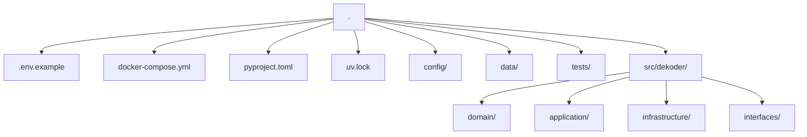
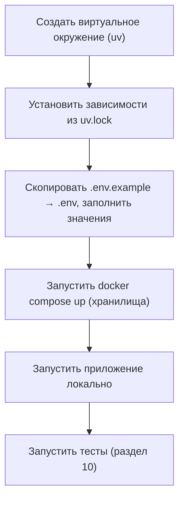

# Окружение разработки — MVP персонального AI-ассистента «Декодер» (версия 2.0)

**Версия документа:** 2.0
**Статус:** Approved
**Дата:** 2026-07-28
**Основание:** [`01_requirements_analysis_v2.0.md`](01_requirements_analysis_v2.0.md) (требования, версия 2.0, Approved), [`02_system_architecture_v2.0.md`](02_system_architecture_v2.0.md) (архитектура, версия 2.0, Approved), [`03_project_structure_v2.0.md`](03_project_structure_v2.0.md) (структура проекта, версия 2.0), [`04_domain_model_v2.0.md`](04_domain_model_v2.0.md) (доменная модель, версия 2.0), [`05_internal_interfaces_v2.0.md`](05_internal_interfaces_v2.0.md) (внутренние интерфейсы, версия 2.0)
**Соотношение с версией 1.0:** [`docs/06_development_environment.md`](../06_development_environment.md) описывает окружение разработки для состава MVP версии 1.0 (единый профиль, одна модель, структура `modules/<module>/...`) и не изменяется этим документом. Новая структура проекта (`03`: `domain/application/infrastructure/interfaces/shared/composition`) и новый состав портов (`05`) требуют пересмотра состава сервисов Docker-окружения и переменных конфигурации — окружение описано заново, поверх уже утверждённых `01`–`05`.

## 1. Назначение документа

Документ определяет единое окружение разработки проекта «Декодер» версии 2.0: инструменты, структуру конфигурации, состав локального Docker-окружения, порядок запуска, стандарты кодирования и правила тестирования, обязательные для любого разработчика.

Это **стандарт разработки**, а не руководство пользователя, не инструкция по деплою и не DevOps-документ: Production Deployment (Kubernetes, реальное развёртывание, CI/CD pipeline, мониторинг, резервное копирование, эксплуатация) — предмет отдельного документа, не входящего в объём этого. Здесь фиксируется только то, что нужно, чтобы одинаково воспроизводимо писать и проверять код локально.

## 2. Принципы окружения

| Принцип | Пояснение |
|---|---|
| **Reproducible Environment** | Любой разработчик, получивший репозиторий, воспроизводит рабочее окружение по фиксированной последовательности шагов (раздел 8) без дополнительных решений об инструментах или версиях — они уже зафиксированы этим документом. |
| **Configuration as Code** | Состав переменных окружения, состав Docker-сервисов и правила разработки существуют как файлы в репозитории (`.env.example`, `docker-compose.yml`, `pyproject.toml`, конфигурация линтеров — разделы 4, 7, 9), а не как знание, передаваемое устно. |
| **Local First** | Разработка и большая часть тестирования (раздел 10) не требуют внешней инфраструктуры, кроме собственной машины разработчика и локального Docker — окружение не предполагает обязательного постоянного подключения к общим/облачным средам. |
| **Container Friendly** | Всё, что нельзя (или не нужно) устанавливать напрямую на машину разработчика — хранилища данных, — запускается контейнером (раздел 7); сам код приложения при этом не обязан выполняться в контейнере для повседневной разработки (раздел 14). |
| **Environment Isolation** | Зависимости проекта изолированы от остальной системы разработчика (виртуальное окружение Python, раздел 5); тестовое окружение изолировано от окружения повседневной разработки (раздел 10) — они не разделяют файл хранилища данных, конфигурацию или состояние друг друга. |
| **Deterministic Dependencies** | Одна и та же версия каждой зависимости устанавливается у всех разработчиков и во всех запусках — обеспечивается единым lock-файлом (раздел 5, раздел 11), а не диапазонами версий, разрешаемыми заново при каждой установке. |

## 3. Целевая платформа

| Компонент | Требование |
|---|---|
| Python | 3.12+ |
| Менеджер зависимостей | `uv` (раздел 5) |
| Контейнеризация | Docker и Docker Compose |
| Контроль версий | Git |
| Основная целевая среда | Linux (контейнеры и продуктивная среда — вне объёма этого документа) |
| Поддерживаемые среды разработки | Windows, macOS, Linux — все три поддерживаются для написания и локального запуска кода |

Архитектура (`02`, раздел 3, Infrastructure Independence; `03`, раздел 2, Clean Architecture) не зависит от операционной системы: бизнес-логика (`domain/`, `application/`) не содержит платформенно-зависимого кода, а единственные места, где ОС могла бы иметь значение, — конкретные адаптеры (`infrastructure/`, `interfaces/`) и инструменты окружения (Docker, менеджер зависимостей) — одинаковы на всех трёх поддерживаемых средах разработки.

## 4. Структура окружения

```text
.
├── .env.example
├── docker-compose.yml
├── pyproject.toml
├── uv.lock
├── config/
├── data/
├── docs/
├── scripts/
├── tests/
│   ├── unit/
│   ├── integration/
│   └── e2e/
└── src/
    └── dekoder/
        ├── domain/
        ├── application/
        ├── infrastructure/
        ├── interfaces/
        ├── shared/
        └── composition/
```



Дерево каталогов `src/dekoder/` — то же, что зафиксировано в `03`; этот документ не вводит новых каталогов кода, только файлы уровня окружения (`.env.example`, `docker-compose.yml`, `pyproject.toml`, `uv.lock`) в корне репозитория.

## 5. Python Environment

- **Виртуальное окружение.** Изолированное виртуальное окружение на проект, управляемое `uv`; глобальные пакеты интерпретатора не используются проектом ни при разработке, ни при запуске тестов (принцип Environment Isolation, раздел 2).
- **Менеджер зависимостей — `uv`.** Единый инструмент для создания виртуального окружения, установки зависимостей и их фиксации. Ни один из `01`–`05` менеджер зависимостей не выбирает — решение зафиксировано этим документом.
- **`pyproject.toml`** — единственное место, где объявлены зависимости проекта (секция `[project.dependencies]`) и границы поддерживаемой версии Python (раздел 3).
- **`uv.lock`** — единственный источник истины для точных версий всех зависимостей, включая транзитивные; коммитится в репозиторий (раздел 11).
- **Фиксированные версии библиотек.** Установка из `uv.lock` детерминирована — один и тот же `uv.lock` даёт одинаковое окружение у всех разработчиков и при каждом запуске (принцип Deterministic Dependencies, раздел 2).
- **Отсутствие глобальных пакетов.** Ни один пакет, необходимый проекту, не устанавливается в общесистемный интерпретатор Python разработчика — так исключается расхождение окружений «у меня работает» между машинами.

## 6. Конфигурация

| Категория | Обязательность | Источник |
|---|---|---|
| Токен и секрет вебхука Telegram | Обязательные | `.env` |
| Доступ к шлюзу моделей (ключи поставщиков, выбранных архитектурой — `02`, раздел 8) | Обязательные | `.env` |
| Адрес/путь векторного хранилища | Обязательные | `.env` |
| Адрес/путь хранилища структурированных данных | Обязательные | `.env` |
| Логин и хеш пароля администратора | Обязательные | `.env` (не хранятся в хранилище структурированных данных — `01`, раздел 4.11) |
| Лимит активных профилей автора (по умолчанию 4 — `01`, раздел 9, п. 8) | Необязательные (есть значение по умолчанию) | `.env` |
| Уровень детализации технических журналов | Необязательные (есть значение по умолчанию) | `.env` |
| Каталог моделей (`Model Catalog`, seed) | Обязательные | файл в `config/` |
| Каталог Content Skills (seed) | Обязательные | файл в `config/` |
| Seed-профиль автора по умолчанию | Необязательные (используется только при первом запуске на пустом хранилище) | файл в `config/` |
| `CorrelationId` текущей операции | Служебные | вычисляется в рантайме (`05`, `CorrelationIdGenerator`), не задаётся человеком |

`.env.example` — коммитится в репозиторий, перечисляет все переменные без значений секретов; `.env` (или переменные окружения контейнера) — не коммитится никогда. Разделение файлов и правило «секреты нигде, кроме окружения» унаследовано из `01`, раздел 8, без изменений.

## 7. Docker Environment

Docker в этом окружении не служит границей между модулями кода (`02`, раздел 3 — модульный монолит) — он воспроизводит только внешнюю инфраструктуру, от которой зависит приложение через порты (`05`, раздел 7–8).

| Сервис | Назначение | Обязателен в MVP |
|---|---|---|
| `app` | Единственный процесс FastAPI, обслуживающий и Telegram, и Admin UI (`interfaces/telegram/`, `interfaces/admin_http/` — оба в одном процессе, `02` раздел 3) | Да |
| Сервис структурированного хранилища | Реализует `ProfileRepository`, `ContentSkillRepository`, `ModelCatalogRepository`, `SessionRepository`, `MemoryRepository`, `KnowledgeRepository` (`05`, раздел 7) | Да — либо отдельным сервисом, либо файлом на томе `app` (конкретная технология и топология — решение системной архитектуры при реализации, не этого документа, `01` раздел 8) |
| Сервис векторного хранилища | Реализует `VectorRepository` (`05`, раздел 7) | Да, отдельным сервисом |

**Не входит в MVP:** Redis или любой другой кеш/очередь — ни `01`–`05`, ни это окружение не устанавливают требования, которое обосновывало бы отдельный сервис кеширования или очереди сообщений; при появлении такого требования его сначала фиксируют `01`/`02`, а не добавляют в Docker-окружение напрямую. Отдельного контейнера для Admin UI не существует — это тот же процесс `app`, тот же образ, тот же порт (см. выше).

**Volumes.** Постоянный том для данных `app` (хранилище структурированных данных, если оно файловое, и файловое хранилище оригиналов документов — `03`, раздел 4, `data/`); отдельный постоянный том для данных сервиса векторного хранилища.

**Networks.** Одна внутренняя сеть Docker Compose, объединяющая `app` и оба сервиса хранения; наружу из окружения публикуется только `app` (порт приложения) — сервисы хранения не публикуются на хост-машину, кроме как для целей отладки.

**Что не описывается здесь.** Конкретные образы и версии этих сервисов, реквизиты продуктивного развёртывания, Kubernetes, CI/CD pipeline, мониторинг, резервное копирование — вне объёма этого документа (раздел 1).

## 8. Локальный запуск



1. Создать виртуальное окружение проекта средствами `uv`.
2. Установить зависимости строго из `uv.lock` (раздел 5, раздел 11) — не из диапазонов версий `pyproject.toml` напрямую.
3. Скопировать `.env.example` в `.env` и заполнить обязательные значения (раздел 6).
4. Поднять сервисы хранения (раздел 7) через Docker Compose.
5. Запустить приложение локально (`composition/`, `03`, раздел 3) — сама разработка бизнес-логики (`domain/`, `application/`) не требует поднятого Docker (раздел 14).
6. Запустить тесты (раздел 10) — какие именно требуют поднятого Docker, а какие нет, определяется их видом.

## 9. Стандарты разработки

| Инструмент | Назначение | Решение |
|---|---|---|
| **Ruff** | Форматирование и статический анализ (линтинг), включая сортировку импортов | Единственный инструмент для этих трёх задач |
| Black | Форматирование кода | Отдельно не используется — форматирование полностью покрыто Ruff; два инструмента с пересекающейся ответственностью создавали бы риск конфликтующих правил и лишнюю точку настройки |
| isort | Сортировка импортов | Отдельно не используется — по той же причине, что и Black: эта функциональность уже есть в Ruff |
| **MyPy** | Статическая типизация | Обязателен для проверки соответствия реализаций портам (`05`, раздел 7–8) — весь код проекта использует полные аннотации типов |
| **pytest** | Тестовый фреймворк | Единственный фреймворк тестирования проекта (раздел 10) |
| **pre-commit** | Локальные проверки перед коммитом | Запускает Ruff и MyPy до того, как изменение попадёт в историю репозитория; тяжёлые тесты (integration/e2e, раздел 10) в обязательный pre-commit не входят — они требуют поднятой инфраструктуры |
| **EditorConfig** | Базовое единообразие файлов (отступы, конец строки, кодировка) между разными редакторами | Обязателен, минимальная настройка, не заменяет Ruff |

Единые правила: любое изменение кода проходит Ruff и MyPy без ошибок до коммита; ни один инструмент не настраивается индивидуально под разработчика — конфигурация лежит в репозитории (принцип Configuration as Code, раздел 2).

## 10. Тестирование

Структура тестов зеркалирует архитектурные слои (`03`, раздел 9):

| Вид | Что проверяет | Требует Docker | Обязательность |
|---|---|---|---|
| `tests/unit/` | `domain/` и `application/` — бизнес-правила без ввода-вывода, порты подменены тестовыми реализациями | Нет | Обязательны при каждом изменении затронутого кода; часть pre-commit (раздел 9) |
| `tests/integration/` | `infrastructure/` и `interfaces/` — конкретные адаптеры против реальных (тестовых) сервисов хранения | Да (раздел 7) | Обязательны перед объединением изменения, затрагивающего `infrastructure/` или `interfaces/`; не входят в обязательный pre-commit из-за требования к инфраструктуре |
| `tests/e2e/` | Полный сценарий (`05`, раздел 13) через `interfaces/` и `composition/` | Да | Рекомендуются для изменений, затрагивающих целый пользовательский сценарий; для точечного исправления в границах одного модуля могут быть пропущены |

Тестовое окружение изолировано от окружения повседневной разработки (принцип Environment Isolation, раздел 2): тесты используют собственный набор переменных окружения и собственные (временные либо отдельные тестовые) экземпляры сервисов хранения — никогда те же данные, что при обычном локальном запуске.

## 11. Управление зависимостями

- Никаких произвольных обновлений библиотек вне отдельного, явного изменения — версия зависимости не меняется «заодно» с не связанной с этим задачей.
- Версии зависимостей фиксированы `uv.lock` (раздел 5); в `pyproject.toml` — только сами зависимости и, при необходимости, минимально поддерживаемые диапазоны, а не точные версии.
- Обновление `uv.lock` — отдельное, самостоятельное изменение, проходящее тот же review, что и любое другое изменение кода (через pull request), а не автоматическое или попутное действие.
- `uv.lock` — единый lock-файл на весь проект; отдельных lock-файлов для части зависимостей или для отдельных сред не существует.

## 12. Логирование

- **Структурированные журналы.** Технические журналы — в структурированном виде (`01`, раздел 4.12), пригодном для машинного разбора, а не произвольный текст.
- **Уровни логирования.** Настраиваются переменной окружения (раздел 6, необязательная категория) со значением по умолчанию, достаточным для обычной разработки.
- **`CorrelationId`.** Каждая запись технического журнала одной операции несёт один и тот же `CorrelationId` (`04`, Value Object; `05`, порт `CorrelationIdGenerator`) — это единственный способ сопоставить техническую запись, запись `DialogueHistory` и запись `AuditRecord` одного запроса при разборе инцидента, не являясь при этом внешним ключом (`04`, раздел 8).
- **Маскирование секретов.** Токены, ключи API, пароли и хеши паролей не попадают в журналы ни в каком виде, даже частично.
- **Запрет логирования чувствительных пользовательских данных.** Полный текст пользовательского запроса, полный сформированный промпт, содержимое фактов долговременной памяти, содержимое документов базы знаний — не логируются (`01`, раздел 4.12; `05`, раздел 8, реализация `Logger`).

## 13. Управление конфигурацией

| Что | Источник | Хардкодить запрещено |
|---|---|---|
| Секреты (токены, ключи, хеш пароля администратора) | Только переменные окружения | Да — ни в коде, ни в файлах `config/` |
| Адреса/пути сервисов хранения | Только переменные окружения | Да |
| Каталог моделей, каталог Skills, seed-профиль | Только файлы `config/` | Да — не встраиваются как константы в код (`01`, раздел 4.5, раздел 4.7) |
| Лимиты и значения по умолчанию (например, лимит активных профилей) | Переменные окружения со значением по умолчанию в коде | Значение по умолчанию — не хардкод пути или секрета, а последняя явно объявленная константа, переопределяемая конфигурацией |
| Пути к файлам и каталогам (`data/`, `config/`) | Только переменные окружения/конфигурация, читаемые в одной точке (`shared/config/`, `03` раздел 4) | Да |

Ни один файл `domain/` или `application/` не читает переменные окружения или файлы конфигурации напрямую — единственная точка чтения `shared/config/` (`03`, раздел 4), потребляемая только `composition/` при сборке процесса (раздел 14).

## 14. Архитектурные ограничения

- `Domain` не зависит от конфигурации — ни один файл `domain/` не импортирует `shared/config/` или переменные окружения (`03`, раздел 7).
- Конфигурация читается один раз, при старте процесса, в `composition/` (`03`, раздел 4) — не перечитывается на каждый запрос и не изменяется во время работы процесса.
- Пути не хардкодятся — ни один путь к файлу, каталогу или сетевому адресу не встроен как литерал в код; все пути приходят из конфигурации (раздел 13).
- Docker не обязателен для написания кода — работа над `domain/` и `application/` и запуск `tests/unit/` не требуют поднятого Docker-окружения (раздел 10).
- Все внешние сервисы имеют локальные аналоги — векторное хранилище и шлюз моделей доступны как локальные (Docker) или тестовые реализации портов (`05`, раздел 7–8), что делает разработку не зависящей от доступности внешних провайдеров.
- Проект запускается одинаково на всех поддерживаемых ОС — последовательность раздела 8 не содержит платформенно-зависимых шагов (раздел 3).

## Результат

### Изменённые/добавленные файлы
- Создан: `docs/versions/06_development_environment_v2.0.md` (этот документ).
- Не изменены: `docs/06_development_environment.md` (версия 1.0), `01_requirements_analysis_v2.0.md`, `02_system_architecture_v2.0.md`, `03_project_structure_v2.0.md`, `04_domain_model_v2.0.md`, `05_internal_interfaces_v2.0.md`.

### Поддерживаемые ОС
Windows, macOS, Linux — для разработки; Linux — основная целевая среда (раздел 3).

### Версии основных компонентов
Python 3.12+; `uv` (последняя стабильная версия — точная версия не пинуется этим документом, аналогично решению версии 1.0); Docker и Docker Compose — последние стабильные версии.

### Состав Docker
`app` (единственный процесс, обслуживает Telegram и Admin UI), сервис структурированного хранилища, сервис векторного хранилища (раздел 7). Redis и отдельный контейнер Admin UI — не входят в MVP (обоснование — раздел 7).

### Обязательные инструменты разработки
`uv` (зависимости), Ruff (форматирование и линтинг, включая сортировку импортов), MyPy (типизация), pytest (тесты), pre-commit (проверки перед коммитом), EditorConfig (базовое единообразие файлов) — раздел 9. Black и isort сознательно не добавлены — их роль полностью покрыта Ruff.

### Структура конфигурации
Секреты и адреса сервисов — только через `.env`/переменные окружения; каталог моделей, каталог Skills и seed-профиль — через файлы `config/`; единственная точка чтения обоих источников — `shared/config/`, потребляемая только `composition/` (раздел 6, раздел 13).

### Стандарты кодирования
Единая конфигурация Ruff/MyPy в репозитории, обязательные аннотации типов, pre-commit как обязательный локальный барьер перед коммитом, тестовая пирамида unit/integration/e2e с чётким правилом «что обязательно, что можно пропустить» (раздел 10).

### Замечания к примерам из задания
Два места, где пример в задании разошёлся с уже утверждёнными `01`–`05`, и раздел скорректирован в пользу утверждённых документов:

1. **Конкретная технология хранилищ (например, «Qdrant» из примера задания) не названа.** `01` (раздел 8) и `02` (раздел 3, раздел 9) намеренно не фиксируют конкретную СУБД или векторное хранилище — выбор конкретной технологии оставлен системной архитектуре при реализации. Называть её в этом документе означало бы зафиксировать архитектурное решение окольным путём, в обход `01`/`02`; вместо названия технологии описана роль сервиса в Docker-окружении (раздел 7).
2. **Redis не включён.** Пример задания предлагает добавить его «если действительно нужен» — ни один из `01`–`05` не устанавливает требования (кеширование, очередь сообщений, отдельное хранилище сессий сверх уже определённого `SessionRepository`), которое обосновывало бы отдельный сервис; включение Redis без такого требования расширяло бы состав MVP в обход `01`.
